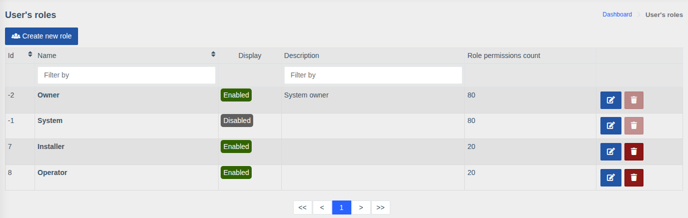
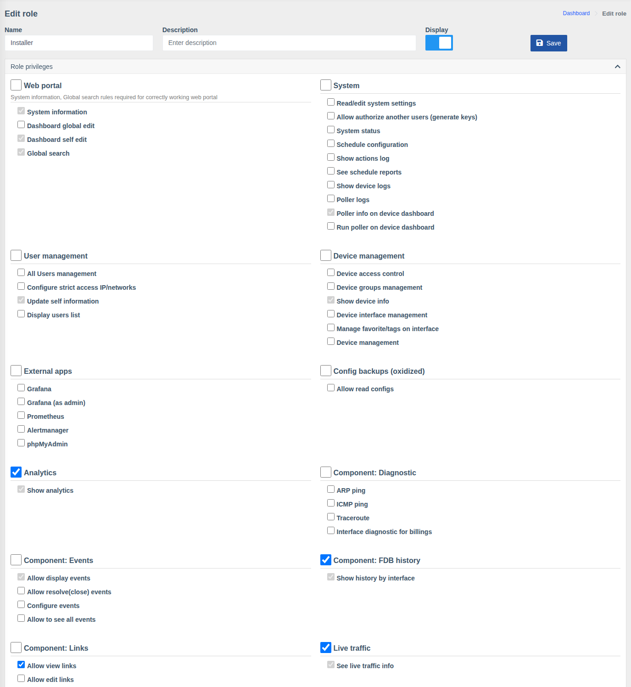

# Roles and permissions

!!! abstract "Overview"

    A role is a set of permissions (privileges) that defines which sections a user sees and which
    actions they can perform. Each user has one role. Which **devices** they see is defined by
    [device groups](./device-groups.md).

Menu: `Users management > Roles`.

The list shows the name, description, display flag and **number of permissions** of each role.

## Built-in roles

| Role | Description |
|------|-------------|
| **Owner** | System owner — has all permissions. Can't be edited or deleted |
| **System** | Internal system role, hidden (not shown when choosing a role) |

You create the other roles (e.g. "Operator", "Installer") yourself.

## Creating and editing a role

Click **"Create new role"** or the edit button next to an existing one.

| Field | Description |
|-------|-------------|
| **Name** | Role name |
| **Description** | Free-form comment |
| **Display** | Whether the role is shown in the list when assigning it to a user |
| **SSO groups mapping** | Shown when SSO sign-in is enabled. See [Single Sign-On → Roles](../sso/index.md#roles) |

Below is the **Role privileges** block: permissions grouped by section. The checkbox next to a
group name toggles all permissions of the group at once. Grey (inactive) checkboxes are basic
permissions every role has. Click **"Save"** after making changes.

## Permission groups

The set of groups depends on installed components. The main ones:

| Group | What it allows |
|-------|----------------|
| **Web portal** | Access to the web interface, dashboard editing (own and global), global search |
| **System** | System settings, system status, scheduler and its reports, action log, device and poller logs, running the poller. **"Allow authorize another users (generate keys)"** — administrators only |
| **User management** | Managing users, allowed IPs, updating own information, viewing users |
| **Device management** | Viewing devices, managing devices, accesses, groups, interfaces, favorite interfaces/tags |
| **External apps** | Access to Grafana (also as admin), Prometheus, Alertmanager, phpMyAdmin |
| **Analytics** | The analytics section — **for all devices regardless of groups** |
| **OLTs** | OLT information; ONU actions: deregistration, reboot, clearing counters, reset, enable/disable, description; managing physical and UNI ports; ONU registration and its settings |
| **Switches** | Switch information; reboot, saving configuration, clearing counters; port description, state and speed; VLANs on ports |
| **Component: Events** | Viewing, resolving and configuring events, viewing all events |
| **Component: Notifications** | Full access, contact settings (own and others'), global notifications |
| **Component: Macros** | Running and editing macros |
| **Component: Links** | Viewing and editing links |
| **Component: Diagnostic** | ARP ping, ICMP ping, Traceroute, interface diagnostic for billings |
| **Component: FDB history**, **Search devices** | FDB history by interface and search in it; search by MAC/IP |
| **Component: Prometheus** | Charts: optical history, traffic, etc. |
| **Live traffic** | Real-time traffic view |
| **Config backups (oxidized)** | Viewing saved configurations |
| **Attachments**, **QR generator**, **Sensors**, **RouterOS**, **Web console** | Permissions of the corresponding components |

## Role examples

| Role | Recommended permissions |
|------|-------------------------|
| **Support operator** | Web portal, Show device info, OLT/switch information, Charts, Allow display events, Diagnostic, Search devices |
| **Installer** | As operator + ONU registration, ONU reboot, ONU description editing, Running macros |
| **Senior engineer** | As installer + Port management, VLANs on ports, Device interface management, Allow edit links, Resolve events, Web console |
| **Administrator** | All groups, including System, User management and Device management |

!!! tip
    With SSO sign-in the role can be assigned automatically from provider groups —
    see [Single Sign-On](../sso/index.md#roles).
