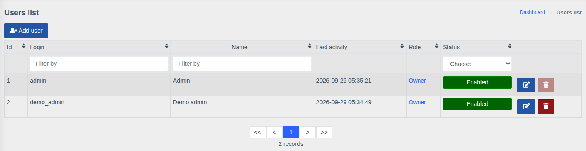
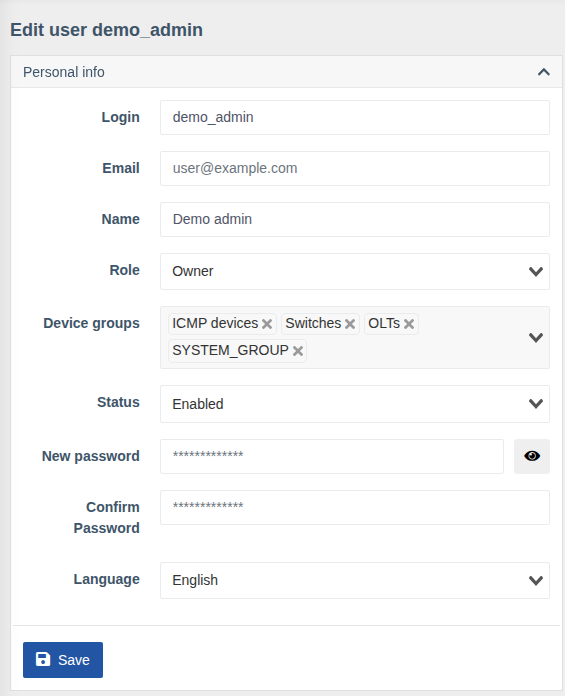

# Users

!!! abstract "Overview"

    Managing staff accounts: creating them, assigning a role and device groups, disabling,
    changing passwords.

Menu: `Users management > Users`.



The list shows the login, name, **last activity**, role and status. It can be filtered by login,
name and status.

## Creating and editing

Click **"Add user"** or the edit button next to an existing one.



| Field | Description |
|-------|-------------|
| **Login** | Sign-in name |
| **Email** | Used to link the user to [SSO](../sso/index.md) and as a contact |
| **Name** | Display name |
| **Role** | [Role](./roles.md) — the user's permission set |
| **Device groups** | [Groups](./device-groups.md) whose devices the user sees |
| **Status** | `Enabled` / `Disabled`. A disabled user can't sign in (including via SSO), but their data and action history are kept |
| **New password** / **Confirm Password** | Set or change the password. When editing, leave empty to keep the current password. If password strength checking is enabled, the password must have at least 8 characters, upper- and lowercase letters, a digit and a special character |
| **Language** | Web interface language for the user |

Click **"Save"** (or **"Create"** for a new user).

## Other blocks of the card

On the user page an administrator can also manage what the user sees in their own
[Account settings](../web-interface/user-settings-overview.md):

- **Notifications configuration** — contacts for [notifications](../components/notifications.md);
- **Strict access by IP/network** — allowed sign-in addresses/networks;
- **Active sessions** — view and close sessions, create an
  [API key](../web-interface/api-key-generation.md);
- **Portal settings** and **Interface cards visibility** — the user's personal UI settings;
- **2FA** — disable two-factor authentication if the user lost access to the authenticator app.

## Useful commands

```bash
wca user:list                              # list users
wca user:change-role <login> [role]        # change role
wca user:reset-password <login>            # set a new password
wca user:reset-ip-strict <login>           # reset IP sign-in restriction
wca user:reset-user <login>                # reset password (becomes equal to login), 2FA and IP restriction
```

!!! info "Permissions"
    Managing users requires **"All Users management"**.
    Viewing the list without changes — **"Display users list"**.
