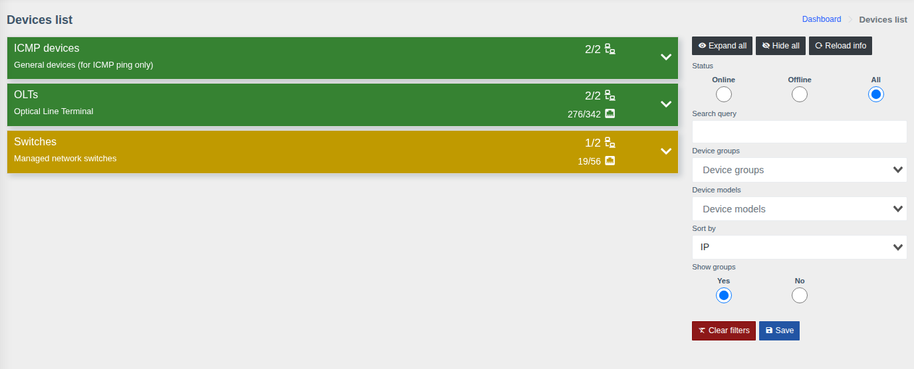
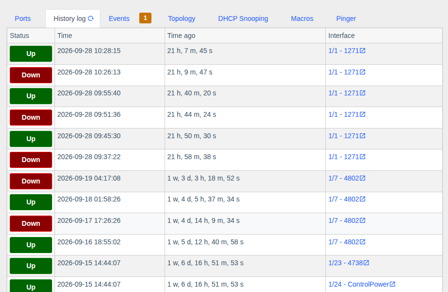

# Device list and device page

!!! abstract "Overview"

    How to find a device, what its page shows regardless of the hardware type, and which blocks are
    on the page of any port or ONU. Type-specific details are on the [OLT](./olt.md),
    [ONU](./onu.md), [Switches](./switches.md), [Mikrotik RouterOS](./routeros.md) and
    [ICMP devices](./icmp-devices.md) pages.

## Device list

The **"Devices"** menu (tree icon in the side menu).

Devices are grouped by [groups](../management/device-groups.md). A group bar shows:

- the number of available devices out of all (`2/2`);
- for OLTs — the number of ONUs online out of all (`276/342`);
- the bar color shows the group state: green — everything is available, other colors — some devices
  or ONUs are unavailable.

Expand a group to see its devices. The panel on the right:

| Element | Purpose |
|---------|---------|
| **Open all / Collapse all** | Expand or collapse all groups |
| **Status** | Show only online, only offline or all devices |
| **Search** | Filter by IP, name, description |
| **Device groups**, **Device models** | Filter by groups and models |
| **Sort by** | Device order within a group |
| **Show in groups** | Show with groups or as a single list |
| **Save** | Remember the filter settings for yourself |

A device, port or ONU can also be found with the **global search** (magnifier icon at the top) — by
IP, name, description, contract, ONU serial/MAC or tag (`#tag`).

## Device page

The left panel is the same for all hardware types:

**Device info**

- **From storage** — data saved in the system: model, name, IP, MAC, serial number;
- **From device** — data received from the hardware: uptime, system name and description, software versions;
- **CPU / RAM / temperature** — current load; the chart icon opens the history;
- for OLTs and switches — the number of ONUs/ports **online / offline / total** and the update time;
- quick access buttons:

| Button | Action |
|--------|--------|
| **Edit** | Open the [device card](../management/devices.md) in management |
| **Web** | Open the hardware web interface (`http://<IP>`) |
| **SSH** / **Telnet** | Open the connection in your computer's SSH/Telnet client |
| **Console**, **Console (auto-login)** | Open the [web console](../components/console.md) in the browser (if the component is enabled and you have permissions) |
| QR icon | Generate the device [QR code](../components/qr-code-generator.md) |

**Other left panel blocks**

- **Device calling** — where each kind of data came from: cache (and when) or online from the hardware;
- **Pollers** — history of automatic device polls: when they ran and whether they succeeded;
- **Supported modules** — what the system can retrieve from this model;
- **Refresh** — request fresh data from the hardware (15–30 s, longer for large OLTs).

On the right are tabs; their set depends on the hardware type.

## Common tabs { #tabs }

| Tab | What it shows | When available |
|-----|---------------|----------------|
| **Events** | Open and resolved [events](../components/events.md) of the device; the number on the tab — open events | Permission to view events |
| **Macros** | Run [macros](../components/macros/getting-started.md) on the device | "Macros" component and run permission |
| **History log** | Port/ONU state change history: Up/Down, time, time ago, interface with a link | Always |
| **Attachments** | Photos and documents for the device — [Attachments](../components/attachments.md) | "Attachments" component |
| **Topology** | Upward topology (chain of uplinks to the core) and device [links](../components/links/describe.md) | "Links" component |
| **Config backup** | Saved configuration and the last backup status — [Config backups](../components/oxidized.md) | Component enabled and backups enabled for the device |
| **Pinger** | ICMP availability — see [ICMP devices and Pinger](./icmp-devices.md#pinger) | Always |
| **DHCP Snooping** | [MAC/IP/VLAN bindings](./dhcp-snooping.md) | Model supports it |

## Port or ONU page { #interface }

Opens from the port table, the ONU tree, search or links elsewhere. At the top are action buttons
(the set depends on the interface type and your permissions), below are cards.

Common cards for a switch port, an OLT physical port, a PON port and an ONU:

| Card | What it shows |
|------|---------------|
| **Device** | Which device the interface belongs to (the arrow goes back to the device page) |
| **Interface marks** | **Favorite** (star) and **tags** — for quick search and grouping. Favorite interfaces are available in `Interfaces > Favorite`, and events are generated for them |
| **Storage info** | When the interface appeared in the system, internal ID, **Poll enabled** (whether the interface is polled on schedule), **Save FDB to history**, comment |
| **Billing info** | Subscriber data from the connected billing ([MikBill](../components/mikbill_integration.md), [NoDeny Plus](../components/nodeny_plus.md), [Userside](../components/us_integration.md)): contract, login, address, status, link to billing |
| **Uptime table** | Interface Up/Down history: when it went up, when down, how long it worked, down reason |
| **FDB table** | MAC addresses the device currently sees on the interface (VLAN, entry type) |
| **FDB history** | On which interface and when each MAC address was seen; "active now" — the MAC is present now |
| **Upward topology** | Chain of devices from this interface to the network core with uplink load |
| **Device calling** | Data source per module (cache/online) |
| **Events** | Events of this interface |
| **Links** | Links to other devices, the **Add link** button |
| **Coordinates** | Map coordinates — pick on the map or with phone geolocation |
| **QR code** | A label with a link to this interface |

!!! tip "Hide unneeded cards"
    The eye icon button in the top right corner of the page (**"Manage interface cards"**) lets you
    turn off cards you don't need. The setting is saved in your account and is also available in
    `Account settings` → **"Interface cards visibility"**.

Next to each card name there is a **"?"** icon with an explanation — see [Hints](../web-interface/theme.md#hints).
