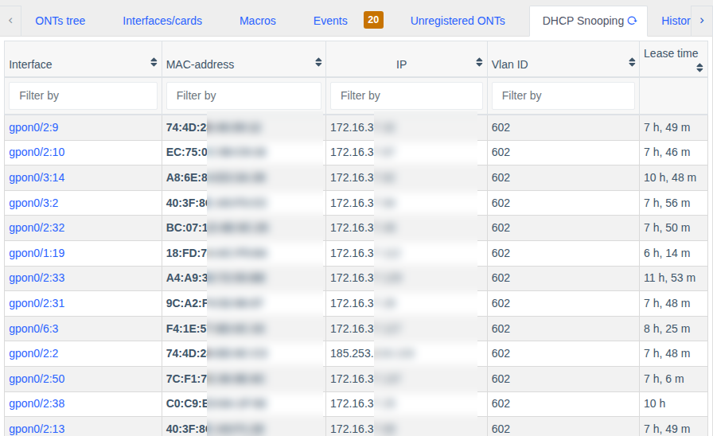
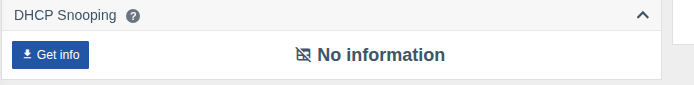

# DHCP Snooping

!!! abstract "Overview"

    Starting with version **0.31** WildcoreDMS shows the **DHCP Snooping** binding table from
    switches and OLTs: which IP address was issued to which subscriber MAC address, in which VLAN,
    on which port/ONU and how long the lease remains. This helps quickly find a subscriber by IP or
    check whether their equipment gets an address.

## Where to view

| Place | What is shown |
|-------|---------------|
| Switch page → **DHCP Snooping** tab | All bindings of the device |
| OLT page → **DHCP Snooping** tab | All OLT bindings matched to specific ONUs |
| Switch port page → **DHCP Snooping** card | Bindings on this port |
| ONU page → **DHCP Snooping** card | Bindings behind this ONU |

The tab and cards are shown only for models that support this feature.

The table contains the **Interface** (port or ONU — linked to its page), **MAC address**, **IP**,
**VLAN ID** and remaining **lease time**. Columns can be filtered and sorted. The refresh button on
the tab requests fresh data from the hardware.

### ONU card

On the ONU page data is requested with the **"Get info"** button (or **"Refresh info"** if data is
already there): on some models bindings are matched to ONUs through the FDB table, which may take
a few seconds.

To load the table automatically together with the rest of ONU information, enable the
[`load_snooping_info`](../management/custom-parameters.md#load_snooping_info) parameter for the
device or model.

!!! tip
    You can hide the card for yourself in `Account settings` → **Interface cards visibility**.

## Supported hardware

| Vendor | Models | Notes |
|--------|--------|-------|
| **D-Link** | DES-3200, DES-30xx, DES-1228/ME, DGS-3000, DGS-3100, DGS-3120, DGS-3420 | The DHCP relay mode is shown too. The DGS-1100/1210 series is not supported (the hardware doesn't provide this data) |
| **BDcom** | EPON/GPON OLTs, including P3608B, GP3600 | Data over SNMP, console fallback if the firmware doesn't support it. Precise ONU matching |
| **C-Data** | FD-EPON, FD11xx, FD16xxV3, FD17xxV3 | ONU matching (by ONU number or via FDB) |

## Permissions

Viewing is available to users with hardware information permissions
(**"Info from switches"** / **"Info from OLTs"**) — see [Roles and permissions](../management/roles.md).
