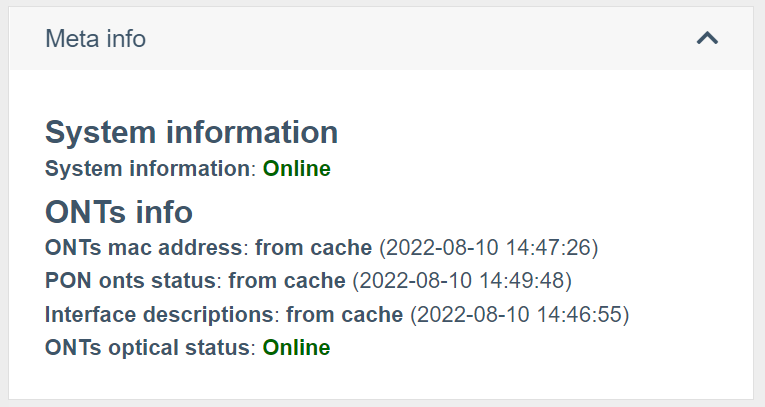
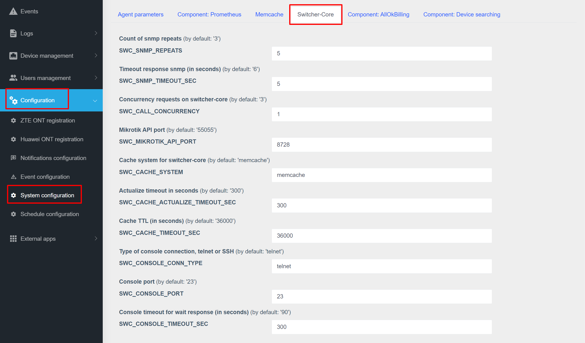

# Working with equipment

## Interaction with equipment
The wildcore system can communicate with the hardware via **snmp version 2c**,
via **console**(ssh/telnet), as well as via **API** (for RouterOS).

It is possible to specify ports in equipment access if your network uses non-standard ports


## Setting the parameters for working with equipment

## Poll equipment
### Getting standardized output via switcher-core modules
Any interaction with the system is performed by calling certain modules switcher-core.
Each vendor and model has its own set of modules.
The list of supported modules by hardware can be obtained with the command
```
wca switcher-core:modules DEVICE_IP
```

### Displaying information in the web interface
The system is aimed at displaying "live" information from the equipment.

But, considering that an acceptable page loading speed is also needed, we made a compromise in the form of response caching.
To view what information was received from the system cache and what from the equipment - expand the "Meta info" (Status-info) block on the equipment page with interfaces / in the ONU.

The screenshot above shows the name of the module, as well as the source from which the data was received:

* **from cache (DATE)** - data received from the cache, and DATE indicates the date this data was added to the cache
* **online** - data received from the equipment.

If you need to get "live" data - click the "Reload info" button (refreshing the page may take some time. Usually 15-30 seconds)

It is also worth considering that some of the data can be displayed with Prometheus (for example, signal levels) and the "Reload info" button will not update this information.
_For more details on what data and on what equipment are taken from Prometheus, see the description of the components, by the type of equipment you need_

## Global settings


