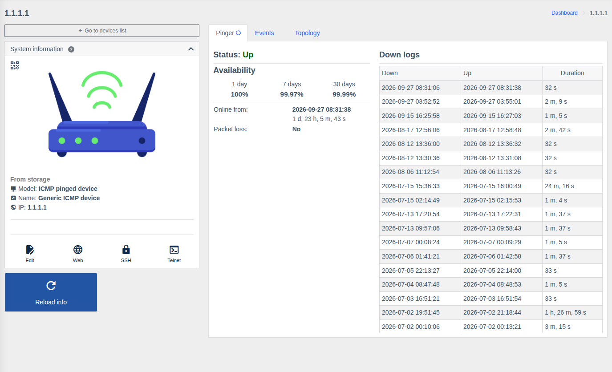
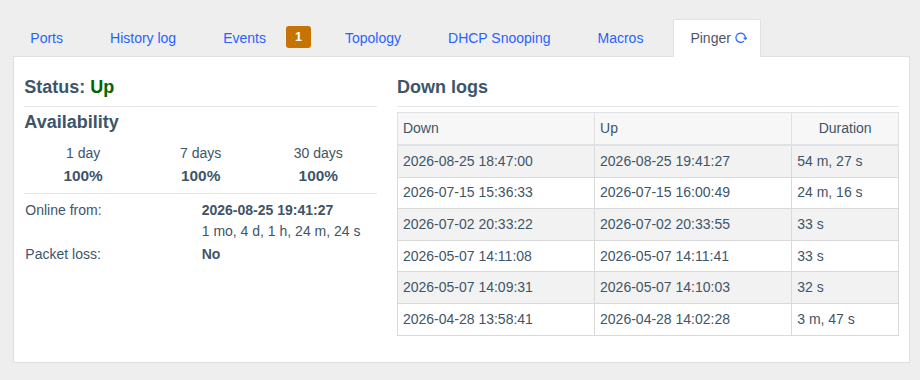

# ICMP devices and Pinger

!!! abstract "Overview"

    **Pinger** monitors the availability of any device over ICMP (ping) and calculates the
    availability percentage and outage history. **ICMP devices** are a separate device type for hosts
    WildcoreDMS doesn't work with over SNMP: servers, cameras, subscriber routers, access points, etc.

!!! info "Component"
    [Pinger](../components/pinger.md) (`pinger`).

## ICMP devices

To monitor the availability of any host:

1. `Device management > Devices` → **"Add device"**.
2. Enter the **IP** and any **access** (credentials aren't used for ICMP).
3. Choose the model manually: **ICMP pinged device** (the "Get info from device" button isn't needed).
   For Ping3 devices choose the corresponding model.
4. Save.

The ICMP device page has the **Pinger**, **Events** and **Topology** tabs. Such a device can be put on
the map, linked to other hardware (e.g. as a switch downlink) and trigger
[notifications](../components/notifications.md) when it's unavailable.

## "Pinger" tab { #pinger }

The tab is on the page of any device:

| Value | Description |
|-------|-------------|
| **Status** | Current state: Up / Down |
| **Availability** | Percentage of time the device was available for **1 day**, **7 days** and **30 days** |
| **Online since / Offline since** | When the device last changed state and how long it has been in the current state |
| **Packet loss** | Whether packet loss is detected |
| **Down logs** | Each outage: when it went down (Down), when it came back (Up), duration |

## How it works

- Availability is checked constantly by a background service for all enabled devices.
- An ICMP outage creates a "device unavailable" [event](../components/events.md), which triggers
  notifications.
- Before accessing hardware over SNMP/console WildcoreDMS pings it — to show "unavailable" right away
  instead of waiting for a timeout (the `SWC_CHECK_ICMP_PING` parameter, see
  [System configuration](../installation-and-updating/env-configuration.md#swc)).
- [Disabled](../management/devices.md) devices are not checked.

!!! tip
    The network firewall between the WildcoreDMS server and the hardware must allow ICMP echo-request/reply.
