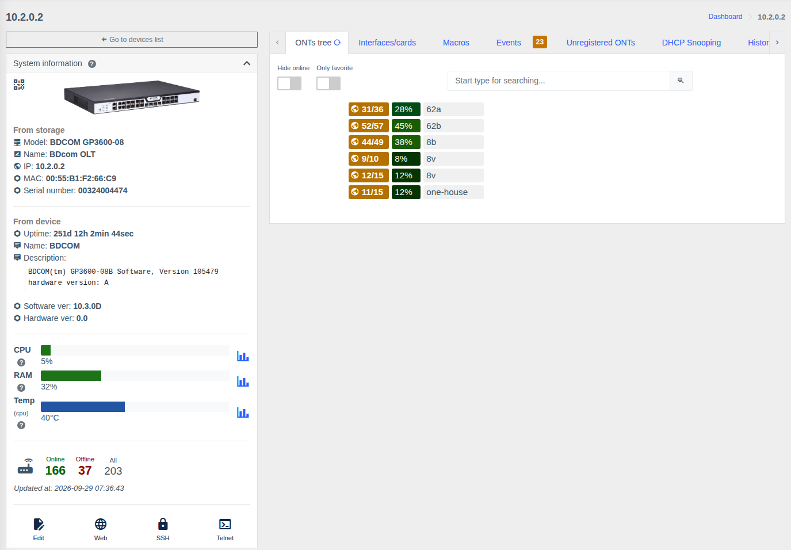
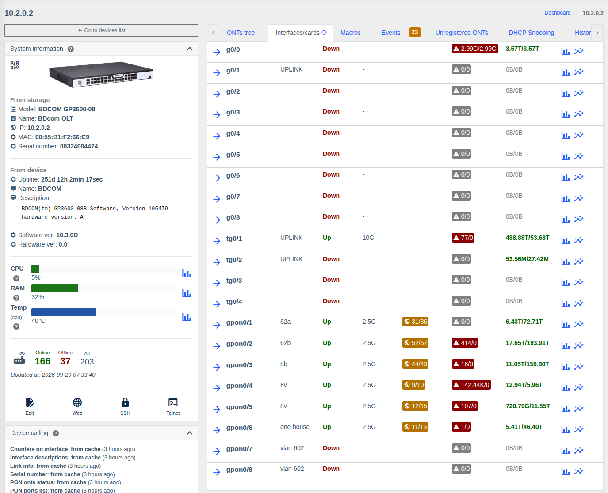
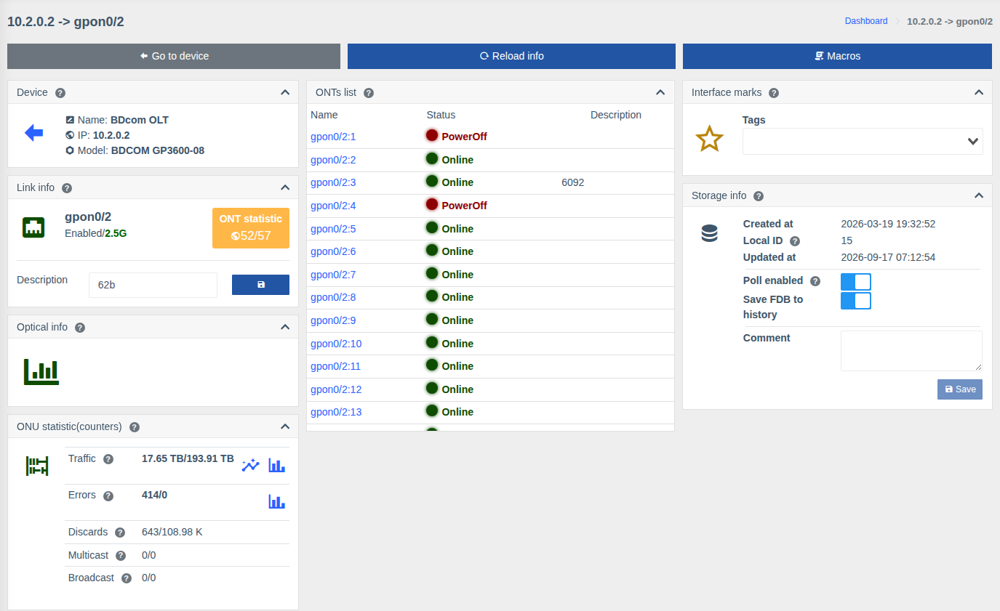

# Working with OLTs

!!! abstract "Overview"

    The OLT page gathers everything about the PON network: the ONU tree by ports, physical
    interfaces, new ONU registration, DHCP Snooping, the blacklist. From here you go to a PON port,
    physical port or specific [ONU](./onu.md) page.

    Supported OLTs: Huawei MA56xx/MA58xx, ZTE C3xx/C6xx, BDcom P3xxx/GP3600, C-Data, V-Solution,
    GCOM — full list in [Supported hardware](../supported-hardware.md). Available data and actions
    depend on the model.

!!! info "Components"
    The OLT page comes from the [OLTs](../components/olts.md) component (`olts`), port actions — [OLTs control](../components/olts_control.md) (`olts_control`), registration — [ONT registration](../components/onts-registration/getting-started.md) (`onts_registration`), charts — [Charts](../components/prometheus_wrapper.md) and [Live traffic](../components/live_traffic.md).

Common page elements (left panel, "Events", "Macros", "History log" tabs, etc.) are described on
[Device list and device page](./device-page.md).

## OLT tabs

| Tab | Purpose |
|-----|---------|
| **ONTs tree** | PON ports and their ONUs |
| **Interfaces/cards** | All physical OLT ports: uplinks, PON ports |
| **Unregistered ONTs** | New ONUs waiting for registration |
| **DHCP Snooping** | [MAC/IP/VLAN bindings](./dhcp-snooping.md) by ONU |
| **ONU blacklist** | [ONU blacklist](./onu-blacklist.md) |
| **Events, Macros, History log, Attachments, Topology, Config backup, Pinger** | [Common tabs](./device-page.md#tabs) |

### ONTs tree { #ont }

Each row is a PON port:

- **ONUs online / total** on the port (`31/36`);
- **port fill level** — ONU count relative to the port maximum (e.g. 36 of 128 = 28%); the color changes as the port gets full;
- port **description**.

Click a port to expand its ONUs with status, serial/MAC, description and signal level. Clicking an
ONU opens its [page](./onu.md).

Above the tree:

| Element | Purpose |
|---------|---------|
| **Hide online** | Show only ONUs that are not online — quick outage lookup |
| **Only favorites** | Show only [favorite](./device-page.md#interface) ONUs |
| **Filter** | Search ONUs by interface name, serial/MAC, description |

### Interfaces/cards

A table of all physical OLT ports (Ethernet uplinks and PON ports):

| Column | Description |
|--------|-------------|
| Name and description | The arrow opens the port page |
| Status, speed | Link state and current speed |
| ONU statistic | For PON — ONUs online/total |
| Errors | Error count (red — there are errors) |
| Traffic | In/out volume; icons — **chart for a period** and **live chart** |
| Actions | **Configure port** (description, admin state) and **Reset port** — port off/on with reset (if the model supports it and you have the "Allow control PON/physical ports" permission) |

### Unregistered ONTs

ONUs connected to the OLT but not yet registered: port, serial/MAC and other data reported by the
OLT. The **"Register"** button opens the registration form based on your template. The list is
refreshed on schedule and when the tab is opened. Setup —
[ONU registration](../components/onts-registration/getting-started.md).

## PON port page

Opens from the ONTs tree or the physical interfaces table.

| Card | What it shows |
|------|---------------|
| **Link info** | Port name, state (Enabled/Disabled) and speed, **ONU statistic** (online/total), port **description** editing |
| **ONUs list** | All port ONUs with status (Online / Offline / LOS / PowerOff) and description, linked to each |
| **Optical info** | Port SFP module optics (if the model supports it) and a history chart |
| **ONU statistic (counters)** | Traffic, errors, discards, multicast, broadcast of the port with charts |
| Common cards | Marks, storage, uptime, topology, events, links, QR — see [Port or ONU page](./device-page.md#interface) |

Top buttons: **Go to device**, **Refresh**, **Macros**.

!!! tip "Local PON port descriptions"
    To keep a PON port description only in WildcoreDMS without writing it to the OLT, enable the
    [`disable_save_description_on_physical_ifaces`](../management/custom-parameters.md#disable_save_description_on_physical_ifaces) parameter.

## Permissions

| Action | Permission |
|--------|------------|
| Viewing the OLT, ONU tree, ports | **Info from OLTs** |
| Configuring and resetting physical ports | **Allow control PON/physical ports** |
| ONU registration | **Register ONTs** |
| ONU actions | see [ONU page](./onu.md#rights) |

Hardware actions require the OLT control component. See [Roles and permissions](../management/roles.md).
