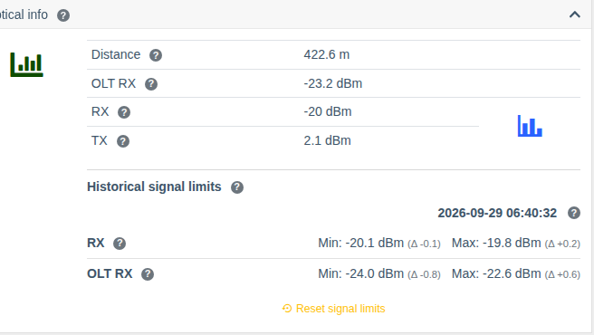

# ONU signal level history

!!! abstract "Overview"

    Starting with version **0.31** WildcoreDMS remembers the **minimum and maximum** optical signal
    level of every ONU and the time of the last change. This shows whether the signal "floats" even
    if it's fine at the moment of viewing — e.g. because of a bad connector or a bent cable.

## What is stored

For every ONU the system stores:

| Value | Description |
|-------|-------------|
| **RX** | Signal level received by the ONU |
| **TX** | Signal level transmitted by the ONU |
| **OLT RX** | Signal level from the ONU received by the OLT |

For each value — the **current value**, **minimum** and **maximum** since the last reset, and the
**time of the last change**. Values are updated by the [poller](./poller.md) (signal level polling)
and when the ONU page is opened; a record is written only when the value actually changed.

## Where to view

### ONU card

ONU page → **"Optical info"** card → **"Historical signal limits"** block.

- date and time of the last signal change;
- for **RX** and **OLT RX** — **Min** and **Max**, and in brackets (Δ) how far the limit is from
  the current value;
- the **"Reset signal limits"** button sets the minimum and maximum to the current readings (with
  confirmation). Useful after a line repair to start observing anew.

### ONU list

The ONU list (`Interfaces > ONT list`) supports sorting by OLT-side RX and has the
**"Optical RX delta"** column — the difference between the ONU RX and OLT RX levels. A large
difference may point to a line problem or to the ONU optics.

## Reset via API

Limits can also be reset for all ONUs of a device at once — with the API methods
`PUT /api/v1/ont-signal/reset/device/{id}` and `PUT /api/v1/ont-signal/reset/interface/{id}`,
see [API](../api/index.md).

## Permissions

| Action | Permission |
|--------|------------|
| Viewing history | **Show device info** |
| Resetting limits | **Device interface management** |
