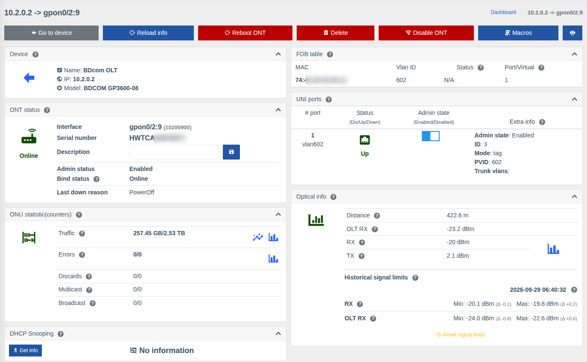

# ONU page

!!! abstract "Overview"

    The ONU page is the main tool of support staff and installers: status and disconnect reasons,
    signal levels, subscriber ports, MAC addresses behind the ONU, counters and ONU actions (reboot,
    disable, delete). It opens from the [ONTs tree](./olt.md#ont), search, the ONU list or links in
    events.

!!! info "Components"
    Viewing — [OLTs](../components/olts.md) (`olts`); action buttons, description, UNI ports — [OLTs control](../components/olts_control.md) (`olts_control`); charts — [Charts](../components/prometheus_wrapper.md), [Live traffic](../components/live_traffic.md); FDB history — [FDB history](../components/fdb_history.md); macros — [Macros](../components/macros/getting-started.md).

The set of cards and actions depends on the OLT and ONU model. Unneeded cards can be hidden — see
[Hide unneeded cards](./device-page.md#interface).

## Action buttons { #actions }

| Button | Action | Permission |
|--------|--------|------------|
| **Go to device** | Back to the OLT page | — |
| **Refresh** | Request fresh data from the OLT | — |
| **Reboot ONT** | Reboot the ONU (with confirmation) | Allow reboot ONT |
| **Delete** | Delete the ONU from the OLT (deregister) | Allow dereg ONT |
| **Reset** | Reset ONU settings | Allow reset ONT |
| **Disable ONT / Enable ONU** | Administratively disable or enable the ONU | Allow disable/enable ONT |
| **Macros** | Run a [macro](../components/macros/getting-started.md) for this ONU | List and execute macros |
| Eye icon | [Manage cards](./device-page.md#interface) | — |

A button is shown only if the model supports the action, the OLT control component is enabled and
you have the corresponding permission.

## Cards

### ONT status

| Field | Description |
|-------|-------------|
| **Interface** | ONU name on the OLT (e.g. `gpon0/2:9`) and internal ID |
| **Serial number / MAC address** | ONU identifier (GPON — serial number, EPON — MAC) |
| **Description** | ONU description on the OLT — can be changed and saved right here ("Allow change ONT description" permission) |
| **Admin status** | Enabled / Disabled — whether the ONU is administratively enabled |
| **Bind status** | Physical state: **Online**, **Offline**, **LOS** (loss of signal — fiber problem), **PowerOff** (power off at the subscriber) |
| **Configuration status** | Whether the ONU configuration is applied on the OLT |
| **Last down reason** | Why the ONU disconnected last time |
| **Last registration / deregistration**, **Online since / Offline since** | When the ONU registered/disconnected and how long it has been in the current state (depends on the model) |

### Optical info

- **Distance** from the OLT to the ONU;
- **RX** — signal the ONU sees from the OLT; **TX** — signal transmitted by the ONU;
- **OLT RX** — signal from the ONU seen by the OLT;
- ONU temperature and voltage (if the model reports them);
- chart icon — signal level history for a period;
- **Historical signal limits** — min and max since the reset, see
  [ONU signal level history](./onu-signal-history.md).

If the ONU is offline, current levels can't be retrieved — see the history chart and historical limits.

### ONU statistic (counters)

Traffic, errors, discards, multicast and broadcast to and from the subscriber. Icons next to traffic —
**chart for a period** and **live chart** (updated every few seconds); next to errors — errors chart.

### UNI ports

The ONU subscriber ports (LAN/POTS):

- **Status** — Up / Down / Disabled;
- **Admin state** — a switch to enable/disable the port ("Control UNI ports on ONU" permission);
- **Extra info** — VLAN mode, PVID, trunk VLANs, speed, duplex, etc. (depends on the model).

### FDB table and FDB history

MAC addresses behind the ONU now (with VLAN and entry type) and history: when and on which ONU each
MAC address was seen. Helps find which subscriber router is connected and whether it moved to another ONU.

### Other cards

| Card | What it shows |
|------|---------------|
| **Vendor info** | Vendor, model, hardware version, firmware versions (active / committed) |
| **ONT configuration** | Current ONU parameters on the OLT (profiles, VLANs, services — depends on the model) |
| **ONT IP host** | ONU IP hosts (management/service interfaces): ID, MAC, IP address |
| **Down history table** | ONU registrations and deregistrations with disconnect reasons |
| **DHCP Snooping** | MAC/IP bindings behind the ONU — the **"Get info"** button, see [DHCP Snooping](./dhcp-snooping.md) |
| **Uptime table** | Up/Down history with down reasons |
| **Device** | The OLT the ONU is connected to |
| Common cards | Marks, storage, billing, topology, events, links, coordinates, QR — see [Port or ONU page](./device-page.md#interface) |

## Permissions { #rights }

| Action | Permission |
|--------|------------|
| Viewing the ONU | **Info from OLTs** |
| Reboot | **Allow reboot ONT** |
| Delete | **Allow dereg ONT** |
| Reset settings | **Allow reset ONT** |
| Enable / disable ONU | **Allow disable/enable ONT** |
| Change description | **Allow change ONT description** |
| UNI ports management | **Control UNI ports on ONU** |
| Clear counters | **Allow clear ONT counters** |

See [Roles and permissions](../management/roles.md).
