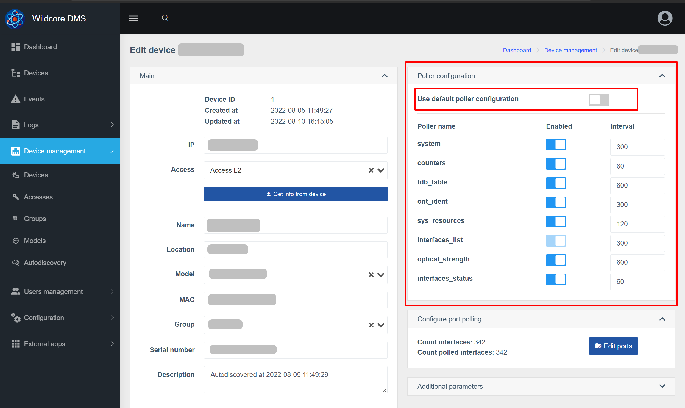

# Equipment poller
The hardware poller runs in the background and collects some information from the hardware.
By default, 10 collector instances work. This means that data can be collected from up to 10 different devices at the same time.

## What is it needed for?
The data received from the equipment by the interrogator is used for:

* Update caches - for faster page loading
* Collection of historical data - for example, plotting signal
* Generation of events and notifications based on them
* Sending metrics to Prometheus

## List of pollers
* **arp_table** - ARP table
* **bgp_sessions** - list of BGP sessions
* **counters** - counters from interfaces (errors, traffic)
* **fdb_table** - FDB table
* **interfaces_list** - list of interfaces with their names and descriptions
* **interfaces_status** - admin status/current state
* **ont_ident** - ONU identifiers (serial numbers/MAC addresses)
* **optical_strength** - signal levels from ONU (RX,TX,OLT-RX, distance to ONU, temperature)
* **system** - only device uptime is being collected at the moment
* **sys_resources** - CPU utilization/memory utilization

## Poller setup
### Changing polling intervals and pollers by device model
The system has the ability to change the polling intervals (in seconds), as well as disable some pollers.

1. Default poller settings
2. Disable this option to change pollers
3. Poller name
4. Enable/disable poller
5. Interval in seconds

After the changes, save the changes to the system.

### Changing polling intervals and pollers by device
It is also possible to rewrite poller settings for a specific device. It makes sense, for example, if you have several olts with a small amount of ONUs, and one, of the same model, "packed" to the eyeballs.

Setting up the poller block is similar to setting up by device model.

### Exclude data collection on certain ports
The change affects the saving of poller data:

* counters
* interfaces_status (for some models)
* optical_strength

1. ID of interfaces in the system
2. Interface name
3. Enable / disable saving metrics by interface

_It should be taken into account that disabling ports only affects the saving of metrics, but not their collection from the equipment (in fact, the collection occurs from all interfaces anyway)_

### Changing the number of running poller instances
You can specify the required number of running instances through the **POLLER_COUNT_PROCS** parameter (in the /opt/wildcore-dms/.env file or via the web interface, in the system settings).
     
It makes sense to increase the number of instances if you notice that the interval for collecting data from equipment is much larger than the specified interval for the model / device.
        
Recommendations for setting the maximum number of instances:

* _Based on RAM:_ (total memory - 3.5Gb) / 0.25Gb = max amount
* _CPU based:_ 2.5 * number of cores = max number
 

### Disable collection attempts from inaccessible hardware
If the **POLLER_IGNORE_DOWN** parameter is set to _true_ - before starting work with the equipment, its availability via ICMP will be checked.
