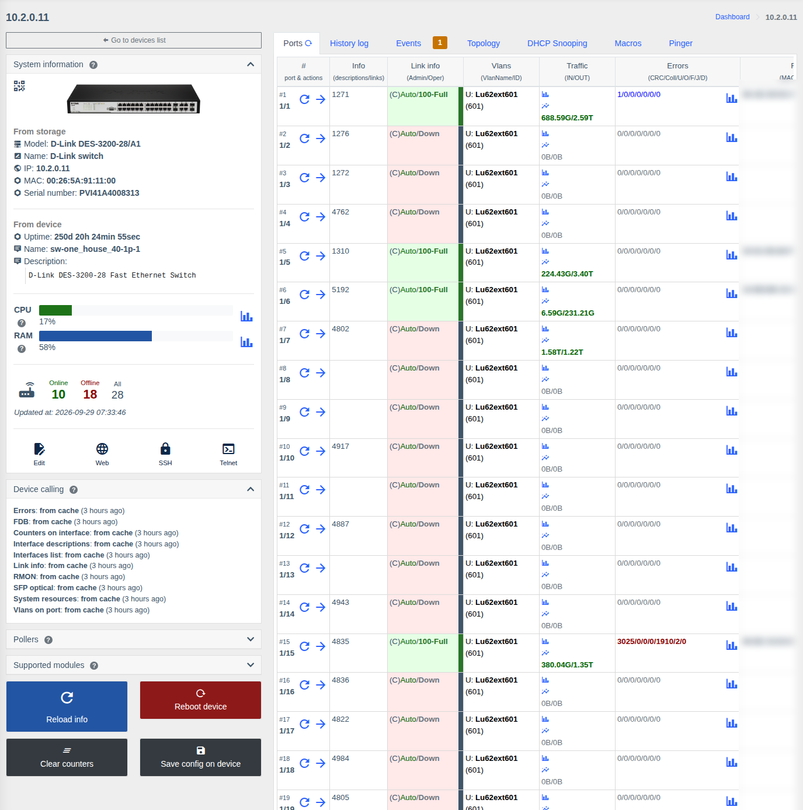
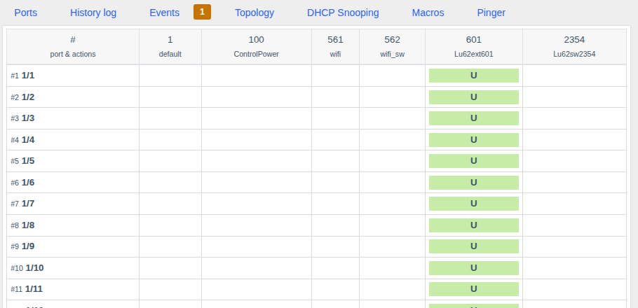
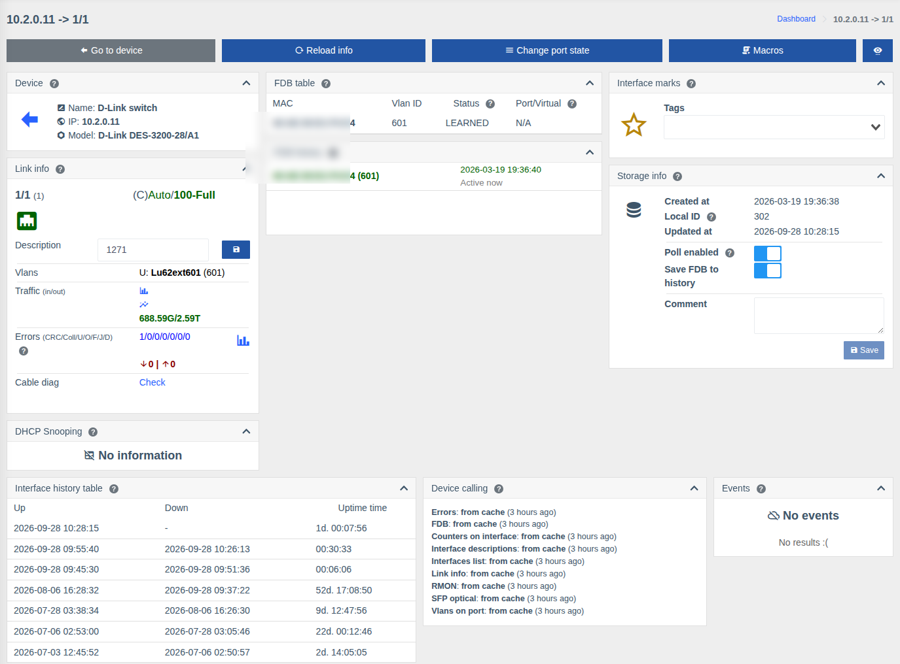

# Switches and L3 hardware

!!! abstract "Overview"

    The switch page shows all ports with their state, VLANs, traffic, errors and MAC addresses, lets
    you manage ports and VLANs, run cable and SFP diagnostics. For L3 hardware ARP, FDB and direct
    route tables are also available.

    Supported: D-Link, Edge-core, Huawei, Cisco, Juniper, HP/HPE, Dell, Eltex, Raisecom, TP-Link,
    Mikrotik (SwOS/CRS), Arista and others — see [Supported hardware](../supported-hardware.md).
    Available data and actions depend on the model.

!!! info "Components"
    Viewing — [Switches](../components/switches.md) (`switches`), L3 tabs — [Routers](../components/routers.md) (`routers`); device and port actions, VLANs — [Switches control](../components/switches_control.md) (`switches_control`); charts — [Charts](../components/prometheus_wrapper.md), [Live traffic](../components/live_traffic.md); FDB history — [FDB history](../components/fdb_history.md).

Common page elements (left panel, "Events", "Macros", "History log", "Topology", "Pinger" tabs, etc.)
are described on [Device list and device page](./device-page.md).

## Device actions { #device-actions }

Buttons under the left panel:

| Button | Action | Permission |
|--------|--------|------------|
| **Refresh** | Request fresh data from the hardware | — |
| **Reboot device** | Reboot the switch (with confirmation) | Allow reboot device |
| **Clear counters** | Reset traffic and error counters on all ports | Allow clear counters |
| **Save config on device** | Write the current configuration to the switch memory | Allow save config |

Buttons are shown if the model supports the action, the switch control component is enabled and you
have the permission.

## "Ports" tab

All ports in one table:

| Column | What it shows |
|--------|---------------|
| **#** | Port number and name; buttons **refresh port data** and **go to the port page** |
| **Info** | Port description and links to other devices |
| **Link info** | Admin state / link state and speed-duplex, e.g. `(C)Auto/100-Full` (C — copper, F — fiber). Color: green — link up, red — no link |
| **VLANs** | VLANs on the port: `U` — untagged, `T` — tagged, with name and number |
| **Traffic** | In/out volume; icons — chart for a period and live chart |
| **Errors** | CRC / Collisions / Undersize / Oversize / Fragments / Jabbers / Drops; change since the previous poll; chart |
| **FDB** | MAC addresses on the port |
| **Diagnostics** | Cable and SFP diagnostics result (if the model supports it) |

The refresh button next to the tab name or **"Refresh"** on the left panel requests fresh data from
the hardware.

## "VLANs" tab

A "port × VLAN" matrix: for each port you see which VLANs it is in and how (`U` — untagged, `T` —
tagged). The action button next to a port opens a form to add or remove VLANs on the port and change
the mode. The tab is available if the model supports VLAN management and you have the
**"VLAN control"** permission.

## L3 hardware tabs { #l3 }

For routers and L3 switches (except Mikrotik RouterOS — see [its own page](./routeros.md)):

| Tab | What it shows |
|-----|---------------|
| **Ports** | Same as for a switch |
| **ARPs** | ARP table: IP ↔ MAC ↔ interface/VLAN |
| **FDB** | MAC table of the whole device |
| **Direct routes** | Networks directly connected to interfaces |
| **VLANs** | Same as for a switch |

## Port page

Top buttons:

| Button | Action | Permission |
|--------|--------|------------|
| **Go to device** | Back to the switch page | — |
| **Refresh** | Request fresh port data | — |
| **Edit port** | The **"Port configuration"** form: admin state (enable/disable the port) and admin speed (auto, 10/100/1000, duplex) | Allow set admin state, Allow set admin speed |
| **Clear counters** | Reset the port counters | Allow clear counters |
| **Macros** | Run a macro for the port | List and execute macros |

Port cards:

| Card | What it shows |
|------|---------------|
| **Link info** | Name, link state and speed, **description** (can be changed and saved — "Allow set description" permission), VLANs, traffic and errors with charts, error change since the previous poll |
| **Cable diag** | The **"Check"** button runs cable diagnostics: state of each pair and distance to a break/short. Automatic run when opening the port is enabled with [`enable_auto_cable_diag`](../management/custom-parameters.md#enable_auto_cable_diag) |
| **Optical info** (SFP) | For optical ports: RX/TX levels, temperature, voltage, laser bias current, BiDi/WDM channels, RX noise, module details |
| **LACP interfaces** | For aggregated links — physical ports in the aggregation, with links |
| **DHCP Snooping** | MAC/IP bindings on the port — [DHCP Snooping](./dhcp-snooping.md) |
| **FDB table / FDB history** | MAC addresses on the port now and history |
| **Uptime table** | Port Up/Down history |
| Common cards | Marks, storage, billing, topology, events, links, coordinates, QR — see [Port or ONU page](./device-page.md#interface) |

!!! note
    On some hardware cable diagnostics briefly drops the link on the port.

## Permissions

| Action | Permission |
|--------|------------|
| Viewing the switch and ports | **Info from switches** |
| Device reboot | **Allow reboot device** |
| Saving configuration | **Allow save config** |
| Clearing counters | **Allow clear counters** |
| Changing port description | **Allow set description** |
| Enabling/disabling a port | **Allow set admin state** |
| Changing port speed | **Allow set admin speed** |
| VLAN management | **VLAN control** |

See [Roles and permissions](../management/roles.md).
