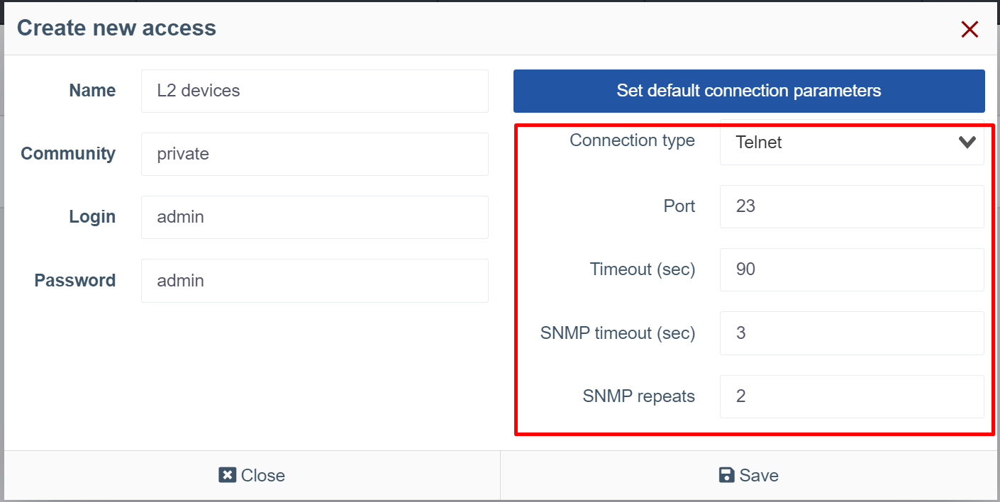
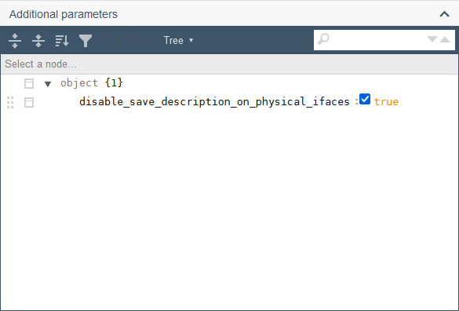
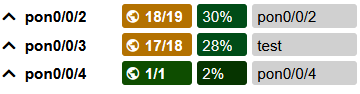

# Working with hardware

## Interaction with hardware
The wildcore system can communicate with the hardware via **snmp version 2c**,
via **console**(ssh/telnet), as well as via **API** (for RouterOS).

It is possible to specify ports in hardware access if your network uses non-standard ports



## Parameter settings for working with hardware

### Polling the hardware
#### Getting standardized output via switcher-core modules
Any interaction with the system is performed by calling certain switcher-core modules.

Each vendor and model has its own set of modules.

The list of modules by supported hardware can be obtained via the command
```shell linenums="1"
wca switcher-core:modules DEVICE_IP
```

#### Displaying information in the web interface
The system aims to display "live" information from the hardware.

But, considering that an acceptable page loading speed is also required, we made a compromise in the form of response caching.

To view which information was received from the system cache and which from the hardware, expand the "Meta info" (Status-info) block on the hardware page with interfaces or on the ONU page.


The screenshot above shows the name of the module, as well as the source from which the data was received:

* `from cache (DATE)`: data received from the cache, and DATE indicates when this data was cached.
* `Online`: data received from the hardware.

If you need to get "live" data - click the "Reload info" button (refreshing the page may take some time, usually around 15-30 seconds).

It is also worth mentioning that some of the data could be displayed in Prometheus (for example, signal levels) and the "Reload info" button will not update this information.

!!! info
    For more details about which data from which hardware is taken from Prometheus, see the description of the components by the type of hardware you're interested in.

## Global settings


## Additional settings
### Model/Device parameters
#### Local PON description
Add the following parameter in the **Additional parameters** tab of a model or a device to disable the saving of PON port description synchronization and be able to set it up locally.

`"disable_save_description_on_physical_ifaces": true`





!!! info
    Please note that to manually type the parameter in the field you have to change **Tree** display type to **Code** in the center of the toolbar of the parameters' tab.