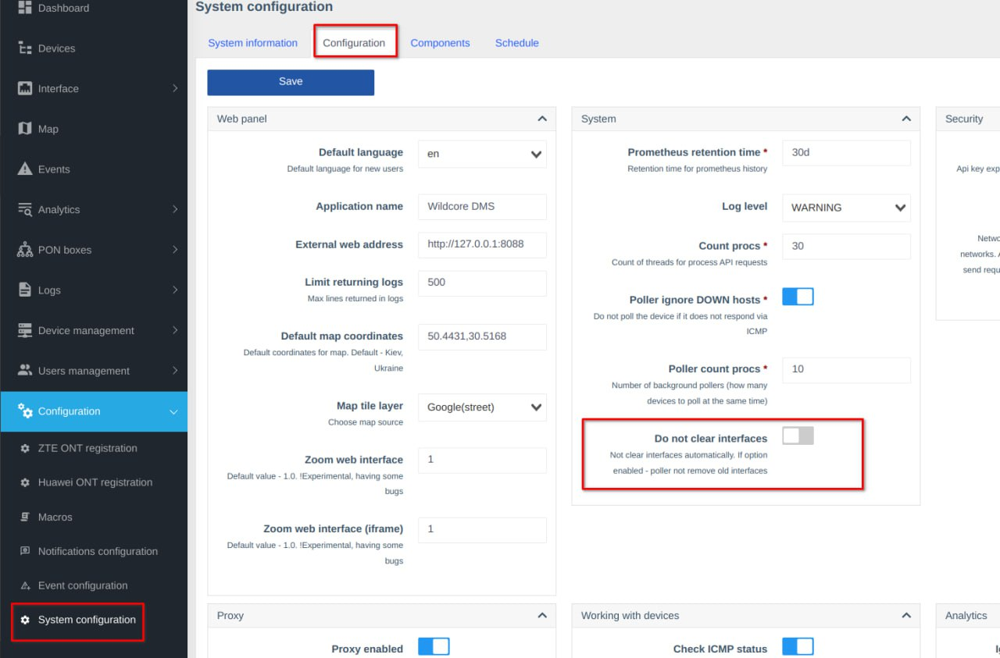

!!! abstract "Overview"
    This page provides various error cases and a solution for them for the WildcoreDMS.

    Feel free to use the right side menu to jump to the section, that you're interested in.

## Step 0: Clear cache and update
If in the course of work you encounter problems with the agent, first of all make sure that you are using the latest version of the software.

Run the following commands to rule out possible problems:

```shell linenums="1"
cd /opt/wildcore-dms 
sudo docker compose down --remove-orphans
sudo docker compose up -d --build 
sleep 10 
wca cache:flush
wca cache:redis:flush-all
```
If the problem or error persists, try the next section with solutions to various known problems.

## Step 1: Known errors and solutions to them

### Agent registered on another IP

This error occurs, when the public IP of your server changes.

Solution:

1. Go to your Personal Cabinet.
2. Navigate to the Agents page and find the suspect agent.
3. Press the Edit button in the upper-right corner.
4. Press the `Reset bound IP address` button next to the current Registered IP.
5. Run `wca-tool register` on the target server.

### Customer search by MAC Address returns interfaces on transport ports

Solution: disable FDB collection on this interface.

Option 1: Add links to the transport interface, which prevents MAC address collection.

Option 2: Disable MAC address collection (a checkbox in the interface card).

### OLT Device List and System stat Dashboard widget display different Interface counts

Interfaces without Status do not count towards the Device List total.

Solution: Disable the **Do not clear interfaces** checkbox in Configuration - System configuration - System panel.



## Step 2: Contact support

Before applying:

1. **Make sure you are using the latest version of the agent and wca-tool**
2. Run the commands described in [Step 0](#step-0-clear-cache-and-update).
3. Make sure the server has stable access to the hardware (like ping and snmpwalk).

If the steps above did not solve the problem, when contacting, try to describe as much as possible the actions that cause the problem, specify:

* Characteristics of the system on which the software is running.
* The role of the user under which the error occurs.
* What rights are granted to this user group.
* Which hardware (if it is) is having problems. 

    It is also desirable to provide the output of the command 
    
    `wca switcher-core:call DEVICE_IP system`.

* Provide screenshots.
* Describe what exactly is wrong, even if it is obvious to you.
* What access level to the equipment was provided (SNMP Community String - RO or RW, login/password as a user or administrator).

[Support Contacts](../../contact/contacts.md)
