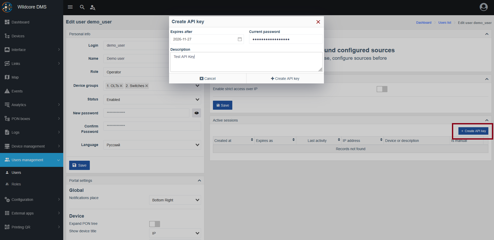

# API-Key Generation

!!! abstract "Overview"
    This page provides an overview of the **API-Key generation** functionality through the Web-Interface.

    In case you need an API-Key (for example for integration with other services, such as billing) they are easy to issue and revoke through the Web-Interface.

## Creating an API-Key

To do this you have two options:

1. For administrators:

      - Navigate to `Users management > Users` and click `Edit` next to the appropriate user entry.
      

2. For users:

      - Navigate to your `Account settings` page.

Then:

- In the `Active sessions` panel, find the `Create API key` button and click it.
- Fill out the form, choosing the `Expiry date` and `Description`, as well as entering your password for confirmation.
- Click `Create API key`.

??? quote "Visual aid"
    