!!! abstract "Overview"
    This page provides description for **Dashboard**, it's **Widgets** and their functionalities.

    Feel free to use the right side menu to jump to the section, that you're interested in.

## Dashboard

This is the **Dashboard** view, which greets you after you sign in and can be found at the top of the left-side menu.

It follows the Responsive Design approach, and it's contents may vary, depending on the screen size of your device.

??? info "Desktop view"

    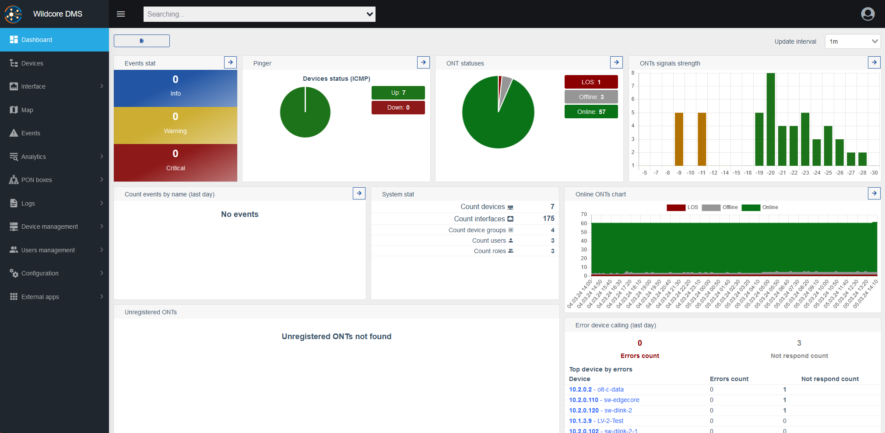

??? info "Mobile view"

    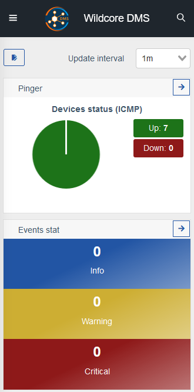

The **Dashboard** provides **Widgets**, which contain various information about the devices you have.

Additionally, it has a button on the left, and a drop-down selector on the right.

| Appearance | Description |
| ---------- | ----------- |
| 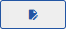 | Toggles Dashboard **Edit Mode**. |
| 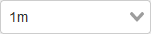 | Allows you to select an Update Interval for your **Widgets**. |

## Dashboard Edit Mode

This toggle allows you to enable and disable the **Edit Mode**.

By default, edits to the layout of the **Dashboard** are saved only for the current user.

The **Dashboard** displays **Widgets** on the **Permissions** basis. Thus, users without proper permissions will not be able to see or use a specific widget, and an empty space will be shown in its place. Edit mode allows the user to manually change the layout of their Dashboard to maximize its efficiency.

When it's enabled, additional interface elements appear.

| Appearance | Description |
| ---------- | ----------- |
| 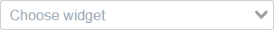 | Adds the chosen widget to the Dashboard. |
|  | Allows you to overwrite the custom layouts of all users to your current. |
|  | Allows you to move widgets. This type of cursor is displayed when you hover over a widget. |
| 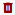 | Deletes the widget it was pressed on. |
|  | Allows you to resize widgets. Can be found in the lower right corner of a widget. |

## Widgets Overview

!!! note
    This section provides a description for every type of widget a Dashboard can have.

    Feel free to navigate to the one you are interested in, using right-side menu.

### Pinger

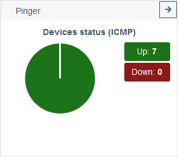

Provides a brief summary of statuses of all the devices.

It checks host availability through `ICMP` and displays their color-coded statuses.

!!! note
    In case there was no answer through `ICMP`, it also checks through `TCP` (ports `22`, `23`, `80`). This can be the reason of notifications about connection attempts from unknow login (anonymous or unknown).

    In case the host is unavailable, it's polling will not be performed neither in background, nor through the web interface.

| Status | Description |
| ------ | ----------- |
| Up | Host is available. |
| Down | Host is offline. |

### ONT statuses

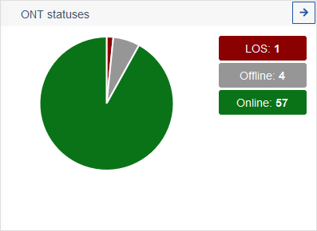

This pie chart lists your ONT devices' statuses.

| Status | Description |
| -- | ---- |
| LOS | Stands for Loss of Signal, and indicates that a device could have a problem with it's optic cables. |
| Online | ONU is online and functioning. |
| Offline | ONU is offline or has problems. |

### Events stat (by severity)

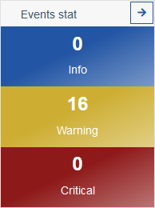

Provides a quick overview of devices' events.

| Status | Description |
| -- | ---- |
| Info | There was an event that might require your attention. |
| Warning | There was an event that requires your attention. |
| Critical | There was a critical event that requires your attention, possibly a malfunction. |

### Events count (by name)

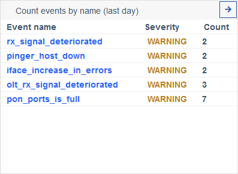

Provides a more detailed overview of events.

### Events table

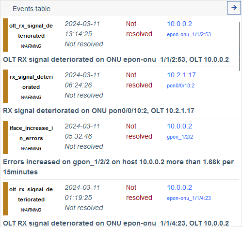

Provides a very detailed table view of events.

### Last user activity

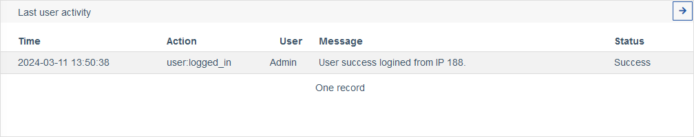

Provides a log of user activities, such as logging in, logging out, etc.

### Unregistered ONTs

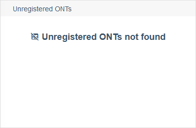

Provides a list of all unregistered ONTs you may have.

### System stat

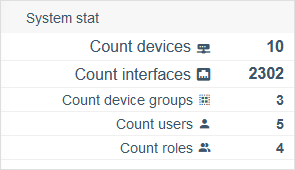

Provides on overview of system statistics.

| Name | Description |
| -- | ---- |
| Count devices | The amount of devices your system has. |
| Count interfaces | The amount of intefaces your system has. |
| Count device groups | The amount of device groups your system has. |
| Count users | The amount of registered users your system has. |
| Count roles | The amount of different roles your system has. |

### Error device calling (last day)

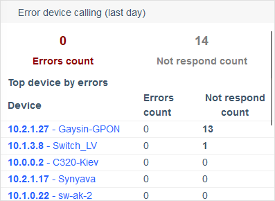

Provides a table view of the devices, that had errors or couldn't be polled in the last day.

### Online devices

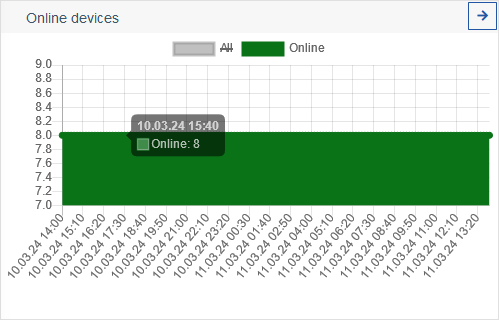

Provides a chart of changes in online device count with time.

### Online ONTs chart

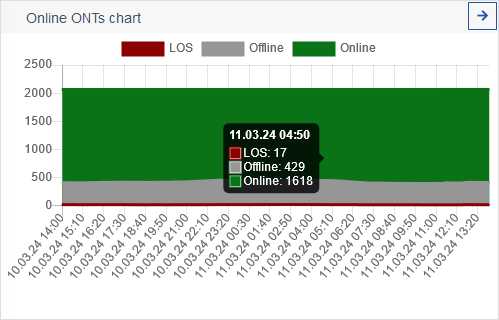

Provides a chart of changes in ONTs statuses with time.

### ONTs signal strength

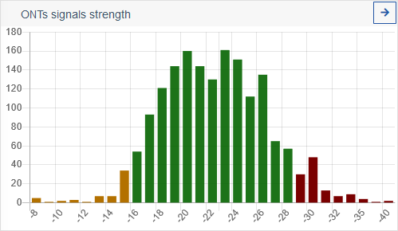

Provides a graph of ONTs' signals strength.