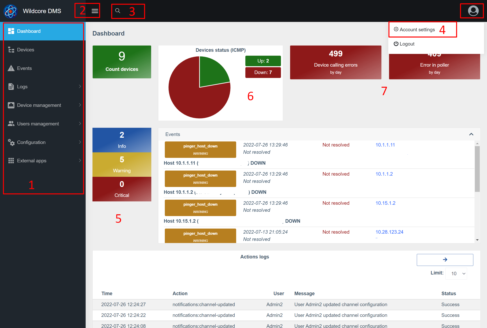
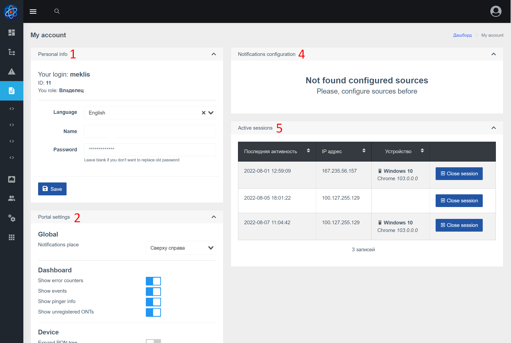

The web interface is a SPA application([wiki](https://ru.wikipedia.org/wiki/%D0%9E%D0%B4%D0%BD%D0%BE%D1%81%D1%82%D1%80%D0%B0%D0%BD%D0%B8%D1%87%D0%BD%D0%BE%D0%B5_%D0%BF%D1%80%D0%B8%D0%BB%D0%BE%D0%B6%D0%B5%D0%BD%D0%B8%D0%B5)),
which works Wildcore DMS API.

## Description of basic elements
### Login page

### Basic elements, dashboard

1. Menu block
2. Menu button
3. Global search (allows you to search for devices, interfaces, ONU)
4. Account settings (change name, password, language, contacts, etc.)
5. Block of events
6. Block pinger
7. Assembly Error Block / Dealing with Errors

### Device dashboard

1. Device group (name and description)
2. Number of devices (online/total)
3. Number of interfaces (online/total)
4. Display control buttons (expand all groups / hide all groups / reload the list from the server)
5. Device filter (stored in the browser)
6. Device name
7. Number of interfaces (online/offline/total)
8. Icon indicating that the device is offline (if the icon is gray, there is no status data yet)

### Account settings

1. Basic account information
2. Portal settings (allows you to configure some settings via the web interface)
3. Save button
4. Setting up notifications (displayed if the notifications component is present). Allows you to add contacts and configure notification settings.
5. Block sessions. Allows you to see your active sessions, where you logged in from, from which device and when you last used it.

