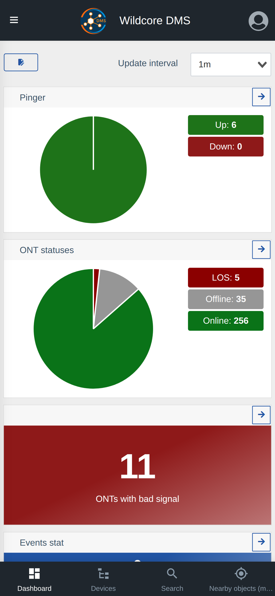

!!! abstract "Overview"
    This page describes the **updated bottom navigation** for mobile devices: how to enable it, how to configure the set of buttons, and how to use it.

    Use the **Contents** menu on the right to jump to the section you need.

## What it is

The **bottom navigation** is a quick-access bar pinned to the bottom of the screen on mobile devices. It holds up to **4 buttons** that you choose yourself: pages from the main menu (for example, **Dashboard** or **Devices list**) and search actions (**Search**, **Search by** and **Objects nearby**).

The configuration is personal — each user builds their own set of buttons. It is stored in the account settings and applies across all of your devices.

??? info "Mobile view"

    

## How to enable and configure

The settings live in **Account settings** → the **Bottom navigation** card.

1. Turn on the **"Show the updated mobile navigation"** switch — without it the bar does not appear.
2. Build the list of buttons (up to **4**):
    - **Left toggle** in a row — temporarily enables/disables the button without removing it from the list.
    - **Dropdown** — chooses what the button does (a menu page or a search action).
    - **Arrows ↑ / ↓** — change the order of the buttons (they appear in the bar in exactly this order).
    - **Trash icon** — removes the button from the list.
3. The **"Create"** button adds a new row (while there are fewer than 4 buttons and unused items remain).
4. The **"Reset"** button restores the default set: **Dashboard**, **Devices list**, **Search**, **Objects nearby**.
5. Press **"Save"** to apply the changes.

!!! note "What you can add"
    The list only offers **pages you have access to** (based on permissions and enabled components). The **"Search by"** action appears only when that search is enabled. The **"Objects nearby"** action opens a quick nearby-search window — see the [Objects nearby](./nearby-objects.md) page for details.

## How to use it

After saving, the bar appears at the bottom of the screen on a mobile device. Tap a button to jump straight to a page or open the corresponding search action. If you need a different set of buttons, return to **Account settings** and edit the list at any time.
