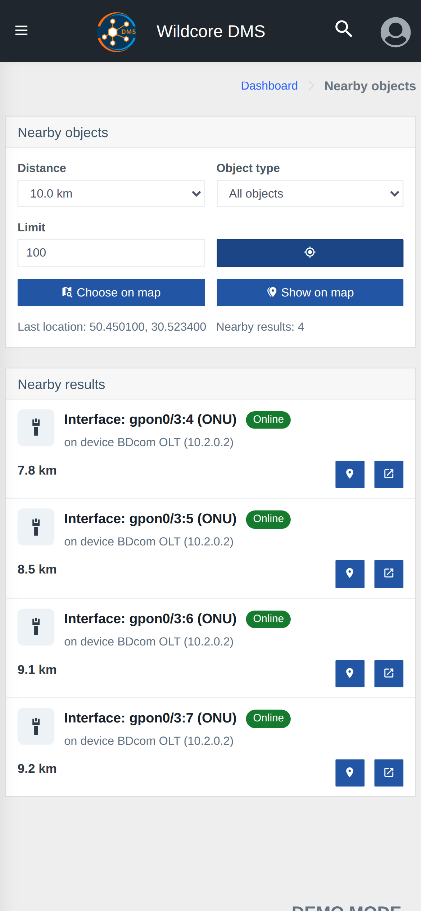

!!! abstract "Overview"
    This page describes the **Objects nearby** feature — finding devices and ONUs near a chosen point, with results shown as a list and on the map, plus directions.

    Use the **Contents** menu on the right to jump to the section you need.

## What it is

**Objects nearby** helps you quickly find the infrastructure around a given point — for example, when you are on site and want to see which devices, ONUs or boxes are located close by. Results are shown as a list with the distance to each object and can be opened on the map with directions.

The feature is available in two ways:

- **A dedicated page** — the **"Objects nearby"** menu item;
- **A quick window** — the **"Objects nearby"** button in the [bottom navigation](./mobile-navigation.md) on a mobile device.

??? info "Page view"

    

## Choosing the search point

The search center can be set in one of these ways:

| Action | Description |
| --- | --- |
|  | **Use my location** — determines the current coordinates via the device's geolocation. Tapping again refreshes the location. |
|  | **Choose on map** — opens a map where you can set the search point manually. |

The last used location is remembered, so the search is ready to go next time.

## Filters

| Filter | Description |
| --- | --- |
| **Distance** | Search radius around the point: from 100 m to 10 km. |
| **Object type** | What to look for: all objects, devices, interfaces or boxes. For interfaces you can additionally pick **ONU**. |
| **Limit** | Maximum number of results (1–500, default 100). |

The selected filters are remembered between sessions.

## Results

Found objects are shown as a list sorted by distance. For each one you see:

- the object's icon and name, plus a **status** (online/offline) for devices;
- additional details (if available) and the **distance** to the search point;
- a **"Show on map"** button and an **"Open object"** button (opens the object's dashboard).

## Map view and directions

The **"Show on map"** button opens all found objects on the map. For every object that has coordinates you can get directions:

- **Directions in Google Maps**;
- **Directions in Apple Maps**.

!!! note "Object coordinates"
    Only objects that have coordinates set are included in the results. If a device or ONU you expect does not appear, check that its coordinates are set on the corresponding dashboard.
