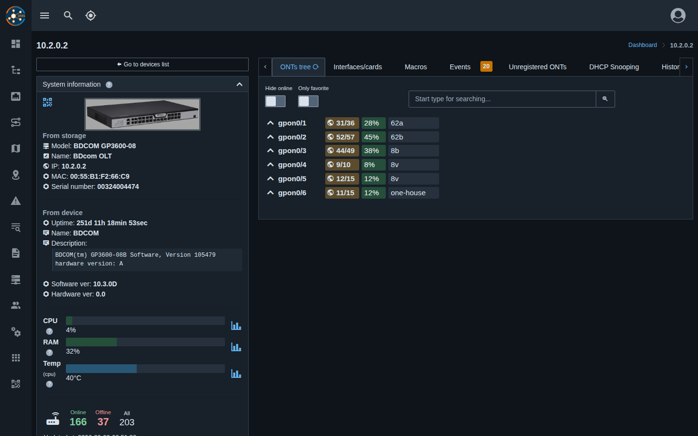
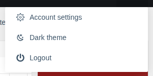
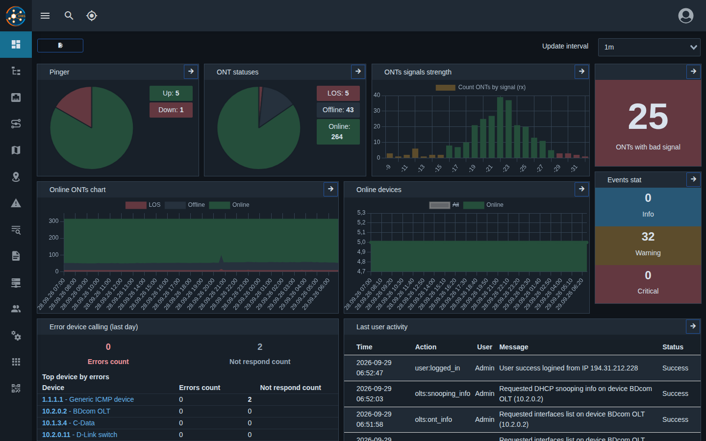

# Dark theme and hints

!!! abstract "Overview"

    Starting with version **0.31** the web panel has a **dark theme** and **field hints** on device,
    OLT and ONU cards.

## Dark theme

### How to enable

1. Click the profile icon in the top right corner.
2. Choose **"Dark theme"** (in the dark theme the item is called **"Light theme"** — to switch back).

The switch is available in the mobile layout too.

### How it works

- Two themes are available — **light** (default) and **dark**.
- The choice is **remembered in the browser** on this device: on another computer or phone the
  theme has to be chosen separately. It's not saved in the account settings.
- The theme is applied instantly in all open tabs and is set before the page loads — no light
  "flash".
- Tables, date pickers, topology, map, console, logs, port and cable diagnostics blocks, ONU
  statuses, charts and dashboard widgets are adapted for the dark theme.

## Field hints

Next to card and field names on device, OLT and ONU pages there is a **"?"** icon. Hover over it
(tap on a phone) to see an explanation: what the value means, its units and where it comes from.

To hide the icons, turn on **"Disable tooltips"** in
[Account settings](./user-settings-overview.md) → "Portal settings" → "Global".
The setting is saved in the account.
