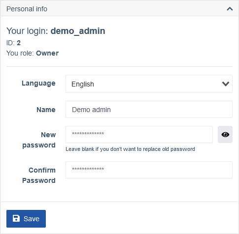
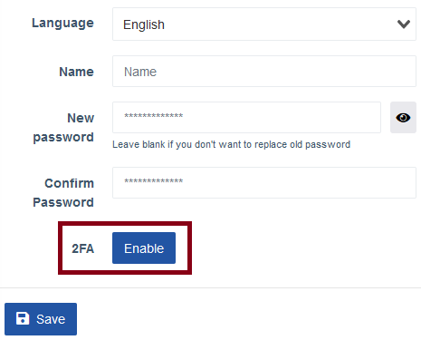
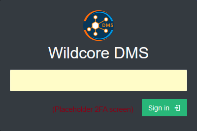
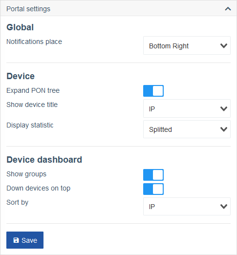
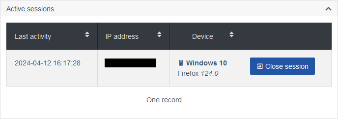

!!! abstract "Overview"
    This page provides description for the **User Settings** screen.

    Feel free to use the right side menu to jump to the section, that you're interested in.

!!! note
    Some settings may be not effective immediately and a page reload is required.

## Personal Info
This section gives an overview of the current user's Login and Role and allows you to change them, as well as your password and system display language.

| Field | Description |
| ----- | ----------- |
| Your login | The login name of the current user. |
| ID | ID of the current user. |
| Your role | The current role assigned to the current user. |
| Language | Allows you to select the system wide display language for this user. |
| Name | Allows you to change the display name for the current user. |
| New password | Allows you to change the password for the current user. |
| Confirm password | Required field in case you want to change the password. |
| 2FA | Allows you to protect your account with a Two-Factor Authentication app. |

### How to set up and use 2FA
1. Click on the **Enable** button next to **2FA**.

    

2. A pop-up window with instructions appears.

    

    Download the [Google Authenthicator](https://play.google.com/store/apps/details?id=com.google.android.apps.authenticator2) app from Play Store and add a new authentication code generator. You can scan the QR code or enter the generated code shown below it manually.

3. Once you have it added, a new PIN code will be generated on your device every 30 seconds. Enter it into the **PIN code** field below the QR code and press submit.

    If the code you entered is valid, a success notification will appear.

    

    

    If you encounter a Pin-code is wrong message, make sure you entered the generator code and the 6-digit code it generated correctly and in time. Once the previous code expires and a new one is generated, it is no longer valid.

4. Now, when you log in with your credentials correctly you will be asked to provide the 2FA code as well.

    

    When 2FA is enabled you can no longer sign in without it. 
    
    **Be sure to make a secure copy of the code that was used to add the code generator.**

## Portal Settings
This section provides settings related to various display features.

### Global
| Field | Description |
| ----- | ----------- |
| Notifications place | Allows you to change where the notifications will appear for this user. |

### Device
| Field | Description |
| ----- | ----------- |
| Expand PON tree | Toggles whether PON tree is exanded by default. |
| Show device title | Allows you to change the device display title. |
| Display statistic | Allows you to change the display type of the stastics. |

### Device dashboard
| Field | Description |
| ----- | ----------- |
| Show groups | Toggles whether devices are shown or hidden in groups. |
| Down devices on top | Toggles the display of the offline devices on top of others. |
| Sort by | Allows you to change sorting type. |

## Notifications configuration

## Strict access
This section provides access-related settings.

| Field | Description |
| ----- | ----------- |
| Enable strict access over IP | Allows you to restrict the IPs from which this user can be logged in. |

## Active sessions
This section displays the current active sessions for this user, when they were active last time, their IP address and the device type they are logged in from, as well as allows you to terminate active sessions manually.

