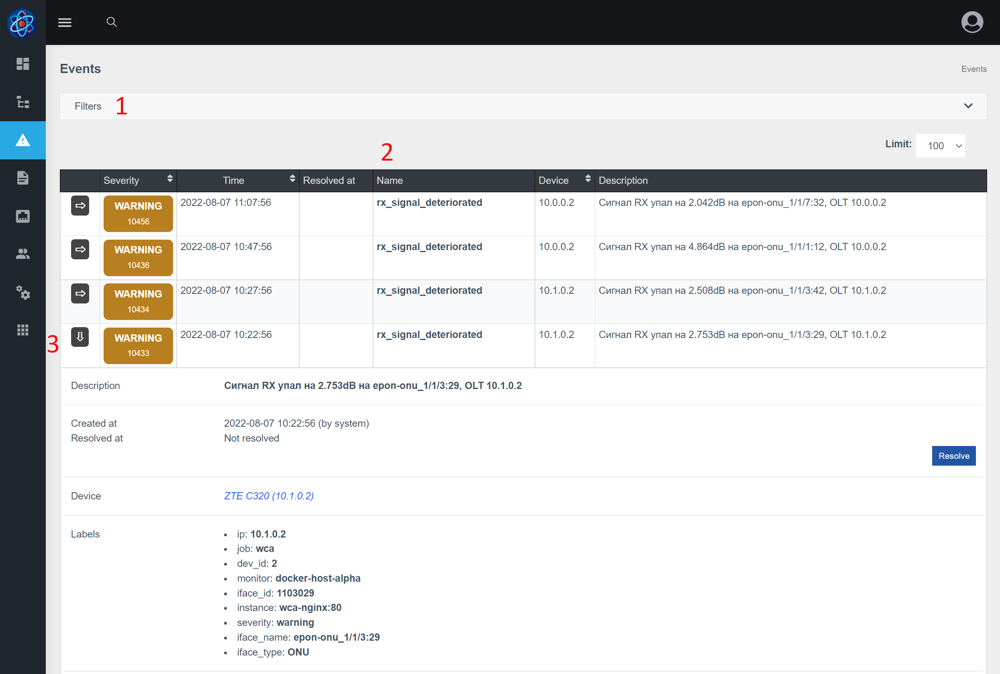
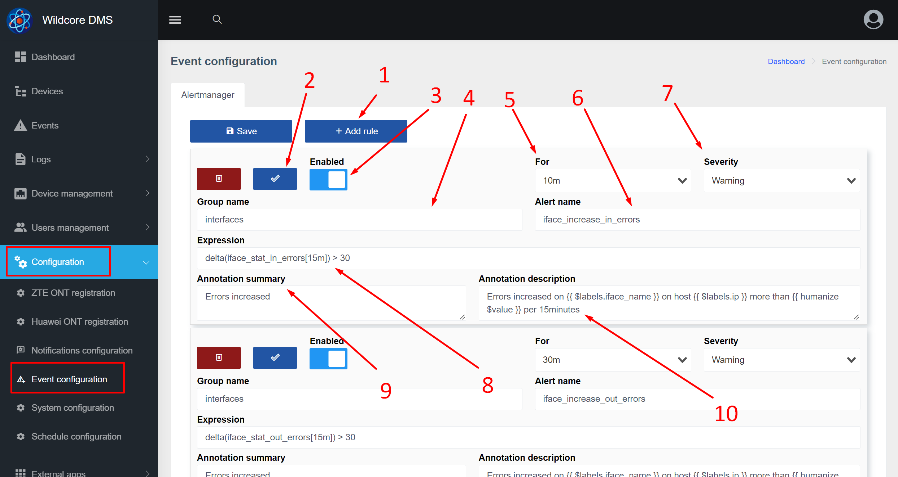

# События (events)
### О Компоненте 
Компонент **Events (events)** получает уведомления от alertmanager и поллера, сохраняет уведомление в истории и по возможности привязывает к оборудованию.     

События имеют следующие ключевые поля:    

* Важность(severity)
* Имя
* Дату начала события
* Дату закрытия(завершения) события
* Текстовое описание события 

Событие отличается от действий тем, что имеет важность, а так же время завершения события.     
Компонент не имеет зависимостей.     

### Отображение в веб-интерфейсе  
 

1. Фильтры, позволяющие отобразить только определенные события
2. Таблица событий
3. Кнопка, что бы развернуть событие и посмотреть более детальную информацию по событию, например labels

### Настройка генерации событий   
Для генерации событий используется [alertmanager](https://prometheus.io/docs/alerting/latest/alertmanager/). В веб-интерфейсе есть страница конфигурации, которая позволяет управлять правилами alertmanager. 

1. Кнопка добавления нового правила
2. Кнопка, позволяющая проверить корректность правила
3. Можно отключить правило, что бы по нему не генерировались события
4. Группа правил (можно почитать здесь - [alertmanager](https://prometheus.io/docs/alerting/latest/alertmanager/)). Обычно, задается какая то логическая группа правил, например правила связанные с интерфейсами относить к группе interfaces.
5. Позволяет указать, как долго условие должно соблюдаться, что бы событие было сгенерировано
6. Имя алерта(фактически - имя события)
7. Уровень важности события
8. Выражение(условие). Для написания выражений используется promQL
9. Аннотация - общее описание алерта без использования лейблов
10. Описание - позволяет указать текст при генерации события. Так же можно использовать значения label для генерации текста. 

Так же есть некоторые системные события которые невозможно настроить(отключить или изменить), так как они генерируются внутренней системой уведомлений, среди таких: 

* падение BGP-сессий
* падение устройств по ICMP   

