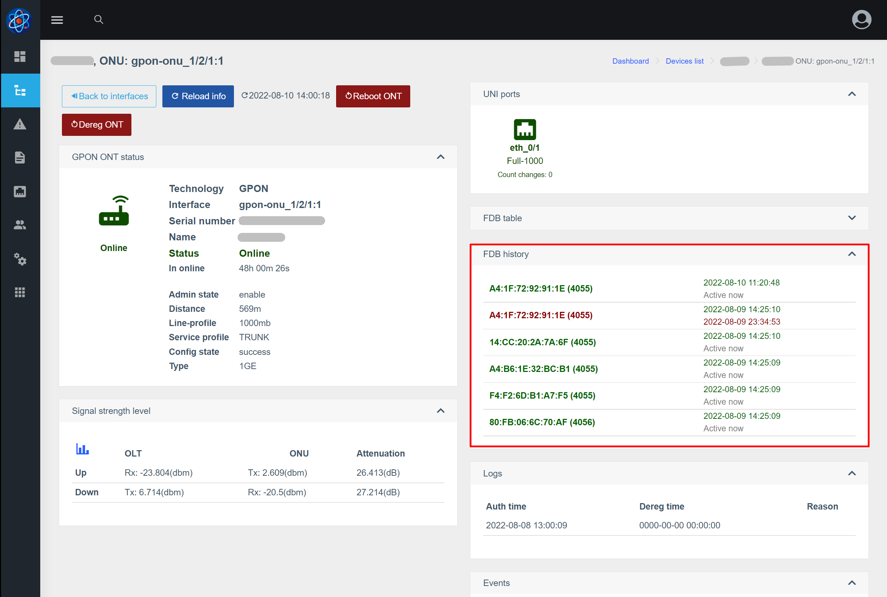

# FDB история
## О Компоненте
Компонент реализует API для получения данных о FDB, получаемых поллером. 

## Отображение в веб-интерфейсе
История отображается в устройствах (по интерфейсу/по ОНУ)    

