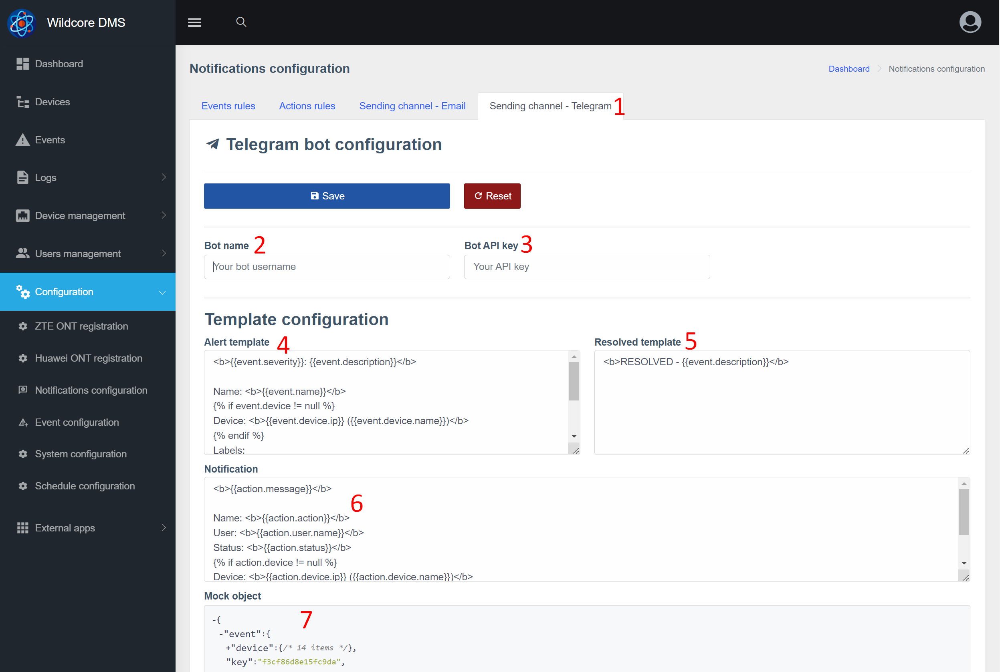
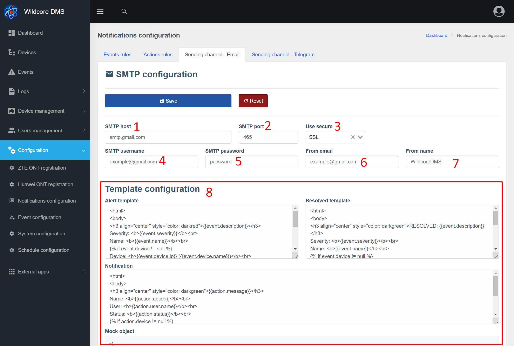
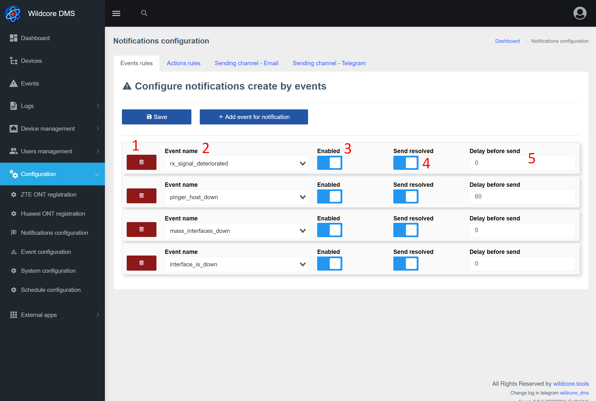
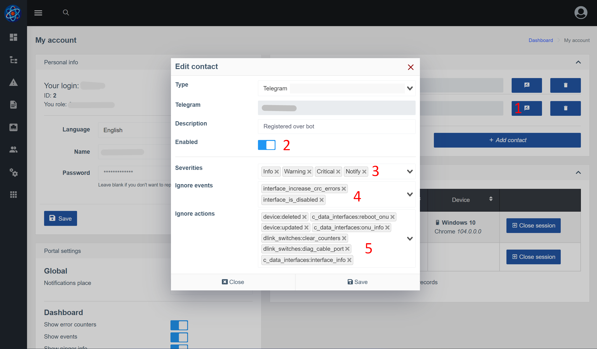

# Уведомления (notifications)
## О Компоненте
Компонент **Notifications** позволяет отправлять индивидуальные уведомления пользователям системы через Telegram и Email.    
Уведомления могут быть двух типов - события(Events) и уведомления(логи действий в системе).       


Одной из особенностей данного компонента является возможность отправки уведомлений конкретному пользователю(а не в группу).         
Так же пользователь может настроить какие именно уведомления и через какой канал(Email/Telegram) должны приходить.     

### Общая схема взаимодействия


Примечания:       

* События имеют две даты - начала и завершения(alert и resolved)   
* Действия(уведомления) имеют одну дату - время совершения действия.      

По этой причине они разделяются по разным группам и имеют разные настройки.     

## Уведомления в веб-интерфейсе 
### Настройка канала отправки - Telegram


1. Выбор вкладки
2. Имя бота - здесь нужно ввести имя вашего бота, который вводили при регистрации в [@BotFather](https://t.me/BotFather)
3. API ключ - полученный ключ от @BotFather
4. Шаблон alert(создание события)*
5. Шаблон resolved(завершение события)*
6. Шаблон notification(действия)*
7. Пример объекта, генерируемого для уведомления. В случае, если это действие(уведомление), параметр event = null. В случае, если это событие - action = null.
   Эти переменные можно использовать для генерации текста уведомлений.

_*Используется шаблонизатор [twig](https://twig.symfony.com/)_

### Настройка канала отправки - Email


1. Адрес вашего SMTP сервера(IP или домен)
2. Порт SMTP
3. Какое шифрование использовать(обычно от вида шифрования так же зависит порт)
4. Ваше имя пользователя для авторизации на SMTP-сервере. Обычно это ваш email
5. Пароль для авторизации на SMTP-сервере
6. От какого email производить отправку(заголовок From в теле email). Обычно это ваш email  
7. Какое имя указать при отправке (заголовок From)
8. Настройка шаблонов (более детальное описание в блоке с телеграм)


### Настройка правил для отправки по действиям(уведомления) <a id="action_rules_conf"></a>
На странице настройки действий для отправки, можно указать по каким действиям нужно генерировать уведомление.    
Так же можно добавить некоторые условия, например отправлять только если действие завершилось ошибкой. 


1. Удалить правило
2. Имя действия. Это поле для ввода с подсказкой(система подсказывает на основе уже произошедших действий)
3. Включение/отключение правила 
4. Отправлять, если действие завершилось ошибкой
5. Отправлять, если действие завершилось успешно

### Настройка правил для отправки по событиям <a id="event_rules_conf"></a>


1. Удалить правило
2. Имя события. Это поле для ввода с подсказкой(система подсказывает на основе уже произошедших событий)
3. Включение/отключение правила
4. Генерировать ли уведомление по завершению события. Актуально, например, при создании события о перезагрузке оборудования.   
5. Сколько секунд ожидать перед отправкой уведомления. Если событие завершится раньше - отправка уведомления будет отменена. Этот параметр относится только к уведомлениям по alert, resolved всегда отправляется сразу же.    

### Настройка контактов и правил отправки в аккаунте пользователя <a id="config_contact"></a>


1. Нажмите изменить контакт в настройках аккаунта/изменение пользователя, что бы получить попап-окно с настройкой контакта
2. Можно отключить контакт, если какое то время не хотите получать уведомлений
3. По каким уровням отправлять уведомления через этот контакт. Так же к уровням есть _Notify_ - это уведомления(действия)
4. Список событий, которые НЕ отправлять через этот контакт
5. Список действий, которые НЕ отправлять через этот контакт 


## Настройка уведомлений через телеграм
### Настройка канала
1. Зайдите в настройки канала отправки телеграм
2. Укажите имя бота, ключ и сохраните
3. Выполните перезапуск бота командой ```wca supervisor:control telegram-bot restart``` (что бы обработчик входящих сообщений получил новые настройки)

### Добавление контактов
1. Перейдите в настройки аккаунта/изменение пользователя и добавьте номер телефона, который используется в телеграм.  
   
2. После добавления контакта - перейдите в ваш бот и отправьте /start или любое другое сообщение. 
В ответ бот должен запросить передачу контактного номера. После передачи контактного номера бот должен ответить следующее: 
   
3. Перезагрузите страницу с настройками аккаунта - должен появится новый контакт с типом Telegram. 

**Отправка уведомлений через телеграм настроена!**     
Далее, вы можете более тонко настроить [какие уведомления хотите получать по этому контакту](#config_contact), 
[какие события](#event_rules_conf) и [какие действия](#action_rules_conf)

