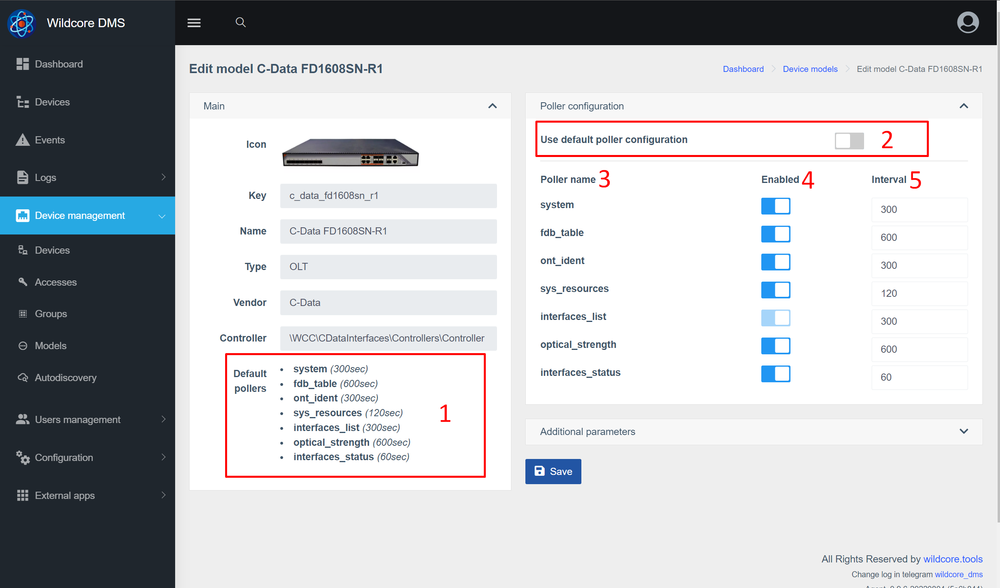

# Опросчик оборудования (poller)
Опросчик оборудования работает в фоне и собирает некоторую информацию с оборудования.       
По-умолчанию работает 10 экземпляров сборщика. Это означает что одновременно данные могут быть собраны с 10 разных устройств.   

## Для чего нужен?
Данные, полученые с оборудования опросчиком используются для: 

* Актуализации кешей - для более быстрой загрузки страницы
* Сбора исторических данных - например, построение графиков сигнала
* Генерации событий и уведомлений на их основе
* Отправки метрик в Prometheus 

## Список поллеров
* **arp_table** - ARP таблица
* **bgp_sessions** - список BGP сессий
* **counters** - счетчики с интерфейсов(ошибки, трафик)
* **fdb_table** - FDB-таблица
* **interfaces_list** - список интерфейсов с их именами и описанием
* **interfaces_status** - админ-статус/текущее состояние
* **ont_ident** - идентификаторы ОНУ (серийные номера/MAC-адреса)
* **optical_strength** - уровни сигнала с ону (RX,TX,OLT-RX,расстояние до ОНУ,температура)
* **system** - в данный момент собирается только аптайм устройства
* **sys_resources** - утилизация CPU/утилизация памяти

## Настройка опросчика
### Изменение интервалов опроса и поллеров по модели устройства
В системе есть возможность изменить интервалы опроса(в секундах), а так же отключить некоторые опросчики.  

1. Дефолтные настройки поллеров
2. Отключите этот параметр, что бы изменить поллеры
3. Имя поллера
4. Включить/отключить поллер
5. Интервал в секундах

После изменений сохраните изменения в системе. 

### Изменение интервалов опроса и поллеров по устройству
Так же есть возможность переписать настройки поллеров для конкретного устройства. Имеет смысл, к примеру, если у вас есть несколько олт с небольшим количеством ОНУ, и один, этой же модели, "забитый" под завязку. 

Настройка блока поллеров аналогична настройке по модели устройства.

### Исключение сбора данных по определенным портам 
Изменение затрагивает сохранение данных по поллерам: 

* counters
* interfaces_status(для некоторых моделей)
* optical_strength

1. ID интерфейсов в системе 
2. Имя интерфейса
3. Включение/отключение сохранения метрик по интерфейсу   

_Стоит учитывать, что отключение портов влияет только на сохранение метрик, но не на их сбор с оборудования(фактически сбор происходит со всех интерфесов в любом случае)_ 

### Изменение количества экземпляров работающих опросчиков
Вы можете указать необходимое количество работающих экземпляров через параметр **POLLER_COUNT_PROCS** (в файле /opt/wildcore-dms/.env или же через веб-интерфейс, в настройках системы).     
     
Количество экземпляров имеет смысл увеличивать, если вы заметили, что интервал сбора данных с оборудования на много больше указанного интервала по модели/устройству.    
        
Рекомендации по установке максимального значения количества экземпляров: 

* _На основе RAM:_ (всего памяти - 3,5Gb) / 0,25Gb = макс количество
* _На основе CPU:_ 2,5 * количество ядер = макс количество 
 

### Отключение попыток сбора с недоступного оборудования
Если параметр **POLLER_IGNORE_DOWN** с установленным значением _true_ - перед началом работы с оборудованием будет проверяться его доступность по ICMP.  
