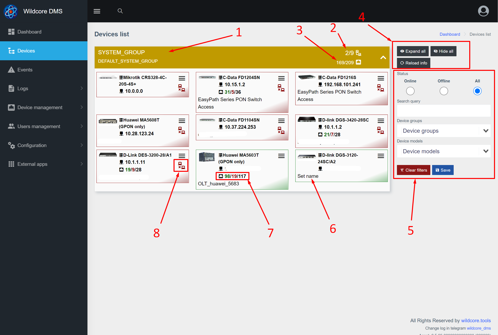

Веб-интерфейс представляет собой SPA-приложение([wiki](https://ru.wikipedia.org/wiki/%D0%9E%D0%B4%D0%BD%D0%BE%D1%81%D1%82%D1%80%D0%B0%D0%BD%D0%B8%D1%87%D0%BD%D0%BE%D0%B5_%D0%BF%D1%80%D0%B8%D0%BB%D0%BE%D0%B6%D0%B5%D0%BD%D0%B8%D0%B5)), 
которое работает Wildcore DMS API.    

## Описание базовых элементов 
### Страница входа 

### Базовые элементы, дашборд

1. Блок меню 
2. Кнопка меню 
3. Глобальный поиск (позволяет производить поиск устройств, интерфейсов, ОНУ)
4. Настройки аккаунта (изменить имя, пароль, язык, контакты и т.п.)
5. Блок событий
6. Блок пингера
7. Блок ошибок сборщика/работы с ошибками   

### Дашборд устройств

1. Группа устройств (имя и описание)
2. Количество устройств (онлайн/всего)
3. Количество интерфейсов (онлайн/всего)
4. Кнопки управления отображением (раскрыть все группы/скрыть все группы/перезагрузить список с сервера)
5. Фильтр устройств(сохраняется в браузере)
6. Имя устройства
7. Количество интерфейсов(онлайн/офлайн/всего)
8. Иконка, отображающая, что устройство офлайн(если иконка серого цвета - данных по состоянию еще нету)

### Настройки аккаунта

1. Основная информация по аккаунту
2. Настройки портала (позволяет настроить некоторые параметры по веб-интерфейсу)
3. Кнопка сохранить
4. Настройка уведомлений (отображается при наличии компонента notifications). Позволяет добавить контакты и настроить параметры уведомлений. 
5. Блок сессий. Позволяет посмотреть свои активные сессии, откуда производился вход, с какого устройства и когда последний раз пользовались.   
