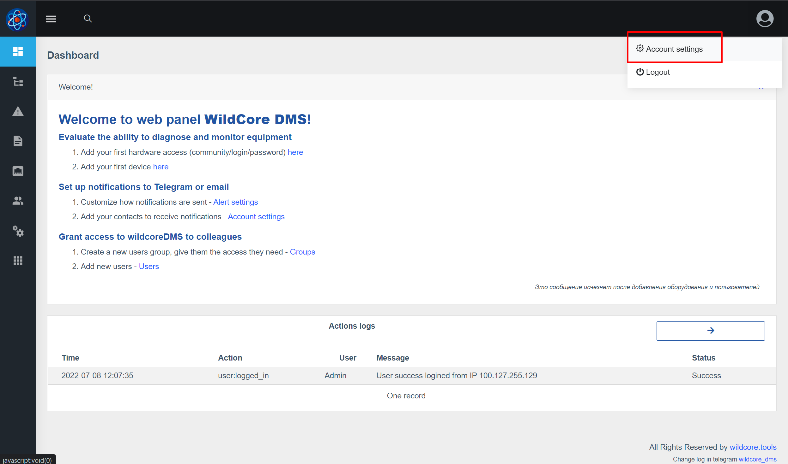

## Вхід до веб-інтерфейсу
**http://ВАШ_IP_СЕРВЕРА:8088**

Введіть логін/пароль за замовчуванням - **admin/admin**    
Після успішного входу ви будете перенаправлені на головну сторінку

## Налаштування свого акаунту
**Встановіть необхідну мову і змініть стандартний пароль для входу**
     

## Додавання доступів до обладнання

## Додавання першого пристрою

Після додавання пристрою - він почне відображатися у "Пристроях" і на нього можна буде перейти
