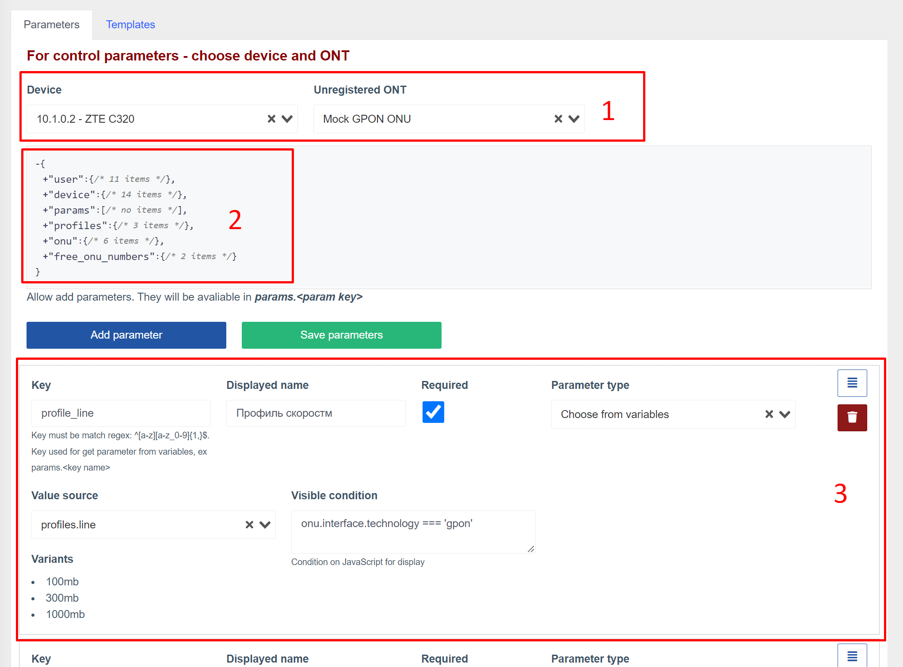
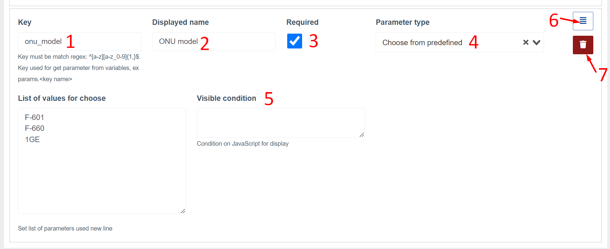
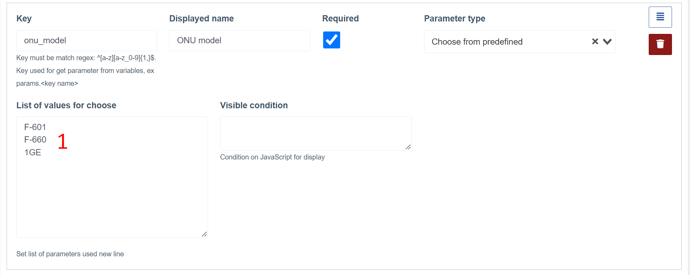
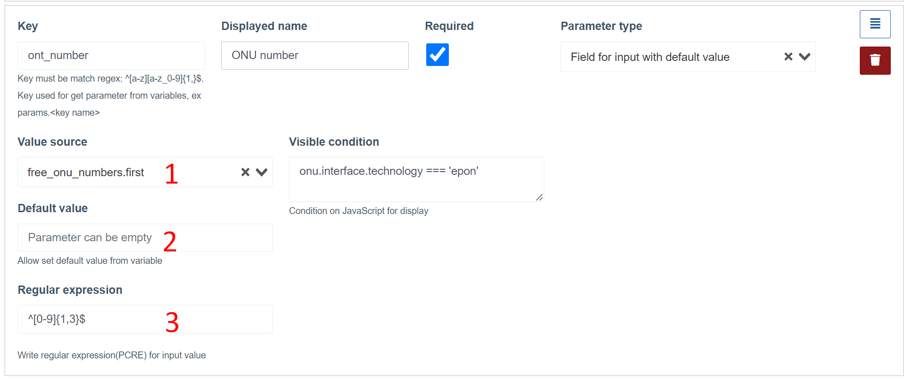
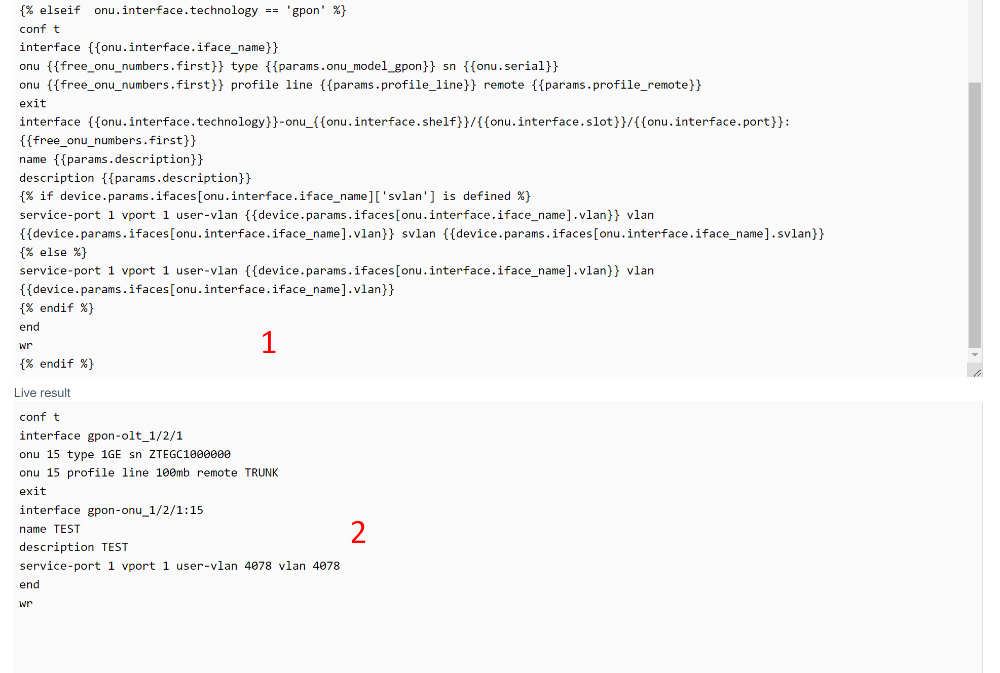

# Регистрация ОНУ на OLTs ZTE
Данный компонент проверяет наличие незарегистрированных ОНУ на ОЛТах ZTE.    
Также позволяет производить регистрацию новых/незарегистрированных ОНУ заполнив небольшую форму.

## Как это работает?
После обнаружения незарегистрированной ОНУ - она начинает отображаться в списке (на дашборде, по всем устройствам и в самом устройстве).    
При нажатии кнопки "Зарегистрировать" - открывается форма регистрации.      
Поля формы для заполнения генерируются динамически на основе созданных параметров.     
После заполнения полей формы и нажатия кнопки зарегистрировать - компилируется список команд для регистрации ОНУ на основе шаблона, введенных параметров и полученных параметров с устройства и незарегистрированной ОНУ.     
Если компиляция шаблона успешна - команды выполнятся на ОЛТ.
При успешной регистрации - отобразится уведомление об успешной регистрации и автоматически переадресует на новую ОНУ.

### Примечания

* Весь консольный вывод по регистрации можно посмотреть в логах вызова оборудования (модуль multi_console_command), как для успешной регистрации, так и при ошибке;
* В случае ошибки на какой то из команд - выполнение команд будет приостановлено.    
  Выполнение может быть приостановлено уже после введенной команды на регистрацию ОНУ.      
  В этом случае необходимо найти ОНУ, под каким номером она зарегистрировалась и донастроить вручную уже на ОЛТе(или же удалить её и попробовать провести регистрацию заново);
* Для генерации шаблона используется [twig](https://twig.symfony.com/). Воспользуйтесь официальной документацией к шаблонизатору, что бы узнать какие возможности есть. Например, могут пригодится ветвления(if-else);
* Если у вас есть какие то уникальные параметры на каждом отдельном ОЛТ - вы можете указать их в дополнительных параметрах устройства и использовать их в шаблоне или параметрах. Частой практикой является указание пользовательских вланов(для отдельных портов или всего устройства). Такие параметры будут доступны в объекте `device.params`

## Компонент в веб-интерфейсе
### Регистрация незарегистрированной ОНУ
**Список незарегистрированных ОНУ на устройстве**

**Форма регистрации ОНУ**

### Конфигурация регистрации
**Страница конфигурации**

**Вкладка настройки параметров**

1. Блок выбора устройства и ОНУ. В списке устройств отображаются только ОЛТ ZTE. Нужно выбрать устройство и незарегистрированную ОНУ, что бы получить список динамических параметров.
2. Переменные, доступные после выбора устройства и ОНУ, которые можно использовать в настройках полей формы регистрации
3. Поле формы регистрации

**Вкладка настройки шаблона**

1. Блок выбора устройства и ОНУ. В списке устройств отображаются только ОЛТ ZTE. Нужно выбрать устройство и незарегистрированную ОНУ, что бы получить список динамических параметров.
2. Форма регистрации, подготовленная на [вкладке параметров](#config_params)
3. Переменные, доступные после выбора устройства, ОНУ и заполнения параметров формы, которые можно использовать для составления шаблона
4. Блок изменения шаблона(под шаблоном так же можно просмотреть сгенерированный набор команд)

## Переменные
Переменные представляют из себя вложенные объекты с полями.     
Значение полей объектов генерируется автоматически на основе текущего пользователя, оборудования, на котором находится незарегистрированная ОНУ.

Вы можете использовать эти переменные для генерации шаблона, а так же поведения формы регистрации.

**В корневом объекте содержатся следующие поля**:

* **user** - текущий пользователь в системе
* **device** - устройство, на котором производится регистрация
* **params** - значения введенные в форме регистрации
* **profiles** - список line и remote профайлов полученных с ОЛТ
* **onu** - ОНУ, которая регистрируется
* **free_onu_numbers** - содержит два поля(первая свободная ону) и список всех свободных ону на порту, где находится незарегистрированная ОНУ.

## Параметры формы регистрации
### В системе доступны следующие типы параметров:
* Выбор(выпадашка) из предустановленных значений
* Выбор(выпадашка) из переменных
* Поле для ввода с дефолтным значением из переменной
* Поле для ввода

### Типичный блок конфигурации параметра(на примере тип - выбор из предустановленных значений)

1. **Ключ(key)*** - По имени ключа можно будет получить доступ к значению параметра в шаблоне, который будет доступен по params.ИМЯ_КЛЮЧА. Желательно вводить ключи только на латинице и при необходимости использовать нижние подчеркивания;
2. **Отображаемое имя(displayed name)*** - Имя поля, которое будет отображаться в форме регистрации;
3. **Флаг "обязательное"** - указывает на то, что при регистрации, это поле обязательно должно быть заполнено(или выбрано в случае выпадашки);
4. **Типа параметра(parameter type)*** - Тип параметра. Необходимо выбрать один из перечисленных;
5. **Условие отображения(Visible condition)** - условие на javascript для отображения поля. В зависимости от переменных должно возвращать true или false.
6. **Кнопка сортировки** - зажав кнопку можно перетащить параметр выше/ниже. Это изменит порядок полей в форме регистрации
7. **Кнопка удаления параметра**

_* - обязательное для заполнения_

### Параметры по типам полей
**Выбор из предустановленных параметров**

1. Здесь можно перечислить список вариантов(с новой строки) для выбора при регистрации

**Выбор из переменной**

1. Источник значений(в списке отображаются только массивы содержащие примитивные значения)
2. После выбора - отображается список значений

**Поле для ввода с дефолтным значением из переменной**

1. Источник значения(в списке отображаются только переменные с примитивным типом)
2. Значение по-умолчанию, если переменной нету или пустое
3. Регулярное выражение для вводимого значения

**Поле для ввода с дефолтным значением из переменной**

1. Значение по-умолчанию
2. Регулярное выражение для вводимого значения

## Шаблон команд
Шаблон используется для создания списка команд, выполняемых на ОЛТ при регистрации ОНУ.      
При составлении шаблона вы должны использовать переменные.     
Под блоком шаблона находится еще один блок, который компилирует шаблон и позволяет просмотреть итоговый список команд, который будет выполнен на оборудовании.    
Компиляция итогового списка команд будет работать только при выборе оборудования, ОНУ. Так же рекомендуется заполнить форму.

1. Блок шаблона
2. Блок живого результата(итоговый список команд)

## Рекомендации по настройке регистрации
* Добавьте ОЛТ ZTE
* Добавьте незарегистрированную ОНУ в сети на этом ОЛТе

Это позволит более детально разобраться какие переменные есть и как заполняются
