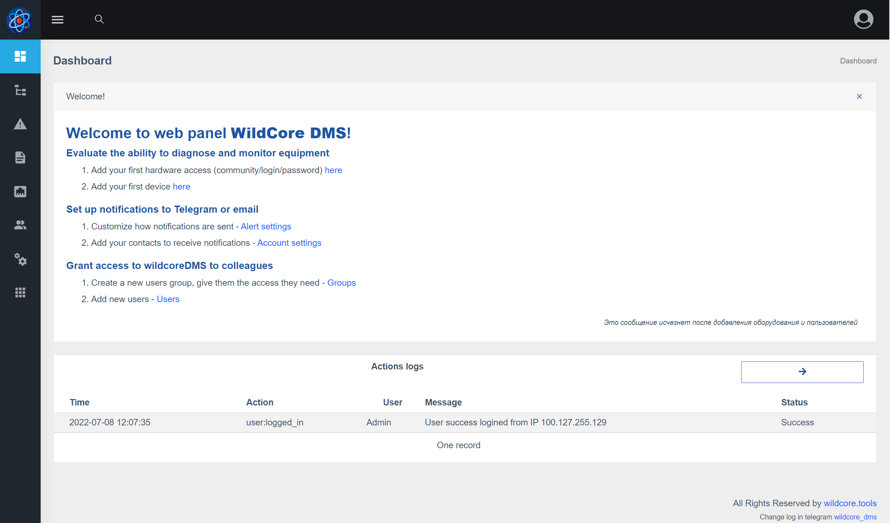
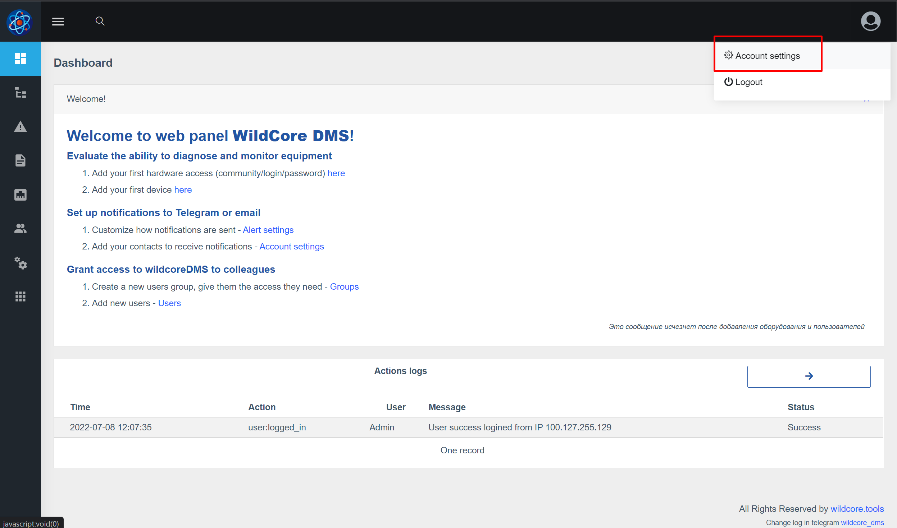
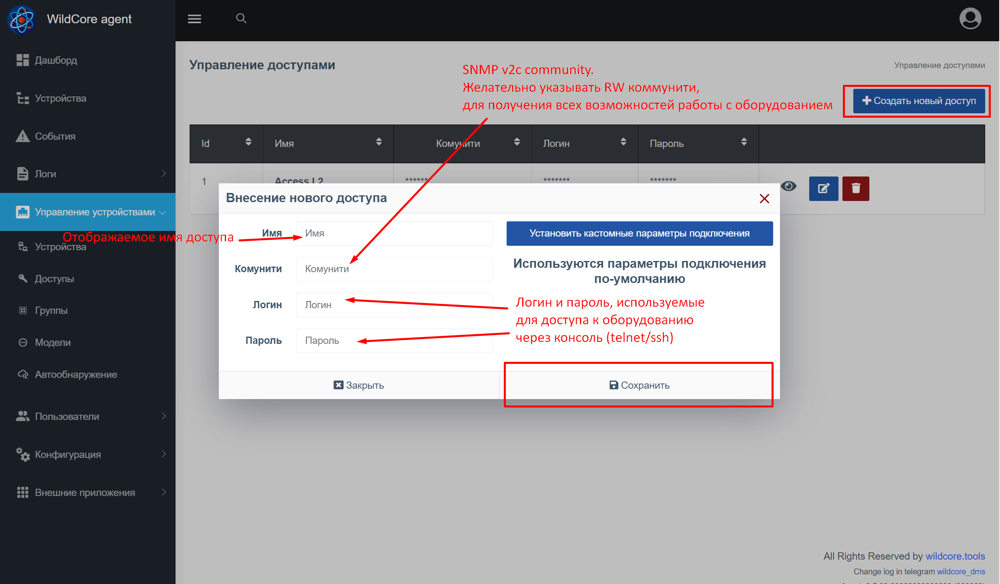
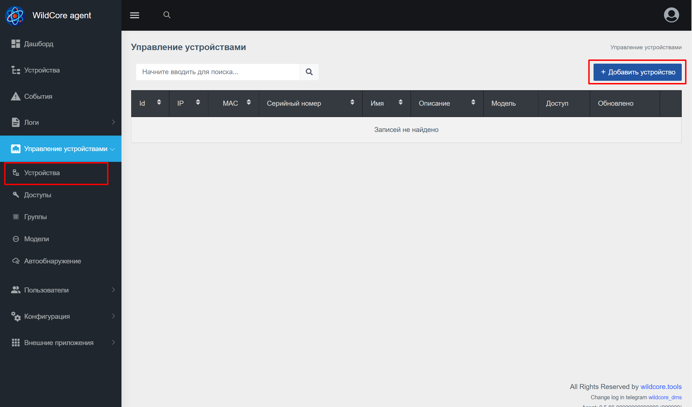
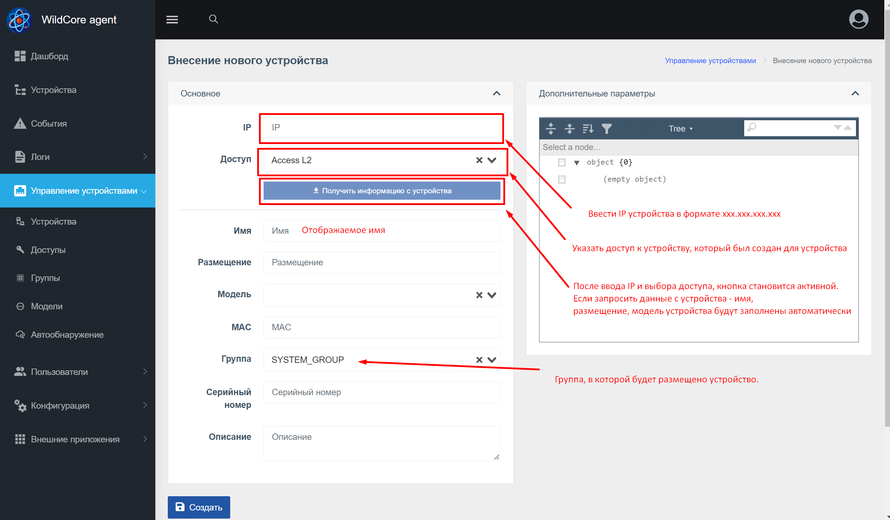

## Вхід до веб-інтерфейсу
**http://ВАШ_IP_СЕРВЕРА:8088**

Введіть логін/пароль за замовчуванням - **admin/admin**
Після успішного входу ви будете перенаправлені на головну сторінку

## Налаштування свого облікового запису
**Встановіть потрібну мову та змініть стандартний пароль для входу**

## Додавання доступу до обладнання

## Додавання першого пристрою

Після додавання пристрою він почне відображатися в "Пристрої" і на нього можна буде перейти

