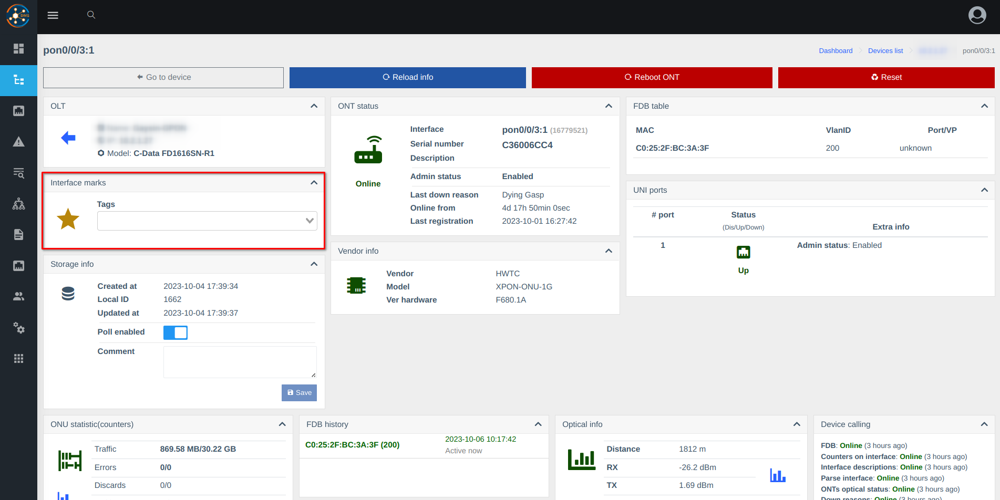
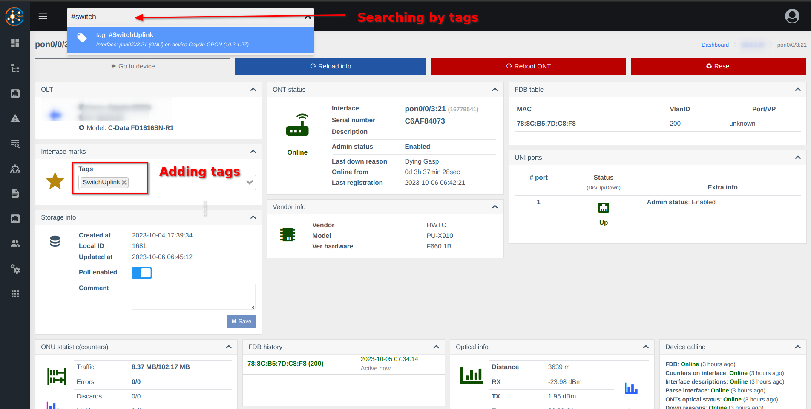
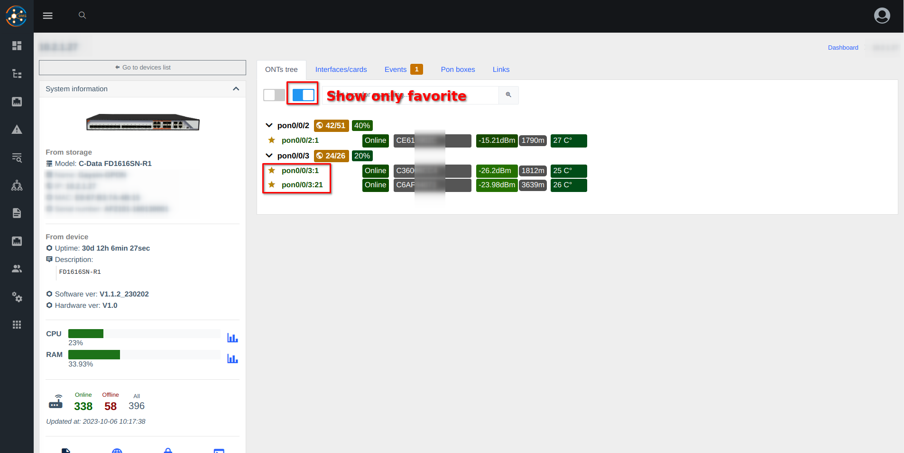
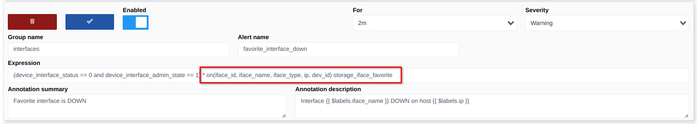
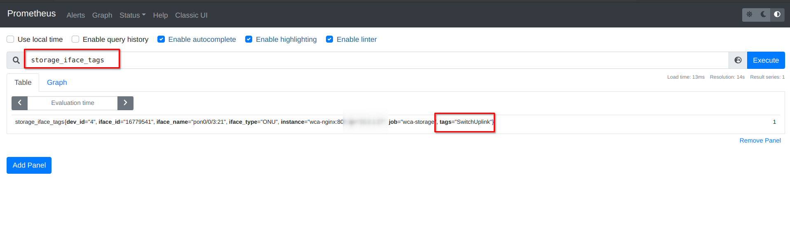
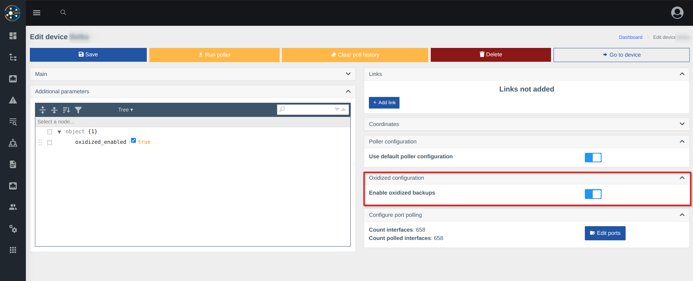
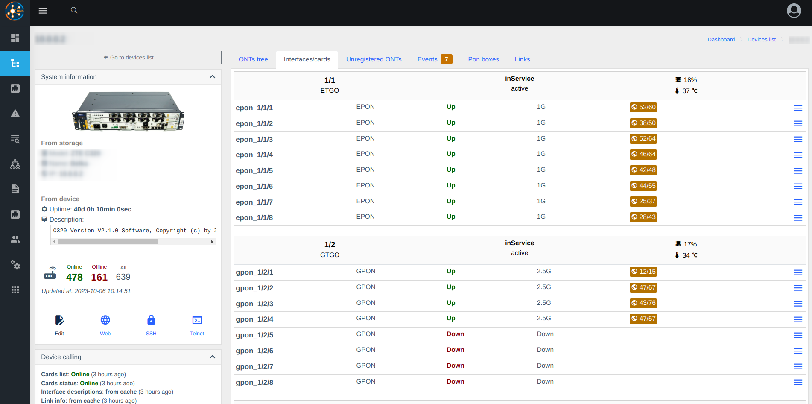

# Версія 0.18 (попередній реліз, 0.18.019)

* **Додані компоненти**
    - [oxidized](../components/oxidized.md) - Резервне копіювання конфігурації пристрою
    - [nodeny_plus](../components/nodeny_plus.md) - Інтеграція з білінгом Nodeny Plus
    - [diagnostic](../components/diagnostic.md) - Методи API для інтеграції діагностики

* **Новий функціонал**
    - Улюблені інтерфейси
    - Позначені інтерфейси
    - Суворий доступ до веб-панелі за IP (cidr)
    - Фізичні порти на OLTs (ZTE/Huawei/C-Data)
    - Інформація про систему в конфігурації
    - Доступ до пристроїв тепер прихований (див. через консоль - `wca device-access:list`)
    - Збереження фізичних портів (OLTs) в Prometheus (для оповіщення)

* **Виправлені помилки**
    - Виключено опитування FDB з вихідних портів (на основі позначених портів та зв'язків)

### Скріншоти








### Встановлення попереднього релізу
1. Оновіть wca-tool до останньої версії
2. Запустіть команду оновлення з вказаною версією
```shell
sudo wca-tool update --dev --version=0.18.019
```

### ❗Застереження
1. Видаліть деякі неправильні рядки з історії fdb (комутатори мають помилку зі збереженням FDB з транспортних портів), виправлено з 0.18.0.    
Запустіть його через 1-2 години після оновлення до 0.18
```      
docker exec -it wca-db mysql -uroot -psuperpassword wildcore_agent -e "DELETE FROM poll_fdb_history WHERE stop_at is not null and device_id in (SELECT d.id FROM devices d JOIN device_models m on m.id = d.model_id WHERE m.type = 'SWITCH');"     
```     
