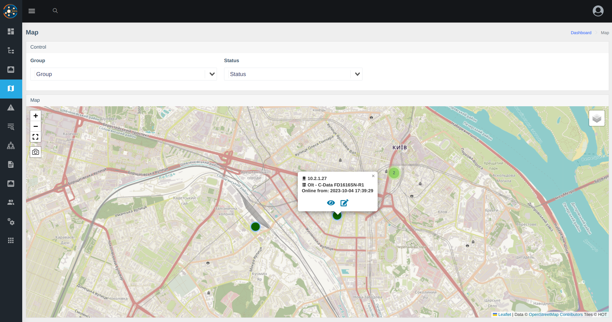

# Версія 0.18 

* **Додані компоненти**
    - [oxidized](../components/oxidized.md) - Резервне копіювання конфігурації пристрою
    - [nodeny_plus](../components/nodeny_plus.md) - Інтеграція з білінгом Nodeny Plus 

* **Новий функціонал**
    - Обрані(favorite) інтерфейси (по обраним інтерфейсам створено також подію)
    - Відмічені(tags) інтерфейси
    - [Описання методів API](../api/examples.md) для інтеграції в ваші системи 
    - Можливість обмеження входу з відповідних IP для користувача
    - Фізичні порти на OLTs (ZTE/Huawei/C-Data)
    - Карта з пристроями і їх станом ПО ICMP
    - Інформація про систему в конфігурації
    - Збереження фізичних портів (OLTs) в Prometheus (для оповіщення)
    - Можливість скинути пароль адміністратора командою `wca user:reset-admin-password` до стандартного - admin
    - Можливість скинути обмеження по IP для користувача `wca user:reset-ip-strict <LOGIN>`
    - Додано можливість змінювати опис порту на світчах Huawei, Edgecore, Alcatel, Eltex (працює через snmpset, ifAlias) 
* **Зміни**
    - Доступ до пристроїв тепер прихований (див. через консоль - `wca device-access:list`)
    - Порт комутатора тепер має свою "карточку" (як з ОНУ), управління портом перенесено в карточку
    - Список ОНУ переміщений в меню "Інтерфейси" і тепер працює з обмеженнями користувачів по групам пристроїв
    - Розміщення блоків в інформації ОНУ змінено таким чином, щоб з мобільного телефона першою була інформація про стан ОНУ


* **Виправлені помилки**
    - Виключено опитування FDB з вихідних портів (на основі позначених портів та зв'язків)
    - ПОН-бокси, відображення боксів в вкладці обладнання 

### Скріншоти



 

### ❗Застереження
1. Видаліть деякі неправильні рядки з історії fdb (комутатори мають помилку зі збереженням FDB з транспортних портів), виправлено з 0.18.0.    
Запустіть його через 1-2 години після оновлення до 0.18
```      
docker exec -it wca-db mysql -uroot -psuperpassword wildcore_agent -e "DELETE FROM poll_fdb_history WHERE stop_at is not null and device_id in (SELECT d.id FROM devices d JOIN device_models m on m.id = d.model_id WHERE m.type = 'SWITCH');"     
```     
