# Версія 0.20 (pre-release)

## Новий функціонал
- **Нові метрики Prometheus**
    - **analytics_duplicated_ont_ident_ifaces** - відображає ОНУ з інтерфейсом 
    - **analytics_duplicated_ont_ident** - відображає ОНУ з підрахунком кількості дублів
    - **analytics_duplicated_mac_addresses_ifaces** - відображає МАК з інтерфейсом
    - **analytics_duplicated_mac_addresses** - відображає МАК з підрахунком кількості дублів
    - **card_status_admin_status** - відображає адмін стан карти (ZTE/Huawei)
    - **card_status_cpu_load** - відображає навантаження CPU карти (ZTE/Huawei)
    - **card_status_memory_usage** - відображає навантаження RAM карти (ZTE/Huawei)
    - **card_status_oper_status** - відображає стан карти (ZTE/Huawei)
    - **card_status_temperature** - відображає температуру карти (ZTE/Huawei)
    - **unregistered_ont** - відображає незареєстровані ОНУ 

- **Можливість отримання внутрішніх подій системи** - дивіться приклади в `/opt/wildcore-dms/examples`
- **Для ZTE EPON додано можливість вибору опису з блоку $$** - параметр `"epon_description_block_index": 1`, який дозволяє змінити блок для відображення між '$$' (варианти - 1 чи 2)   
- **Аналітика: дублікати MAC-адресів**
- **Аналітика: дублікати ОНУ**
- **Аналітика: рівні сигналу ОНУ + віджет**
- **Можливість розділювати статистику інтерфейсів в розрізі фізичний порт/ОНУ**, в налаштуваннях користувача з'явився новий параметр 
- **В налаштуваннях системи з'явилась таблиця з детальною статистикою по типу інтерфейсів в системі**
- **Карта: додано відображення ОНУ**
- **Карта: додано відображення лінків з можливістю редагування проходження лінку**

## Зміни

- RoadRunner версії v2023.3.0-rc.1
- Відключено автоматичну діагностику кабелю за замовчуванням. Щоб ввімкнути(як було раніше), необхідно додати параметр `"enable_auto_cable_diag": true` в модель чи пристрій
- Змінено права ролей користувача
- При видаленні ОНУ - тепер інтерфейс видаляється також з БД wildcore   


## Виправлені помилки

### АПІ/Бекэнд
  - MikBill: при синхронізації абонентів, якщо на один інтерфейс попадає декілька абонентів, тепер не зберігає записів (раніше записувало когось)
  - Виправлено час падіння ОНУ на BDcom
  - Виправлено управління компонентами
  - Виправлено відображення кількості інтерфейсів в дашборді пристроїв
  - Віджет статистики помилок виклику обладнання 

### Веб-інтерфейс
  - Виправлено перехід між пристроями через лінк чи пошук (не вся інформація оновлювалась)


### Скріншоти
#### Карта
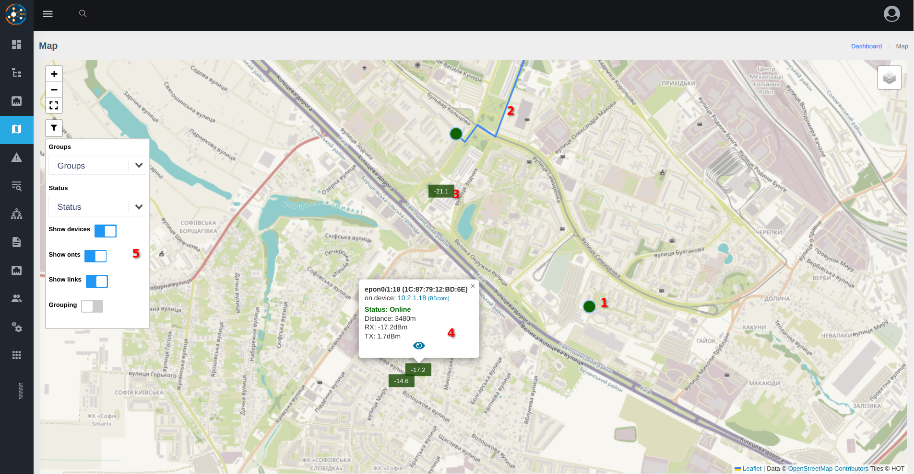    

* 1 - пристрій (світч/ОЛТ)
* 2 - лінк 
* 3 - ОНУ
* 4 - попап з додатковою інформацією
* 5 - фільтри

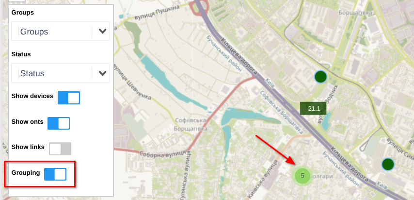    
_* лінки не групуються_    
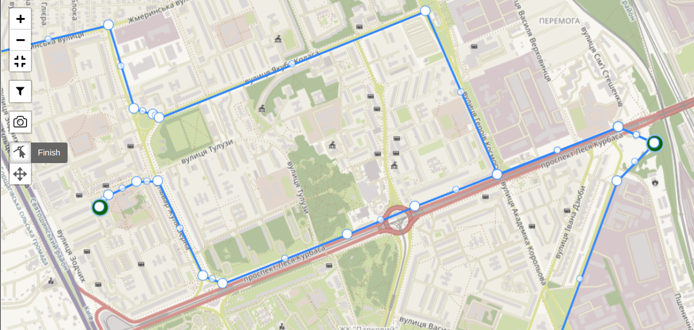
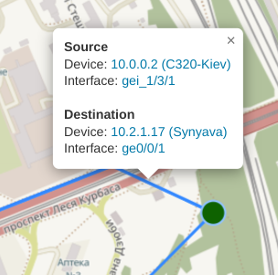

#### Статистика інтерфейсів
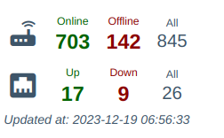
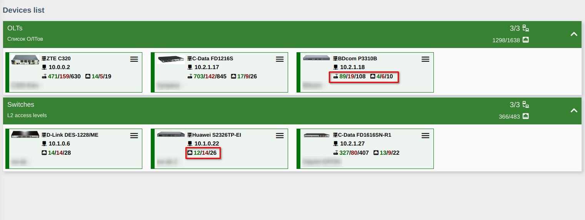
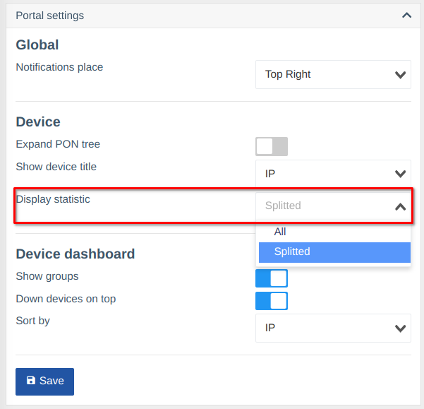

#### Детальна статистика по інтерфейсам
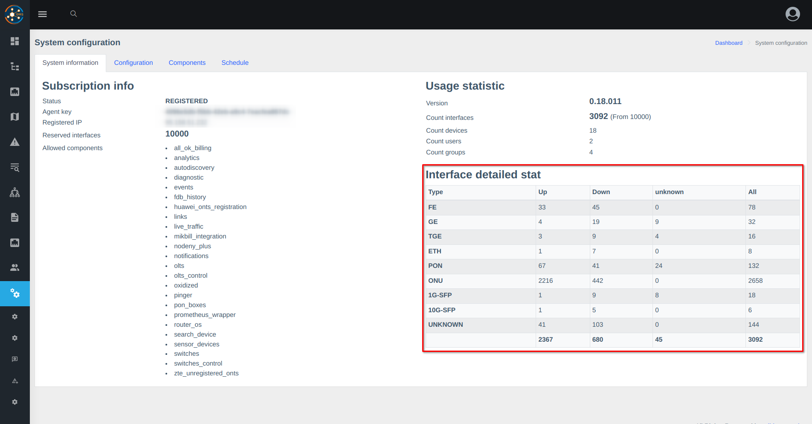

#### Віджет рівню сигналів
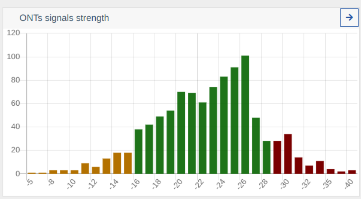

#### Сторінка рівню сигналів 
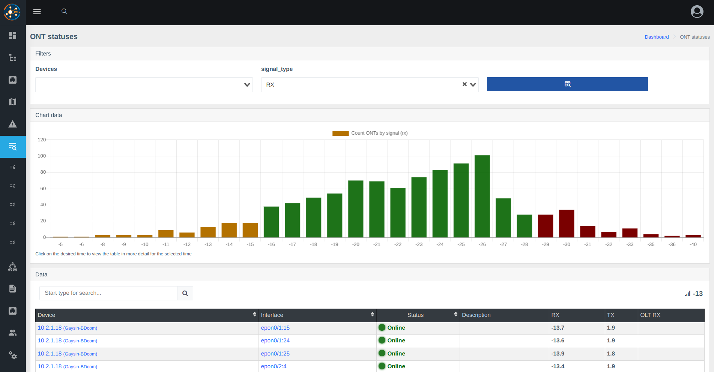

#### Метрики Prometheus 
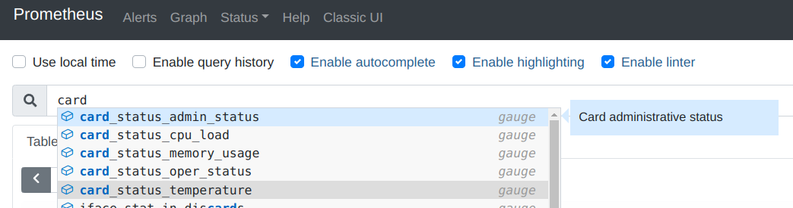
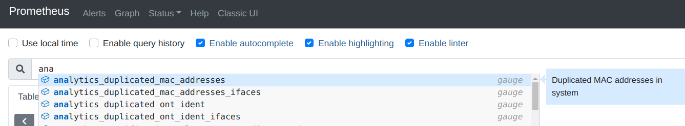


## Оновлення до пре-релізу
```shell
sudo wca-tool update --dev --version=0.20.005
```