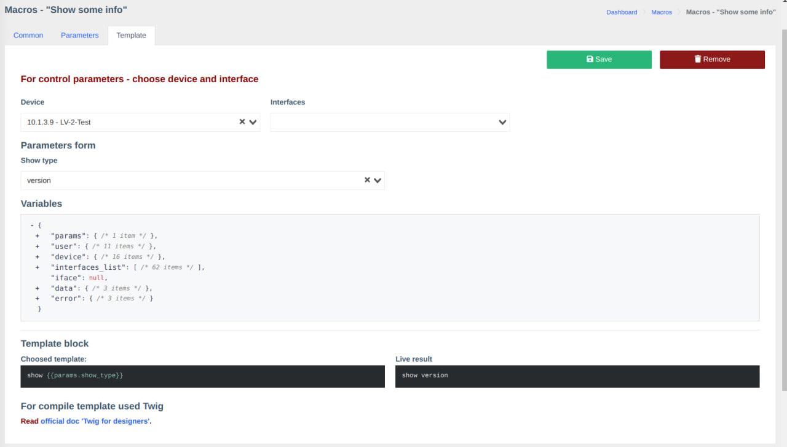
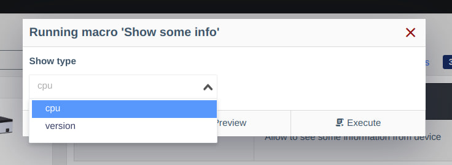
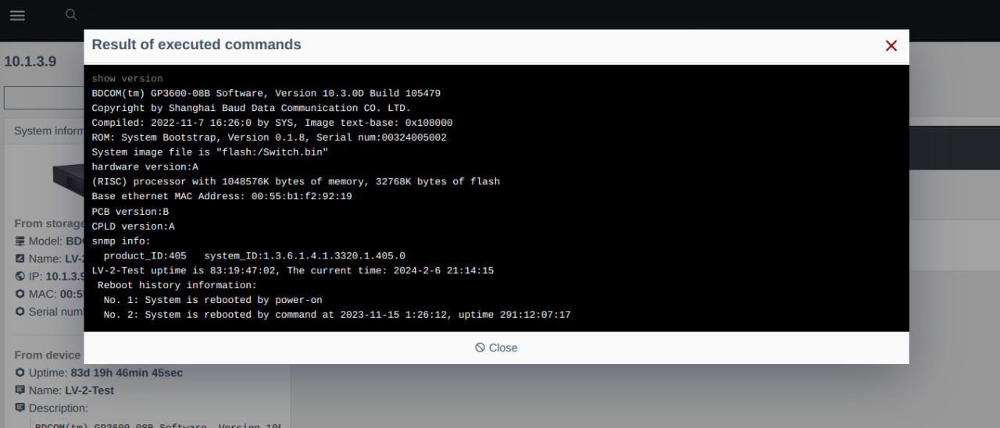

# Версія 0.21 (02.2024)

## Про оновлення

###  Додані компоненти

- [макроси](../components/macros/getting-started.md) - дозволяють розширювати функціональність системи (бета-тестування, оплата буде проводитися у майбутньому)

!!! info   "Компонент "макроси" умовно безкоштовний"
    Наразі компонент знаходится на етапі тестування і поставляється разом з агентом.         
    Орієнтовне введення оплати - **09.2024**      

###  Нові функції
  
- Інтегрована підтримка PWA
- Додана сторінка для PON-порту
- Оптимізована швидкість завантаження ONU/інтерфейсу
- Дозволяє переглядати та змінювати опис фізичного по*рту на OLT
- Доданий сигнал прийому OLT на C-Data FD16xx*
- Доданий детальний статус ONU у системі та Prometheus (-2 - LOS/-1 - PowerOff/0 - Offline/1 - Online)

!!! question "Детальніше про PWA"
    * Що це? - [wikipedia.org](https://uk.wikipedia.org/wiki/%D0%9F%D0%BE%D1%81%D1%82%D1%83%D0%BF%D0%BE%D0%B2%D0%B8%D0%B9_%D0%B2%D0%B5%D0%B1%D0%B7%D0%B0%D1%81%D1%82%D0%BE%D1%81%D1%83%D0%BD%D0%BE%D0%BA)
    * Як встановити? -  [support.google.com](https://support.google.com/chrome/answer/9658361?hl=en&co=GENIE.Platform%3DDesktop)

!!! info "Оптимізація швидкості завантаження ОНУ/інтерфейсу"
    Оптимізація відбувається за рахунок кешування результатів опитувальника в розрізі інтерфейсів.       
    Тому, при відкриті ОНУ, деяки дані будуть взяті з кешу, а деякі з обладнання.       
    Переглянути, які саме методи з кешу, а які з обладнання можна в блоці "Виклики обладнання"    
    
###  Зміни
  
- Оптимізований інтерфейс користувача для мобільних пристроїв
- Оптимізована швидкість завантаження списку інтерфейсів
- Завантаження FDB на Huawei Sxxxx через консоль

## Скріншоти
### PWA 

### Макроси

