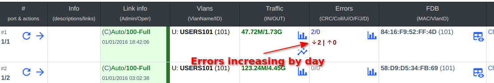

# Версія 0.23 (05.2024)

### Нові можливості:
- Додано підтримку двофакторної авторизації через Google Authenticator. Докладні інструкції доступні [тут](https://wiki.wildcore.tools/uk/web-interface/user-settings-overview/).
- Підтримка C-Data FD16xx з оновленою версією FW3.
- Тепер ви можете встановлювати координати обладнання/ОНУ за допомогою геолокації користувача (система повинна працювати через https).
- Додано новий параметр `PROMETHEUS_EXPOSE`, що дозволяє відкрити доступ до Prometheus ззовні (за замовчуванням - 127.0.0.1:9090).
- Тепер можна відображати ріст помилок на портах в аналітиці.
- Додано статистику по росту за добу в карточці інтерфейсу з можливістю перегляду на графіку.
- Додана кнопка інформації по хосту на сторінці статусів обладнання, яка відкриває модальне вікно з інформацією з пінгера.
- Додано захист від брутфорсу, який буде увімкнено за замовчуванням. Також створено дію з назвою `security:auth_attempts` для налаштування відправлення сповіщень.
- Додана можливість видалення IP з чорного списку командою: `wca security:reset:ipblock <IP_ADDRESS>`. При виклику команди без вказання IP будуть видалені всі IP.
- На ОЛТах C-Data, BDcom, ZTE, Huawei додано модуль `pon_profiles` в макросах, який можна використовувати для налаштування ОНУ вже після реєстрації.
- До макросів додано конструкцію `<sleep X>` для очікування X секунд перед виконанням наступної команди.
- Додано конструкцію `<exception "Повідомлення">` для відміни виконання макросу за певних умов.
- Додано новий компонент `onts_registration` для універсальної реєстрації ОНУ (ZTE, Huawei, C-Data, BDcom).
- Додано модуль отримання незареєстрованих ОНУ `unregistered_onts` для C-Data, BDcom.
- Додано підсвічування різними кольорами статусів лінків на комутаторах.
- Додано новий дозвіл у ролях OLTs -> ONT registration: `Allow view console output on error`, який дозволяє переглядати виконання команд.
- Тепер в параметрах макросів можна відфільтрувати значення в списку.
- Оновлено glibc [посилання](https://lists.debian.org/debian-security-announce/2024/msg00082.html)
- Виправлено деякі помилки в веб-інтерфейсі
- Для ОЛТ додано можливість встановлюти опис портів локально (не звертаючись до обладнання). Для цього в моделі чи пристрої потрібно додати параметр `"disable_save_description_on_physical_ifaces": true`

### Попередження:
- Компоненти реєстрації ОНУ ZTE/Huawei помічені як застарілі.
- Змінено об'єкт інтерфейсу для BDcom, C-Data (interface._onu_num -> interface._onu) - потрібно виправити в макросах і реєстрації.
- Змінна onu -> ont в новій реєстрації
- Додано новий віджет для незареєстрованих ОНУ, його потрібно буде замінити вручну.
- Компоненти реєстрації ОНУ, такі як zte_onts_registration і huawei_onts_registration, будуть видалені в версії **0.24**. Перед цим слід перевірити та перенести реєстрацію на новий компонент.
- Зміни у реєстрації ОНУ:
  - Можна назначити різні форми реєстрації для різних моделей ОНУ.
  - Перевірка умов відображення форми зараз відбувається на стороні клієнта.
  - Можливість фільтрувати список для вибору з джерела за допомогою JS умови.
  - Нова візуалізація після реєстрації ОНУ.
  - Додано нові конструкції `<sleep>` і `<exception>`.
  - Змінена структура зберігання шаблонів і параметрів.
  - Додано можливість імпорту/експорту шаблонів.

### Рекомендації
- Якщо вам потрібні готові шаблони реєстрації і макроси - Ви можете знайти їх в нашій демці [demo.wildcore.tools](https://demo.wildcore.tools/login?demo=demo_admin) і експортувати необхідні

### Трохи скріншотів

