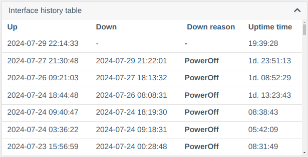
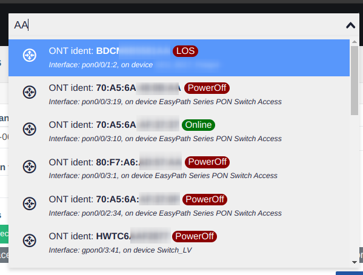
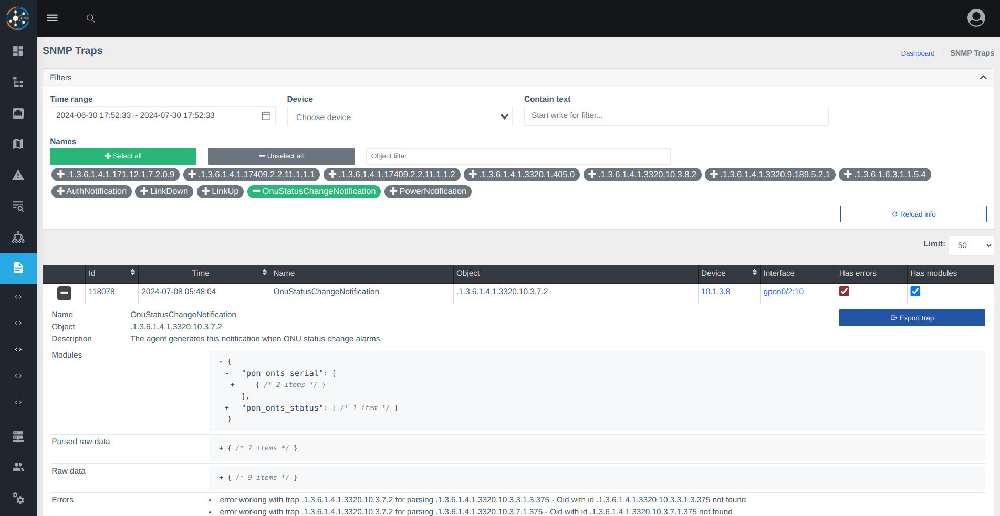

# Версія 0.24 (07.2024)

!!! warning "Увага"
    **Компоненти реєстрації ОНУ (huawei_onts_registration/zte_onts_registration) більше недоступні!**

### Основні зміни
- 📜 Додано історію змін статусу інтерфейсів
- 🔄 Впроваджено траполовку (на даний момент збирає тільки зміну лінка/стану ONU по всіх свічах і BDcom GP36xx)
- 📊 Додано експорт в Excel вибірок з аналітики та інтерфейсів
- 📅 Додано дату останньої зміни стану лінка
- 🚫 Прибрано підтримку старих компонентів реєстрації ONU (huawei_onts_registration/zte_onts_registration)
- 🛠 Виправлено скидання ONU на FD16xx FW v3
- 📶 Виправлено некоректні рівні сигналів на FD16xx FW v3
- 📋 На C-Data в ONU тепер відображаються поточні встановлені профілі (line, srv)
- 🔍 Змінено логіку глобального пошуку - тепер першими в результаті будуть описи інтерфейсів/ONU
- 🔧 Оновлено версію Oxidized до актуальної версії
- 📑 У списку пристроїв винесено налаштування відображення (сортування/групування)
- 📝 Додано сторінку отриманих трапів (логи)
- 🌟 Дещо допрацьовані елементи веб-інтерфейсу (відступи, висота, іконки елементів)

### Скріншоти
Історія падінь інтерфейсів/ОНУ     
       

Пошук зі статусом    
     

Таблиця трапів    
    

