# Версія 0.25 

!!! info "Ця версія ще не опублікована"
    Для оновлення та тестування використовуйте команду 
    ```shell
    sudo wca-tool update 
    ```


!!! danger "Оновлення зламає налаштований дашборд"
    **Через зміну розміру сітки, після оновлення, вам необхідно буде заново налаштувати розміщення та розміри віджетів**


!!! warning "Оновлення може змінити правила генерації подій"
    Якщо у вас є події з назвами `bad_optical_level_olt_rx`, `bad_optical_level_rx`, `high_link_utilization` - їх налаштування будуть змінені до системних

!!! warning "Оновлення може тривати довше ніж зазвичай"
    Через зміну версії MySQL, оновлення може займати більше часу, в залежності, на скільки велика БД 


## **Новий функціонал** ✨
- **Мережева аналітика:** 
    - 🌐 **Автотопологія:** Автоматично визначає зв’язки між пристроями за допомогою LLDP та FDB і записує їх
    - 📈 Збір поточної швидкості інтерфейсів для аналізу використання лінків/портів.
    - ⚙️ Нові параметри аналітики в конфігурації: встановлення допустимих рівнів сигналу для ONU.
Детальний опис в [компоненті з'єднань](../components/links/describe.md)

- **Управління доступом:**
    - 🔒 Перевірка складності пароля (налаштовується через конфігурацію).
    - 🛡️ Шифрування доступу до обладнання ([інструкція](../faq.md#_1)).     
!!! warning "Шифрування доступів увімкнено за-замовчуванням для нових інсталяцій"   
    

---

## **Виправлені помилки** 🐛
- **Загальні покращення:**
    - 🛠️ Виправлено баг з оновленням статусу у пінгері при переході пристроїв між TCP та ICMP доступом.
    - 📝 Усунуто проблеми з логами падіння інтерфейсів на комбо-портах.
    - 🗺️ Виправлено поведінку карти (за замовчуванням правильно завантажується).
    - 🎛️ Виправлено відображення інтерфейсів та фільтрів на карті.
    - 📤 Експорт списку пристроїв в Excel тепер підтримує понад 50 записів.

- **UI/UX:**
    - 📱 Виправлено відображення макросів та конфігурації на мобільних пристроях.
    - 🔍 Блок фільтрів на карті більше не зникає при зміні значень.

- **ICMP-Пінгер:**
    - ❌ Вимкнено підтримку IPv6 (у разі вимкненого IPv6 на сервері усуваються помилки запуску).

---

## **Бекенд** ⚙️
- **Події та алертинг:**
    - 🛑 Новий тип подій: **"внутрішні"** (генеруються системою з можливістю налаштування).
    - 🔄 Перезбір правил Alertmanager при кожному збереженні конфігурації.

- **База даних:**
    - 📊 Оновлення MySQL до версії **8.0.40**.
    - 🛠️ Нові параметри `.env` для MySQL:
        - `MYSQL_INNODB_BUFFER_POOL_SIZE`
        - `MYSQL_KEY_BUFFER_SIZE`
        - Рекомендується збільшувати для підвищення продуктивності.

- **Моніторинг та опитування:**
    - ⏱️ Змінено частоту опитування експортеру лічильників інтерфейсів у Prometheus (можливість встановлення інтервалу в 5 хвилин).


- **Оновлено до актуальних версій**
    - Prometheus
    - Oxidized
    - Grafana
---

## **Фронтенд** 🖥️
- **Віджети та дашборд:**
    - ➕ Додано нові віджети:
        - Кількість ONU з поганим рівнем сигналу
        - Кількість з'єднань із високим навантаженням
        - Список обраних інтерфейсів/ОНУ
        - Список тегів з переходом на них
    - 🖼️ Покращення дашборда:
        - Змінено сітку з 12 до 24 колонок.
        - Висоту рядка зменшено з 20px до 10px (потрібна переналаштування дашборда).
        - Графіки та круги у віджетах тепер змінюють розміри динамічно.
        - Підпис у віджетах типу кругів став клікабельним і веде на сторінку з фільтрами.

- **Сторінки та функції інтерфейсу:**
    - 📜 Нова сторінка **"З'єднання"**: Відображення списку з'єднань, їх навантаження та фільтри.
    - 🗺️ Нова сторінка **"Топологія"**: Відображення мережі з підключеннями у вигляді дерева.
    - 🔄 У інтерфейсі додано блок **"Висхідна топологія"**.
    - 📋 У пристрої додано вкладку **"Логи інтерфейсів"**: показує зміни стану інтерфейсів.

- **Мобільні пристрої:**
    - 📱 Автоматичний фокус на рядок пошуку при відкритті пошуку.
    - 🧹 Відкориговано відступи та дрібні елементи інтерфейсу для кращого досвіду.

- **Покращення сторінок:**
    - 🖥️ Перероблено список ONU (сторінка **"Інтерфейси → Список ONU"**).
    - 🔍 Додано окремі фільтри: "Тільки з поганим сигналом" та "Статус".

---

## **Підтримка обладнання** ⚡
- 🆕 Додано підтримку:
    - **Консоль для макросів** для Eltex.
    - Dell Networking OS (L2).
    - Dell EMC.
- ✅ Виправлено перевірку рівня сигналу на BDcom (усунуто значення -65000).

---

## **Скріншоти** 🖼️
### Топологія
* **Візуалізація топології**       
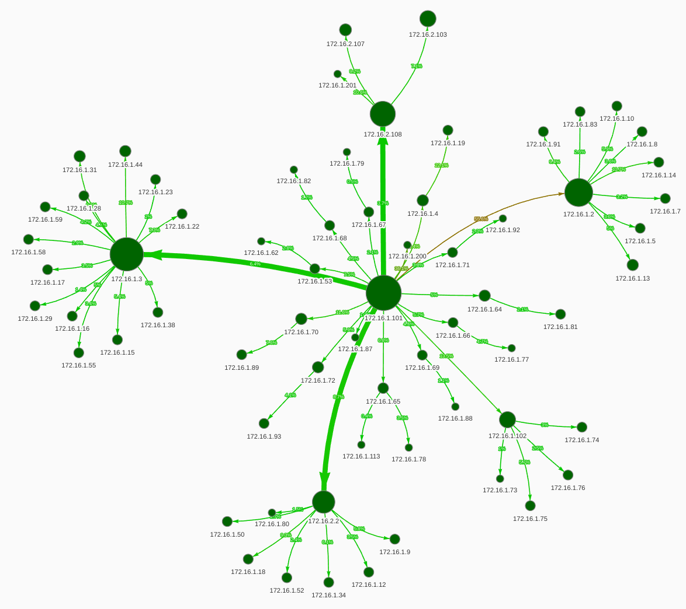    

* **Інформація про пристрій**       
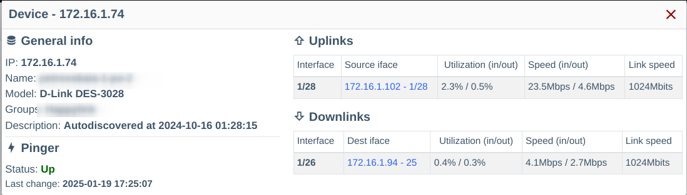

* **Інформація про лінк та навантаження**     
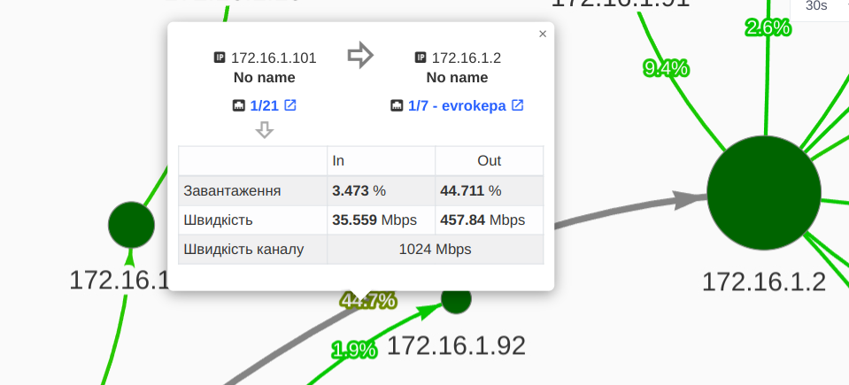

* **Налаштування візуалізації**     
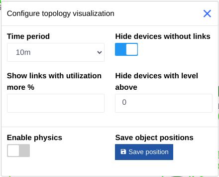

### З'єднання
* **Список з'єднань**    
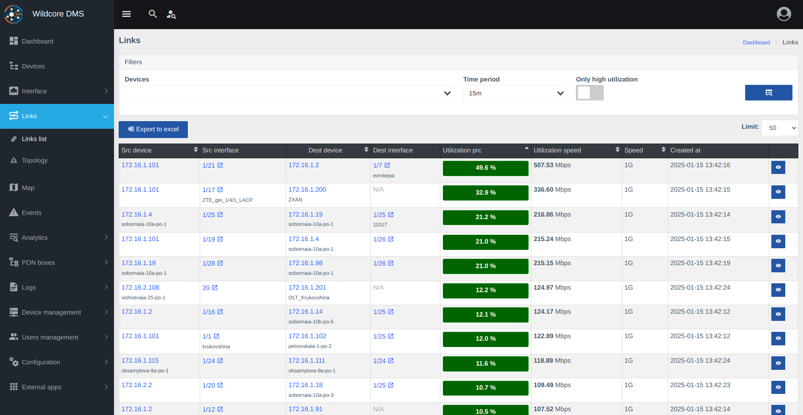      

* **Топологія вверх (до аплінку)**    
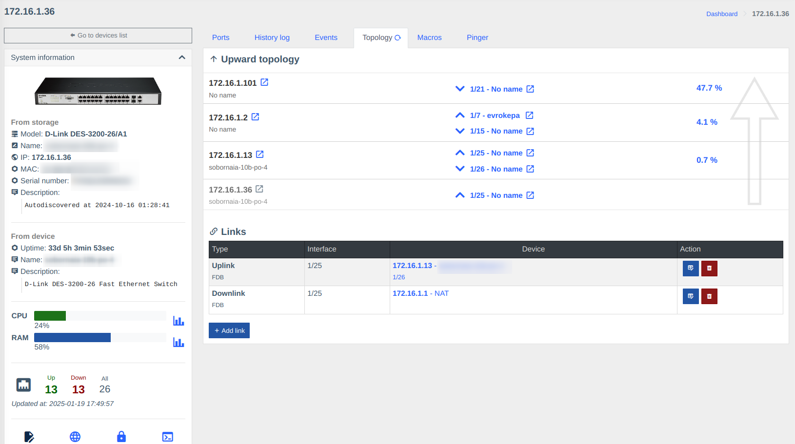

* **Топологія вверх (до аплінку) в карточці пристрою**    
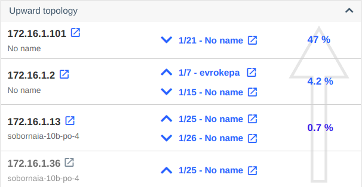

### Налаштування

* **Налаштування генерації подій по навантаженню**    
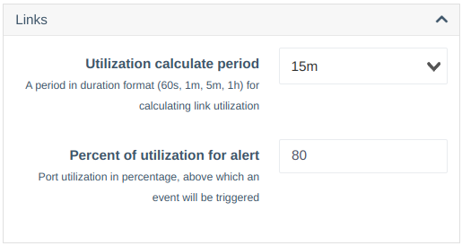

* **Налаштування генерації подій по поганому сигналу**    
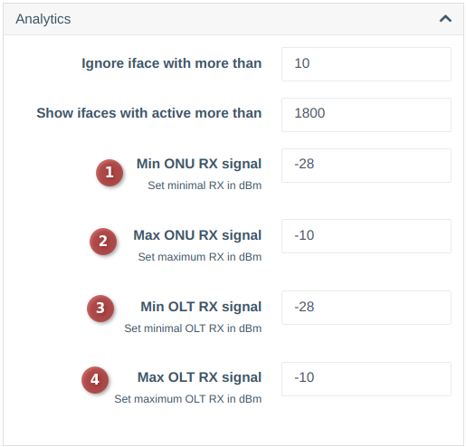

* **Перевірка складності паролю**    
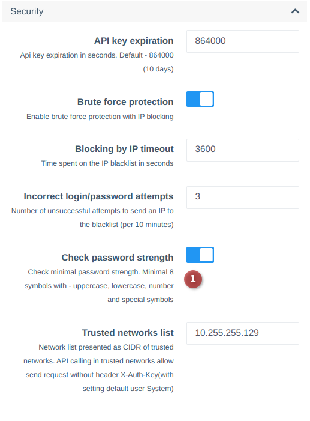

### Історія 
* **Історія зміни статусів інтерфейсів в вигляді логу**
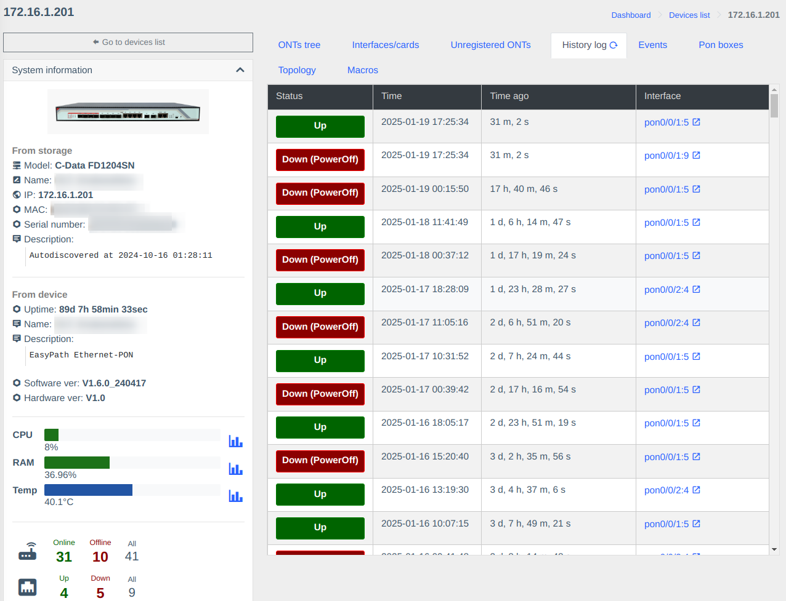


### Список ОНУ
* **Нові фільтри в списку ОНУ**
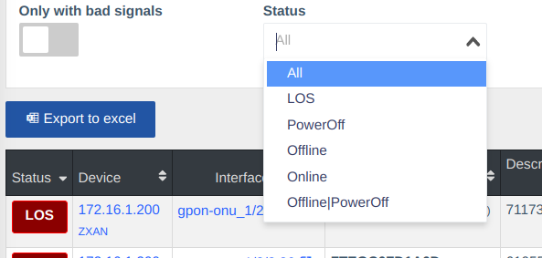

### Нові віджети 
  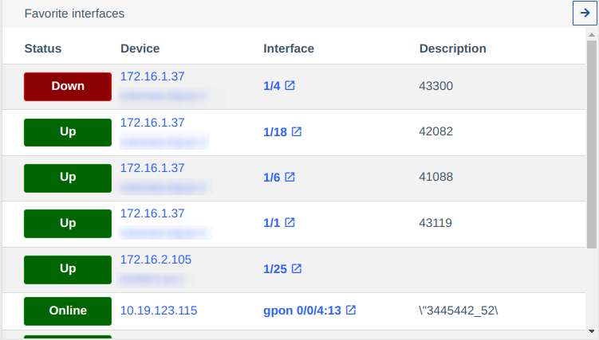
  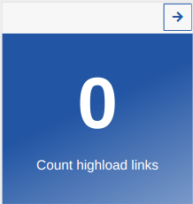
  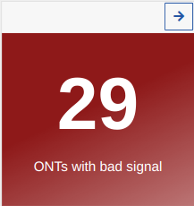
  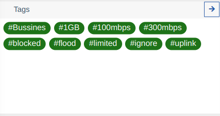

--- 