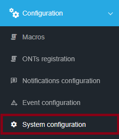
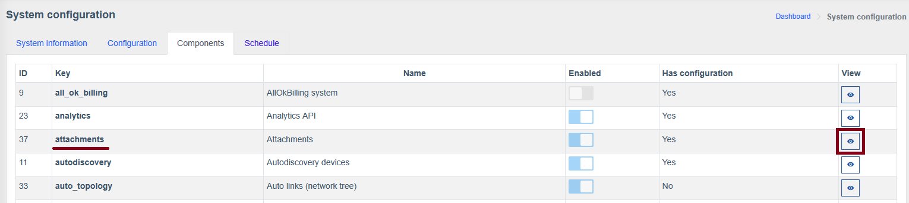
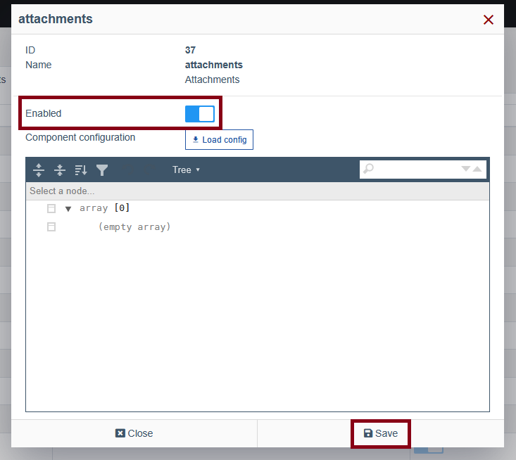
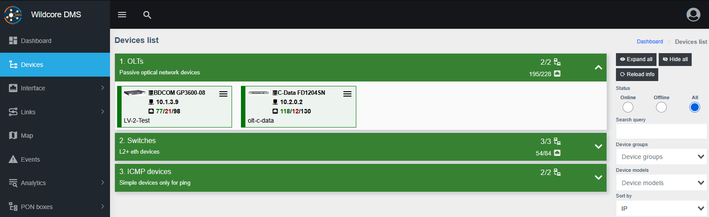
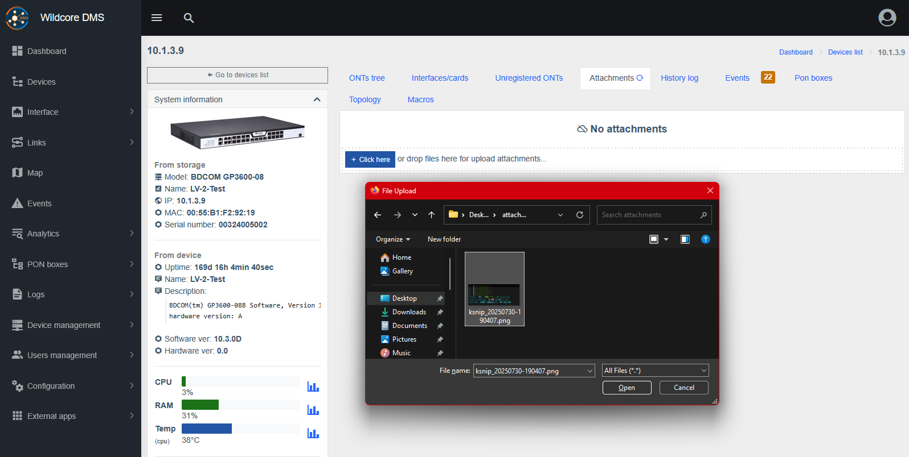
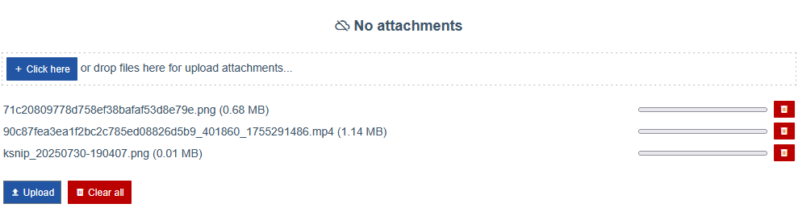
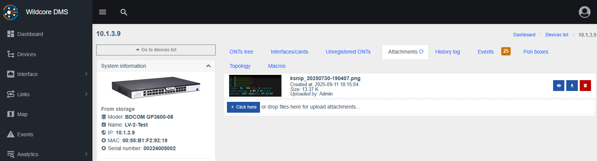
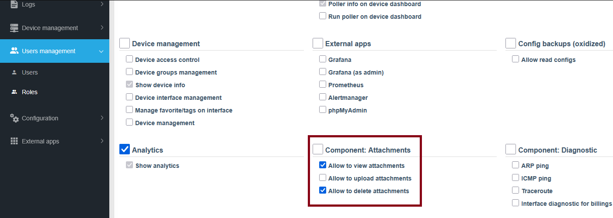

# Вкладення

!!! abstract "Огляд"
    
    **Вкладення** це компонент, що дозволяє завантажити різні медіа файли (картинки, відео тощо) в дешборді об'єктів (прилад/ОНУ/інтерфейс).

!!! warning "Увага"
    **Вкладення** потребують версію Wildcore `>=0.28`. Інструкція по оновленню доступна [тут](../installation-and-updating/update.md).

!!! info "Інформація"
    Щоб увімкнути **Вкладення** перейдіть на сторінку `Конфігурація > Конфігурація системи > Компоненти`, знайдіть компонент `attachments` і натисніть `Перегляд` в тому ж рядку, увімкніть перемикач `Включено` і збережіть зміни.

    ??? "Візуальна допомога"
        
        
        

## Додавання Вкладень
1. Перейдіть на сторінку управління об'єкта, до якого ви хочете завантажити вкладення.

    ??? "Візуальна допомога"
        

2. Оберіть вкладку **Вкладення** і натисніть кнопку або перетягніть файл у зону завантаження.

    ??? "Візуальна допомога"
        

3. Файл буде додано до попередьного перегляду завантажуваних файлів. На цьому етапі він ще не завантажений і ви можете змінити список файлів, які ви хочете додати, прибравши зайві або додавши нові.

    Натисніть `Завантажити`, або `Очистити все`, щоб скасувати процес завантаження вкладень.

    ??? "Візуальна допомога"
        

4. Обрані файли будуть завантажені на ваш сервер та пов'язані з обраним об'єктом, доступні для перегляду і завантаження у його владці **Вкладення**.

    ??? "Візуальна допомога"
        

!!! warning "Увага"
    Якщо ви використовуєте проксі-сервер вам може бути необхідно збільшити ліміт завантажень у його налаштуваннях, наприклад:

    ```cfg title="nginx.conf: server block"
    client_max_body_size 500M;
    ```

## Дозволи для Вкладень

!!! info "Інформація"
    Для конфігурації доступні окремі дозволи для Перегляду/Завантаження/Видалення для різних ролей.

1. Перейдіть до меню `Користувачі > Ролі` та натисніть `Змінити` навпроти потрібної.

    ??? "Візуальна допомога"
        

2. Знайдіть розділ `Компонент: Вкладення` та відмітьте потрібні галочки.

    Не забудьте зберегти зміни у верхній частині сторінки.

    ??? "Візуальна допомога"
        