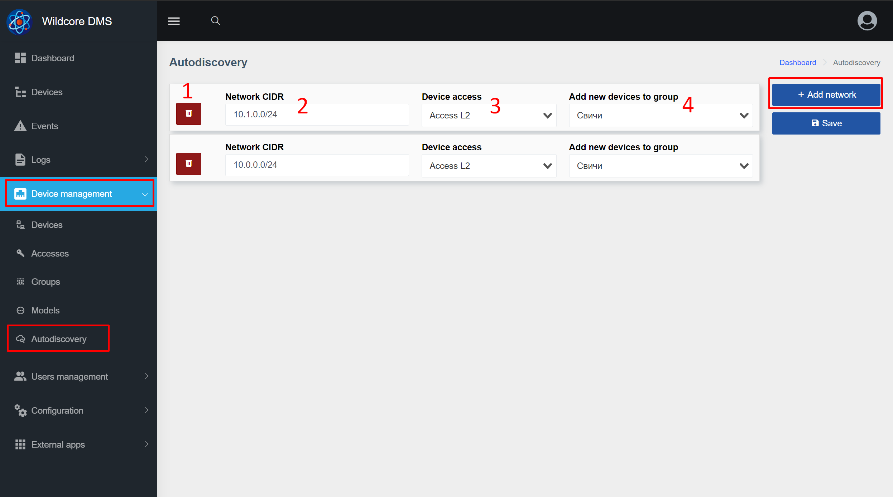

# Автовиявлення
## Про компонент
Компонент **Autodiscovery** дозволяє автоматично додавати підтримуване обладнання шляхом сканування попередньо визначених підмереж.

## Як відбувається відкриття?
Зазначена підмережа сканується за допомогою snmp із спільнотою, зазначеною в доступі. Сканування виконується в багатопотоковому режимі (5k потоків) з малим часом відгуку.
Далі весь список виявлених пристроїв передається в систему для доповнення.
Система перевіряє, чи існує ця IP-адреса в системі.
Якщо це новий IP, робиться спроба додати обладнання в систему, в зазначену групу.
До системи можна додати лише підтримуване обладнання.

При додаванні з пристрою беруться такі поля: назва пристрою, місцезнаходження + для деяких пристроїв mac-адреса та серійний номер.

## Налаштувати автовиявлення
### Веб-інтерфейс

1. Кнопка «Видалити правило виявлення».
2. Підмережа у форматі CIDR для пошуку обладнання
3. Доступ до використовуваного пристрою
4. Група пристроїв, до якої потрібно додати знайдений пристрій

### Налаштування
1. Додайте доступ до необхідного обладнання _(Керування пристроями -> Сторінка Доступи)_ - необхідно вказати спільноту / логін / пароль
2. Створіть необхідні групи пристроїв _(Керування пристроями -> сторінка Групи)_
3. На сторінці конфігурації додайте необхідні підмережі, вкажіть використовувані доступи та групу
4. Збережіть правила виявлення

Пошук нового обладнання проводиться кожні півгодини (*/30) з 6 ранку до 23 вечора.
Ви можете отримати доступ до цих налаштувань через налаштування планувальника _(Конфігурація -> Сторінка конфігурації розкладу)_.

Також можна розпочати сканування вручну, не чекаючи запуску планувальника за допомогою команди - `wca autodiscovery:scan`.

