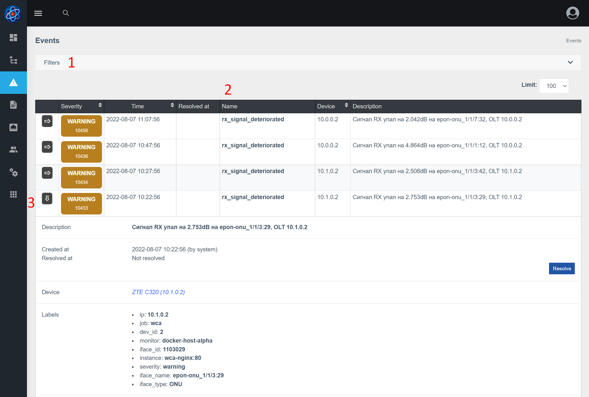

# Події (events)
### Про Компонент
Компонент **Events (events)** отримує повідомлення від alertmanager та поллера, зберігає повідомлення в історії та по можливості прив'язує до обладнання.

Події мають такі ключові поля:

* Важливість (severity)
* Ім'я
* Дату початку події
* Дату закриття (завершення) події
* Текстовий опис події

Подія відрізняється від дій тим, що має важливість, а також час завершення події.
Компонент немає залежностей.

### Відображення у веб-інтерфейсі

1. Фільтри, що дозволяють відобразити лише певні події
2. Таблиця подій
3. Кнопка, щоб розгорнути подію і переглянути більш детальну інформацію про подію, наприклад labels

### Налаштування генерації подій
Для створення подій використовується [alertmanager](https://prometheus.io/docs/alerting/latest/alertmanager/). У веб-інтерфейсі є сторінка конфігурації, яка дозволяє керувати правилами alertmanager.

1. Кнопка додавання нового правила
2. Кнопка, яка дозволяє перевірити коректність правила
3. Можна відключити правило, щоб по ньому не генерувалися події
4. Група правил (можна почитати тут – [alertmanager] (https://prometheus.io/docs/alerting/latest/alertmanager/)). Зазвичай, визначається якась логічна група правил, наприклад правила пов'язані з інтерфейсами відносити до групи interfaces.
5. Дозволяє вказати, як довго умова повинна дотримуватися, щоб подія була згенерована
6. Ім'я алерта (фактично - ім'я події)
7. Рівень важливості події
8. Вираз (умова). Для написання виразів використовується promQL
9. Анотація – загальний опис алерту без використання лейблів
10. Опис – дозволяє вказати текст при генерації події. Також можна використовувати значення label для генерації тексту.

Також є деякі системні події, які неможливо налаштувати (відключити або змінити), оскільки вони генеруються внутрішньою системою повідомлень, серед таких:

* падіння BGP-сесій
* падіння пристроїв по ICMP
