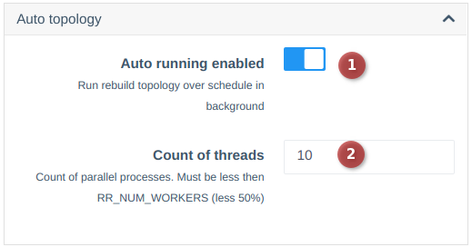
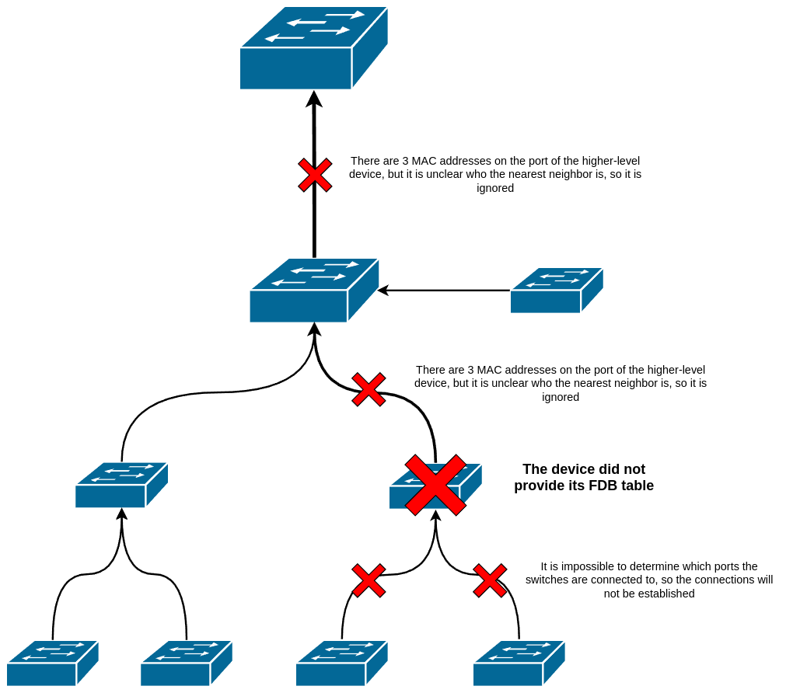

# Автотопологія

!!! info "Доступно з версії 0.25"

Компонент автотопології дозволяє знаходити зв'язки між обладнанням, використовуючи FDB (пріоритетно) та LLDP.

Компонент будує зв'язки, визначаючи при цьому напрямок до аплінку.
Аплінк визначається на основі MAC-адреси, отриманої з ARP обладнання (використовується мережевий шлюз пристрою).

!!! warning "Точність топології не гарантується, все залежить від того, як побудовано мережу"

---

## Налаштування автотопології

Фоновий запуск автотопології вимкнено за замовчуванням.
Щоб увімкнути — перейдіть до налаштувань системи (Configuration -> System configuration -> TAB Configuration -> BLOCK Autotopology).
??? "Скрін блоку"
    
Топологія перезбирається кожні 3 години, але якщо є необхідність, ви можете змінити частоту опитування в налаштуваннях планувальника (завдання `auto_topology_scan`).

!!! warning "Автоматична топологія використовує кешовані відповіді з обладнання, тому немає сенсу встановлювати частоту опитування частіше, ніж параметр актуалізації кешу"

---

## Ручний запуск автотопології

Також ви можете запустити збір топології вручну, виконавши команду:
```shell
wca auto_topology:scan
```

---

## Особливості та застереження
!!! note "Якщо в пристрої вже вказаний аплінк-інтерфейс вручну, то порт не буде змінено автоматично, також не буде додано додатковий аплінк, якщо він був виявлений"
!!! note "Автоматична топологія не передбачає наявність декількох аплінків. Якщо їх кілька — потрібно вказувати вручну"
!!! warning "З'єднання знайдені автотопологією очищуються через 3 дні, якщо вони перестають виявлятися протягом цього часу"

!!! note "Автоматична топологія будує звязки лише по одному з'єднанню. Якщо у вас декілька з'єднань з одним обладнанням - їх потрібно додавати вручну"
!!! info "В випадку, коли частина зв'зків не була побудована, спробуйте ввімкнути LLDP на тих пристроях, між якими не було побудовано зв'язок"
!!! info "Перевірте роботу LLDP за допомогою команди `wca switcher-core:call <DEVICE_IP> lldp_info`, якщо зв'язки не були побудовані навіть після ввімкнення lldp"

??? note "Проблема побудови топології на базі FDB"
    **Топологія на базі FDB будується "знизу-вверх".**      
    Якщо якись із вузлів не повернув повну таблицю маків(чи повернув не повну таблицю), то знайти топологію на порту буде неможливо(через неможливість знайти послідовність включення)      
    
    Нижче ілюстрація подібної ситуації.    
    
    
    
    **На агрегаторах/корневих вузлах та роутерах рекомендується вмикати LLDP.**
