# Зв'язки 
Компонент `links` — компонент для збереження та відображення зв'язків між обладнанням.

Він дозволяє вказати вихідний та цільовий пристрій із зазначенням портів підключення за допомогою веб-інтерфейсу або API.

---

## Управління зв'язками вручну
??? info "Встановіть права для управління зв'язками"
    Переконайтеся, що у ролі користувача дозволено змінювати пристрої та зв'язки.
    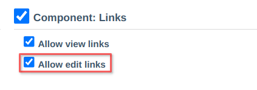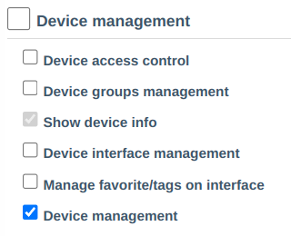

- Перегляд та управління через редагування пристрою.
   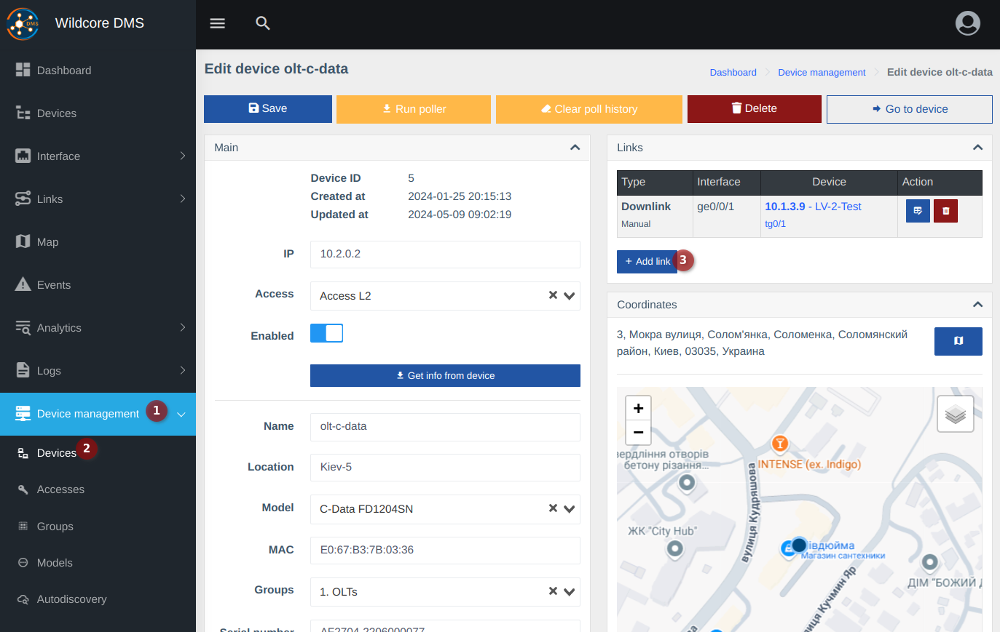
- Перегляд та управління в картці пристрою, на вкладці "Топологія".
   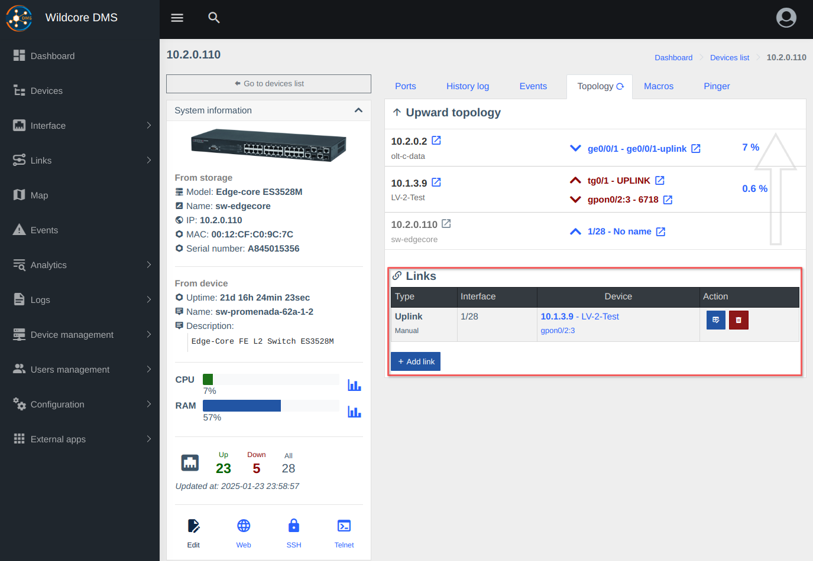

- Попап-вікно додавання інтерфейсу.
   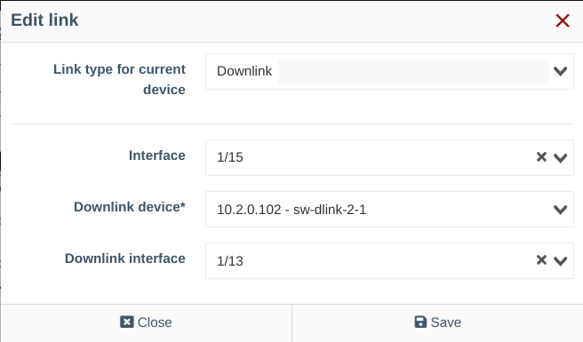   
!!! note "Встановлювати обидва інтерфейси не обов'язково, якщо ви його не знаєте"

## Управління зв'язками автоматично
Автоматичний збір топології описано - [тут](./autotopology.md)

---

## Перегляд зв'язків
Для перегляду зв'язків можна використовувати сторінки управління, але більш зручними є спеціалізовані сторінки та компоненти, вони описані нижче.

### Топологія "вгору" (до аплінку) на основі зв'язків
У картці пристрою, на вкладці топологія можна побачити зв'язок до аплінк-пристрою (ядру).  
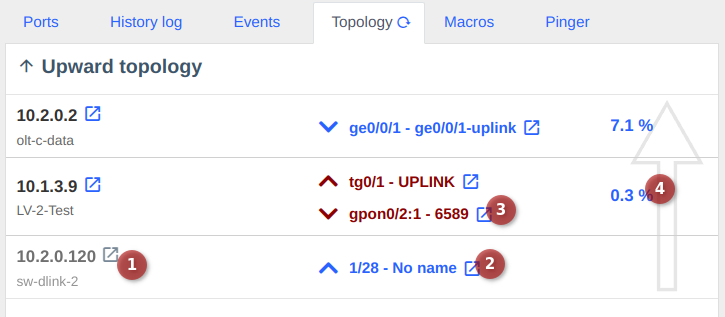
> 1. Поточний пристрій (сірим кольором).
> 2. Uplink-інтерфейс на цьому пристрої.
> 3. Downlink-інтерфейс, до якого підключено нижчестоящий пристрій.
> 4. Навантаження зв'язку ([детальніше про розрахунок утилізації](./utilization.md)).
>   
> _Червоним кольором виділені інтерфейси у стані Down/Offline (на скріншоті представлена демонстрація)._ 

_Ця ж інформація відображається в інтерфейсі/ОНУ, в окремому блоці._

### Візуалізація топології мережі
Візуалізація топології — це сторінка, яка відображає зв'язки та пристрої у вигляді графа.    
На сторінці можна переглянути стан доступності пристроїв (дані з пінгера) — вузли будуть зафарбовані зеленим кольором, якщо пристрій доступний, і червоним, якщо пристрій недоступний (не відповідає за ICMP/TCP).
Вузли мають різні розміри, що залежать від кількості дочірніх елементів.

Зв'язки зафарбовуються градієнтно залежно від навантаження.
Зелений — менше навантаження.
Червоний — більше навантаження.

Також лінки мають товщину, яка залежить від швидкості лінка.  
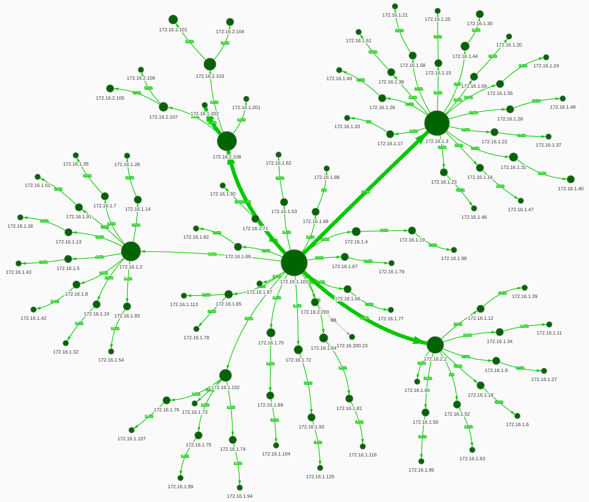
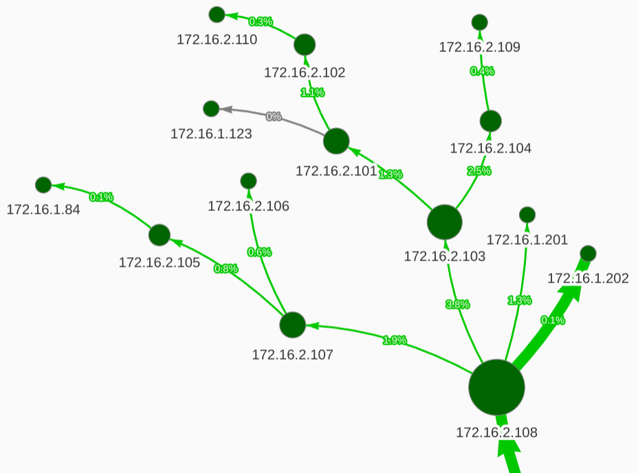

**Вузли та зв'язки — клікабельні.**     
При кліку на елемент ви побачите тултіп з інформацією.
При кліку на вузол ви також можете клікнути на "очко" і переглянути детальнішу інформацію про пристрій.
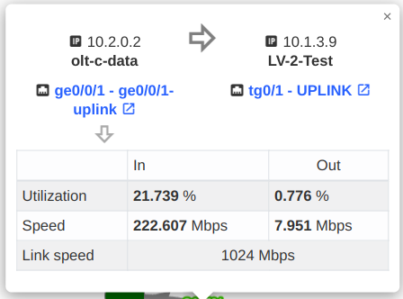
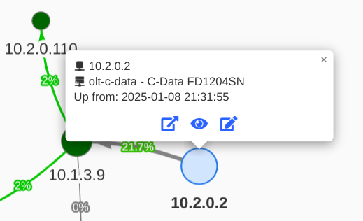

**Справа в куті є кнопка "меню", яка відкриває налаштування відображення.**  
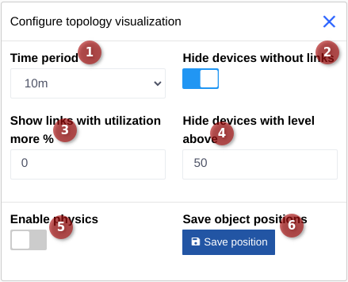    
У налаштуваннях можна встановити:    

1. Тимчасовий період (період підрахунку утилізації лінка).
2. Чи відображати пристрої без зв'язків.
3. Відображення лінків лише з навантаженням понад N%. Якщо встановлено 0 — відображаються всі.
4. Рівень відображення від батьківського вузла (щоб не відображати велику "павутину", а показувати лише кореневі пристрої, можна змінювати цей параметр, встановивши 1-3).
5. Включення фізики (розміщує вузли автоматично, віддаляючи їх на певну відстань).
6. Кнопка збереження позицій також вимикає фізику та дозволяє розмістити вузли у потрібному положенні (можна перетягувати).

!!! note "Після переміщення елементів — збережіть позиції."
!!! note "Якщо вам потрібно переміщувати елементи — вимкніть автооновлення, оскільки автооновлення перезаписує позиції за раніше збереженими."

!!! warning "Позиції та налаштування зберігаються у вашому браузері. При вході з іншого браузера — розміщення елементів та параметри будуть відрізнятися."

