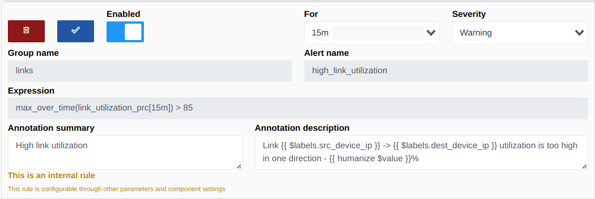
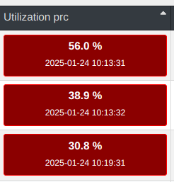
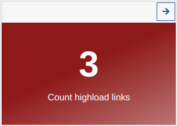
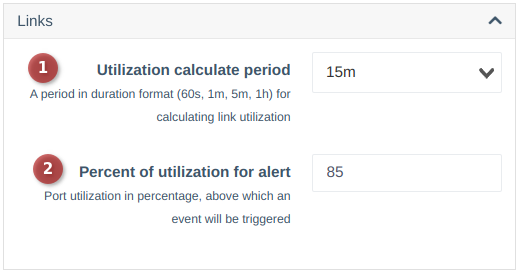

# Утилізація лінків

Утилізація лінків відображається у візуалізації топології та списку з'єднань.

??? info "Метрики для розрахунків навантаження"
    Ви можете розрахувати утилізацію для будь-якого інтерфейсу, з якого знімаються показники лічильників та швидкість інтерфейсу (метрики: `iface_stat_out_octets`, `iface_stat_in_octets`, `device_interface_speed`).
    Є можливість налаштувати події чи використовувати метрики ззовні, наприклад в Grafana      

---

## Основні метрики

Для виділення сильно навантажених з'єднань і відображення їх у віджеті була додана спеціальна метрика - `link_utilization_prc`, а також створено внутрішню подію - `high_link_utilization`.


У системній конфігурації, у блоці `links`, ви можете вказати бажаний період розрахунку та відсоток навантаження, при перевищенні якого буде створено подію. На основі відкритих подій підраховується кількість навантажених лінків (відображення у віджеті) та підсвічуються червоним на сторінці з'єднань.

??? info "Приклад відображення"
    * На сторінці списку з'єднань     
      
    * Віджет     
      

!!! warning "Якщо ви закриєте таку подію, з'єднання більше не вважатиметься перевантаженим, навіть якщо його навантаження досягне 100%"
!!! note "Через певний час (приблизно 1 годину) подія буде знову створена AlertManager-ом, якщо навантаження залишиться високим"

---

## Розбіжності у даних

Можливі розбіжності між поточним навантаженням і тим, чи вважається лінк перевантаженим, оскільки дані отримуються з різних джерел і метрик. Наприклад:
- Розрахунок навантаженості для створення події встановлений на 15 хвилин, а ви налаштували відображення на 1 годину. У такому разі значення навантаження може відрізнятися.

Ви можете вимкнути створення подій у налаштуваннях подій, і тоді система не буде відображати перевантажені лінки.

---

## Розрахунок утилізації лінків

Утилізація лінків розраховується на основі зібраних лічильників трафіку з обладнання та швидкості лінка.
Приклад запиту PromQL:
```promQL
(sum(rate(iface_stat_out_octets[15m])) by (dev_id, iface_id) / 1024 / 1024 * 8) / sum(device_interface_speed) by (dev_id, iface_id) * 100  

(sum(rate(iface_stat_in_octets[15m])) by (dev_id, iface_id) / 1024 / 1024 * 8) / sum(device_interface_speed) by (dev_id, iface_id) * 100  
```

На сторінках [візуалізації топології](./describe.md#_6) та сторінці лінків відображається більше значення із вибірки (in/out). За замовчуванням лічильники беруться з інтерфейсу вищестоящого пристрою. Якщо на цьому інтерфейсі немає лічильників, дані знімаються з нижчестоящого інтерфейсу.

---

## Налаштування періодів
Період (15 хвилин у прикладі вище) відображає середнє значення навантаження за останні 15 хвилин. Ви можете змінити період на більший або менший в налаштуваннях
     

1. Період, в який проходить розрахунок навантаження 
2. Максимальний відсоток навантаження, після якого буде створено подію    


### Рекомендації:
!!! note "Для коректного відображення навантаження період повинен бути щонайменше у два рази більшим за частоту опитування лічильників з обладнання (налаштовується в параметрах опитувача, моделях або обладнанні)"
!!! note "Частота опитування не повинна бути частішою ніж 1 раз на хвилину, оскільки це мінімальний період, за який Prometheus збирає метрики з експортерів"

---