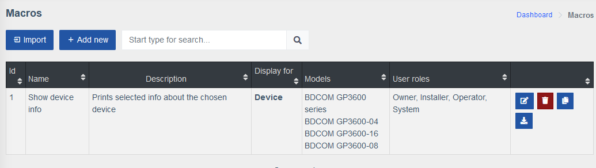

# Макроси

!!! abstract "Огляд"
    **Макроси** це компонент, що поставляється окремо, який дозволяє користовачу покращити функції Системи за допомогою спрощення та автоматизації CLI команд на своїх пристроях, використовуючи простий графічний інтерфейс, такі як перегляд логів, снупінгу, або навіть управління VLAN мережами на обраних портах.

!!! warning "Увага"
    Створення та використання макросів вимагає специфічних налаштувань прав **Ролі користувача**.

    Їх можна знайти на сторінці **Користувачі > Ролі > Компонент: Макроси**.

    Обирайте різні комбінації прав для різних ролей задля безпеки Вашої системи.

    

!!! danger "Попередження"
    Макроси працюють лише на присторях, що підтримують `multi_console_command`, список яких можна знайти [тут](https://github.com/meklis/switcher-core/blob/master/docs/DEVICES.md).

!!! tip "Підказка"
    Ви можете знайти та завантажити приклади макросів на нашій [демо сторінці](https://demo.wildcore.tools/config/macros), а також знайти детальні пояснення деяких прикладів макросів на сторінці [Приклади шаблонів Twig](./twig-examples.md).

## Меню Макроси

!!! info "Інформація"
    Меню **Макроси** можна знайти у висувному меню зліва, у вкладці **Конфігурація**.

    Тут ви можете створити новий макрос з нуля, або **Імпортувати** вже готовий.

    

    *Відкриття сторінки ****Макроси**** вперше*


## Створення простого макросу

У цьому розділі ми проведемо Вас через процесс створення макросу крок за кроком.

1. Щоб створити новий макрос, натисніть кнопку **Додати новий** у верхньому лівому кутку сторінки **Макроси**.

    Шаблони побудовані за допомогою системи Twig, що дозволяє включення змінних у команди, оголошення та призначення додаткових змінних, або навіть виконання логіки чи обробки тексту всередині шаблону.
    
    За додатковою інформацією зверніться до [документації Twig](https://twig.symfony.com/doc/3.x/templates.html).

    !!! info "Інформація"

        | Назва           | Опис                                 |
        | --------------- | ------------------------------------ |
        | **Загальне**  | У цій вкладці вказані назва та опис макросу, а також ролі користувачів та пристрої, якім дозволено його виконувати. Останнє дає більше свободи налаштувань та дозволяє очистити інтерфейс, за допомогою приховування макросів, що не відповідають вимогам обраного контексту виконання. |
        | **Параметри** | Ця вкладка представляє собою основу макросу.<br>У полі **Пристрій** вибирається пристрій на якому макрос буде виконуватися, після чого з кешу пристрою завантажуються **Змінні** у вигляді JSON структури задля полегшення роботи з ними.<br>За допомогою випадаючого меню **Інтерфейси** обирається окремий інтерфейс, на якому належить виконувати макрос, після чого завантажується змінна `iface`, що вміщує в собі інформацію про обраний інтерфейс.<br>Кнопка **Додати параметр** створює новий запис, де можна описати властивості об'єкту `{{params}}`, доступ до яких має макрос (див. розділ **Шаблон**). |
        | **Шаблон**    | Шаблони збудовані за домомогою системи [**Twig**](https://twig.symfony.com/), що дозволяє включення змінних в команди, оголошення та призначення додаткових змінних, або навіть логіка чи обробка тексту всередині шаблону.<br>Див. [документацію Twig](https://twig.symfony.com/doc/3.x/templates.html) для подальших деталей. |


2. Заповніть вкладку **Загальне**

    

    !!! info "Інформація"
        - Оберіть **Назву**, що відображає мету вашого макросу з першого погляду.
        - **Опис** дозволяє детальніше описати макрос, або направити його користувача.
        - У випадаючому меню **Ролі** можна призначити користувачів, яким дозволено виконувати цей макрос.
        - **Фільтр за виробником** дозволяє скоротити список пристроїв у наступному меню задля зручності.
        - Поле **Моделі** дозволяє обрати окремі моделі пристроїв, на яких можна виконувати цей макрос.
        - Поле **Показувати для** дозволяє налаштувати області відображення цього макросу, наприклад у картці `Пристрою`, чи лише на окремо обраних `Портах` або `ONU`.
        - **Відображення результатів** визначає чи отримуватимете ви результат виконання всіх команд, лише останньої, або взагалі ніякого.

    ??? example "Приклад"
        

3. Параметри

    
    !!! info "Інформація"
        
        - Випадаюче меню **Пристрій** дозволяє обрати пристрій, на якому цей макрос буде виконуватися і завантажити його змінні задля зручності доступу до них. 
        - **Інтерфейс** завантажує додаткову змінну `iface`, що містить у собі опис обраного інтерфейсу.
        
        Вибір **Пристрою** на цьому етапі не є обов'язковим, ви можете натиснути кнопку **Додати параметр** відразу.

    ??? example "Приклад"
        

4. Натисніть кнопку **Додати параметр**, з'явиться нова картка **Параметру**. 
    
    Заповніть її відповідно до ваших вимог.

    

    !!! info "Інформація"

        - **Властивість**: Це назва ключа властивості об'єкту `{{params}}`, що використовується для доступу до її значення за допомогою `{{params.<property>}}`.
        - **Відображувана назва властивості**: Надайте короткий опис вашого параметру, який буде відображено у вікні виконання макросу.
        - Галочка **Обов'язковий**: Вказує, чи має цей параметр бути обов'язково обраним при виконанні макросу.
        - Щоб правильно визначитися з вибором **Типу параметра**, див. [**Опції типів параметрів**](./parameter_type_options.md).
        - **Умови видимості**: Це поле визначає коли і де має бути показаний цей параметр. `!iface`, наприклад, ховає його з панелей `Інтерфейсів` пристроїв.


    ??? example "Приклад"
        
        

    !!! tip "Підказка"
        
        Кнопка  дозволяє за допомогою перетягування вгору чи вниз змінити порядок **Параметрів**.

5. Перейдіть на вкладку **Шаблон** та оберіть **Пристрій** та/або **Інтерфейс**.
    

    !!! info "Інформація"
        Обирання пристрою чи інтерфейсу не є обов'язковим і виконується лише для зручності роботи зі змінними пристрою.

        Якщо ви обрали пристрій, знизу з'явиться блок **Форма Параметрів**, що відображає **Параметри**, які  були створені у попередньому кроці.

    ??? example "Приклад"
        

6. Створіть **Шаблон** для свого макросу за допомогою синтаксису **Twig**.
    

    !!! info "Інформація"
        Ви можете створити власний **Шаблон**, або використати один з прикладів нижче.

        Після того, як ви заповните поле **Обраний шаблон**, поле **Результат** відразу відобразить результат компіляції вашого **Шаблону**, конкретні команди, що будуть виконані на обраному **Пристрої**.

        Синтаксис див. на офіційному сайті [**Документації Twig для дизайнерів**](https://twig.symfony.com/doc/3.x/templates.html) (англійською).

        [**Тут**](./twig-examples.md) ви можете знайти більше прикладів **Шаблонів**.

        

        ```twig linenums="1"
        show {{params.show_type}}
        ```
    
7. Натисніть кнопку **Створити макрос**

    !!! tip "Підказка"
        Усі ваші макроси можна знайти у меню **Макроси** у вигляді таблиці, разом з кнопками **Змінити**, **Видалити**, **Клонувати** та **Експортувати**.
        

        | Іконка | Назва | Опис |
        | ------ | ----- | ---- |
        |  | Змінити | За допомогою цієї кнопки можна змінити існуючий макрос. |
        |  | Видалити | За допомогою цієї кнопки можна видалити існуючий макрос. |
        |  | Клонувати | За допомогою цієї кнопки можна створити копію існуючого макросу. |
        |  | Експортувати | За допомогою цієї кнопки можна експортувати існуючий макрос у вигляді `JSON` файлу.<br>Поле **Ролі** при цьому буде стерте задля безпеки. |

           


## Використання макросів

Щоб використати макрос, створений у розділі **Створення простого макросу**, перейдіть до відповідного **Пристрою**/**Порту**, який ви вказали для нього, та натисніть кнопку **Виконати**.


Коли ви натисните кнопку **Виконати**, з'явиться спливаюче вікно **Виконання макросу**.


Тут можна знайти **Відображувану назву властивості** та опції у випадаючому меню, що ви вказали для цього параметру раніше.

!!! tip "Підказка"
    Кнопка **Попередній перегляд** дозволяє вам побачити як буде виглядати команда при виконанні макросу з обраними параметрами.

Натисканням кнопки **Виконати** ви запускаєте макрос, і на екрані з'явиться результат у новому спливаючому вікні, якщо у полі **Відображення результатів** було обрано будь-що, окрім **Не відображати**.


??? info "Історія змін"
    | Публікація № | Зміни                                |
    | ------------ | ------------------------------------ |
    | `0.21.004`   | Додана документація меню Макроси     |