# Опції типів параметрів

!!! abstract "Огляд"
    
    Цей розділ містить пояснення щодо опцій, які ви маєте, поля **Тип параметру** у картці створення **Параметру** макроса.

## Типи параметрів
!!! info "Інформація"
    **Тип параметру** це опція, що дозволяє вибрати конкретне джерело значення вашого параметру.

    Усі **Параметри** є *опціональними*, якщо не встановлено галочку **Обов'язковий**.


| Тип                               | Опис | Тип даних значення | Тип селектора |
| --------------------------------- | ---- | ------------------ | ------------- |
| **Випадний список з запропонованих** | Дозволяє автору макроса заздалегідь визначити список значень, що може набувати цей параметр. | `string` | Випадний список |
| **Випадний список зі змінних**  | Дозволяє обрати параметр з представлених у змінній типу `Array`, наданою обраним **Пристроєм**.<br>Див. розділ **Детальний огляд** знизу, для використання зі змінними типу `Object`. | `string`,<br>`int`,<br> `Object`  | Випадний список |
| **Текстове поле зі змінною**    | Дозволяє користувачеві вручну ввести необхідні параметри під час виконання макросу, та додатково заздалегідь обрати один з наданих **Пристроєм**, напр. `{{user.name}}`. | `string` | Випадний список, Текстове поле |
| **Текстове поле**               | Дозволяє користувачеві вручну ввести необхідні параметри під час виконання макросу.  | `string` | Текстове поле |


## Детальний опис

### Випадний список з запропонованих

!!! quote ""

    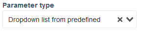

**Доступні поля параметру:**

!!! quote ""

    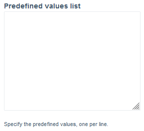

    Це багаторядкове текстове поле дозволяє заздалегідь визначити список значень, які користувач може обрати під час виконання макроса.

    Кожне окреме значення має бути визначене на окремому рядку, наприклад:

    ``` linenums="1"
    value_1
    value_2
    value_3
    ```

    Це створює випадний список з цими значеннями на вкладці **Шаблону** та у спливаючому вікні під час виконання макросу.

    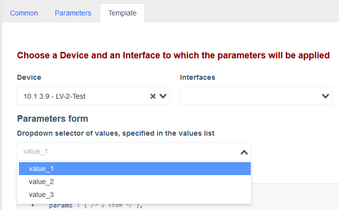

    !!! tip "Підказка"
        Оберіть **Пристрій** зі списку на сторінці **Шаблон**, щоб побачити блок **Форма Параметрів**, та щойно створений **Параметр** у ньому.
        
        Його назва зазначена над ним, та відповідає значенню поля **Відображувана назва властивості** цього параметру.
    
    Обране значення оновлює властивість об'єкту `params` з ключем, що відповідає зазначеному у полі **Властивість** у картці параметру.
        
    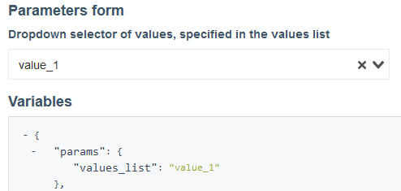

    !!! info "Інформація" 
        Тут, `"values_list"` є ключем **Властивості** цього **Параметру**.

        Доступ до значення цієї властивості можна отримати у **Шаблоні** за допомогою `params.<property>`, наприклад `{{params.values_list}}` у даному випадку.

### Випадний список зі змінних

!!! quote ""
    
    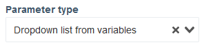

**Доступні поля параметру:**

!!! quote ""
    
    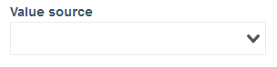

    Цей випадний список дозволяє обрати змінну типу `Array`, надану обраним **Пристроєм**.

    Значення, що зберігаются у цьому масиві, відображені знизу для зручності.

    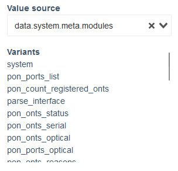

    !!! info "Інформація"
        Тип даних значень, що зберігаються у обраному масиві, впливає на роботу з наступним **Доступним полем параметру**.

!!! quote ""

    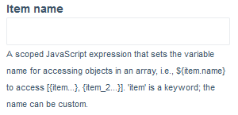

    Це текстове поле приймає JavaScript-вирази для доступу до властивостей об'єктів всередині обраного масиву.
    
    Оброблений вираз визначає відображувану назву у випадному списку **Параметру** для кожного елемента масиву.

    Для доступу до властивостей об'єктів використовується синтаксис `${item.<властивість>}`.

    За замовчуванням, коли це поле пусте, це `${item.name}`.

    !!! tip "Підказка"
        Ви можете залишити це поле пустим, якщо елементи масиву є "простими" за типом, такі як: `string`, `int` абощо.

    ??? info "Інформація"
        Деякі **Пристрої** мають властивість `interface` всередині змінних, які надають.

        У JavaScript, `interface` є *ключовим словом*, і таким чином не може бути використане як назва змінної всередині контексту, це поточний спосіб обійти це обмеження.
    
    ??? example "Приклад"
        1. Вкажіть **Властивість** та **Відображувану назву властивості**, `port` і `Порт` у даній демонстрації.
        2. Вкажіть **Тип параметру** як **Випадний список зі змінних**.
        3. Вкажіть масив з об'єктами як **Джерело значеннь**, `interfaces_list` у даному випадку.
        4. Вкажіть наступне **Назва елементу**: `${item.name} - ${item.status}`. 
        
            `name` і `status` є ключами властивостей об'єктів всередині масиву, що можна побачити у полі нижче.
        
            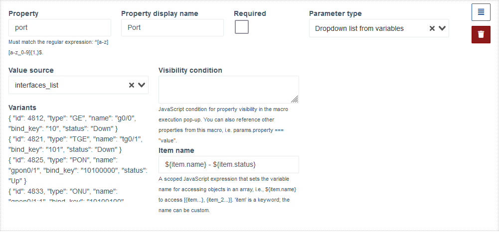

        5. Перейдіть до вкладки **Шаблон**, та оберіть **Пристрій**, що має змінну `interfaces_list`.
        6. З'явиться випадний список **Порт**, що має список об'єктів масиву `interfaces_list`, кожен з яких представлений обробленим значенням поля **Назва елементу**.
            
            Елемент, обраний тут, відповідатиме об'єкту всередині масиву `interfaces_list`, а його інші властивості стають доступними для використання у шаблоні.

            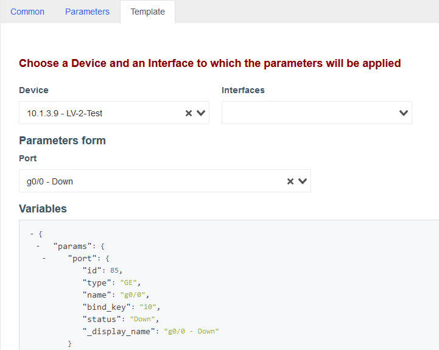


### Текстове поле зі змінною

!!! quote ""
    
    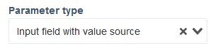

**Доступні поля параметру:**

!!! quote ""

    

    Цей випадний список дозволяє обрати змінну простого типу, надану обраним **Пристроєм**, такого як `string`, `int` абощо.

!!! quote ""

    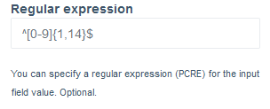

    Це текстове поле дозволяє визначити регулярний вираз для фільтрації введених користувачем у текстове поле **Параметру** значень у вкладці **Шаблон**, та під час виконання макросу.

### Текстове поле

!!! quote ""
    
    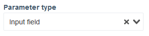

**Доступні поля параметру:**

!!! quote ""

    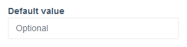

    Це *необов'язкове* поле, що дозволяє задати значення змінної **Параметру** за замовчуванням.


!!! quote ""

    

    Це текстове поле дозволяє визначити регулярний вираз для фільтрації введених користувачем у текстове поле **Параметру** значень у вкладці **Шаблон**, та під час виконання макросу.