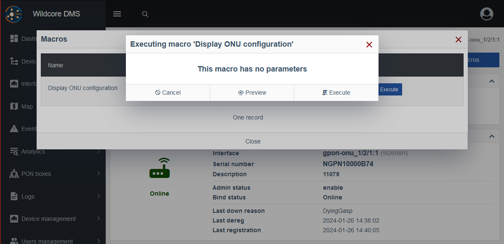
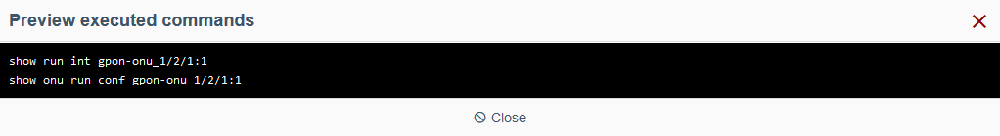
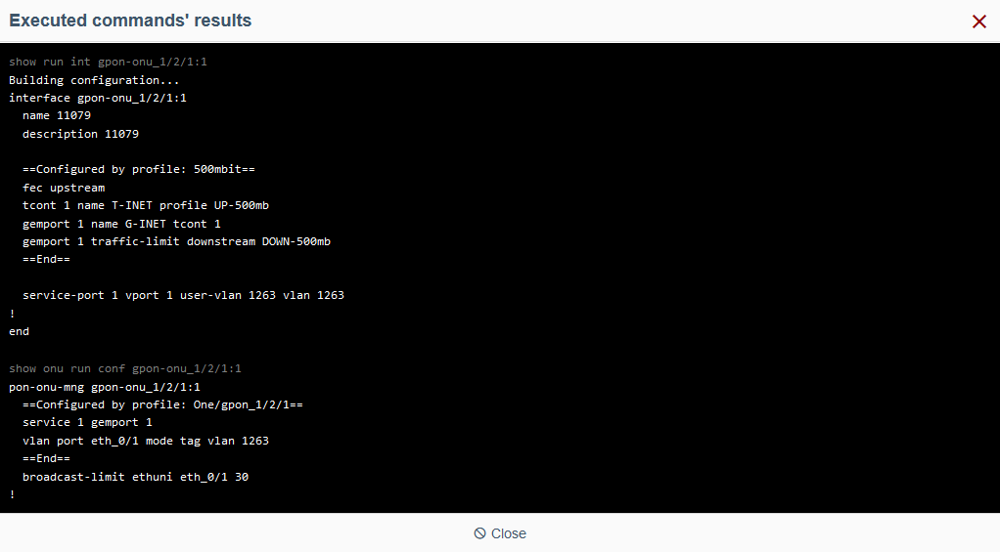
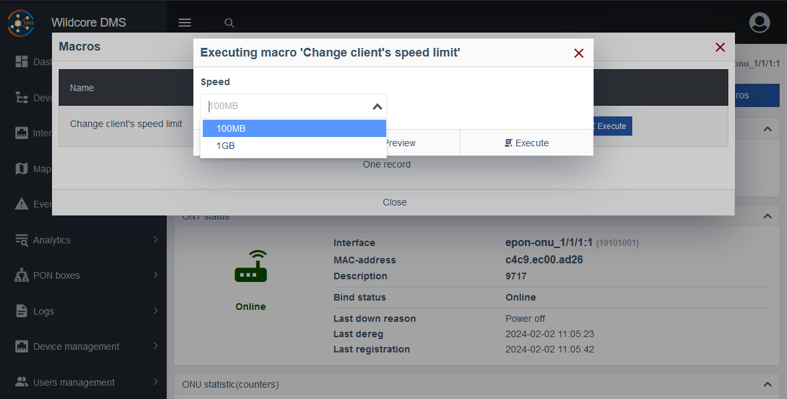
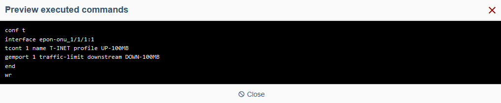
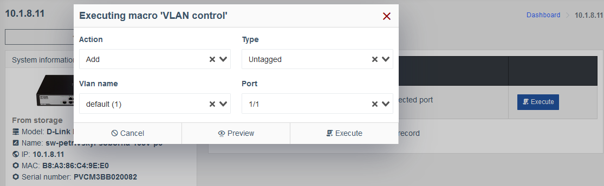
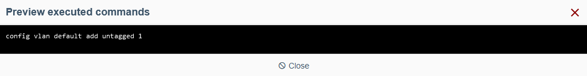
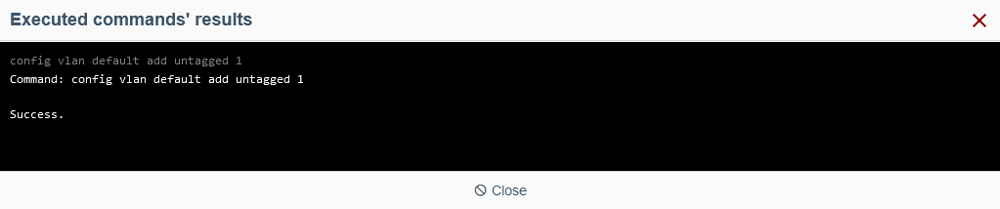

# Приклади шаблонів Twig

!!! abstract "Огляд"
    Ця сторінка представляє кілька простих **Макросів**, надісланих нашими користувачами, разом з поясненнями.

    Ви можете скопіювати їх та спробувати!

!!! warning "Увага"
    Команди можуть відрізнятися, залежно від пристроїв, що ви використовуєте.

    Відповідні команди, див. у посібнику до вашого пристрою.

## Перегляд конфігурації ONU

Цей приклад демонструє простий **Шаблон** без **Параметрів**, який просто відображає інформацію.

### Загальне

!!! quote ""
    1. **Назва:** `Перегляд інформації ONU`
    2. **Опис:** *можете вказати детальний опис цього макросу*
    3. **Ролі:** *можете обрати належні для виконання цього макросу ****Ролі***
    4. **Фільтр за виробником:** Для цілей цієї демонстрації, ми оберемо виробника `ZTE`
    5. **Моделі:** `ZTE C320`
    6. **Показувати для:** `ONU`
    7. **Відображення результатів:** `Усі команди`

### **Параметри**

Для цієї демонстрації нам не потрібні **Параметри**, тому ми пропускаємо цю вкладку.

### **Шаблон**

!!! quote ""
    1. **Пристрій** та **Інтерфейс:** *можете обрати ****Пристрій**** та/або ****Інтерфейс****, що підходять для виконання цього макроса*
    2. **Форма Параметрів:** З огляду на те, що ми не маємо жодних параметрів, цей розділ не відображається.
    3. **Змінні:** Тут можна побачити змінні, отримані з **Пристрою** та **Інтерфейсу**.
    4. **Блок шаблону:**

        - **Обраний шаблон:**

            ``` twig
            show run int {{iface.name}}
            show onu conf {{iface.name}}
            ```

            ???+ info "Інформація"
                Це текстове поле, яке визначає ваш макрос. Воно містить конкретні CLI команди, що будуть виконуватись на обраному **Пристрої** та/або **Інтерфейсі**, у поєднанні з будь-якими параметрами або змінними, де це доречно.

                Тут ми використовуємо змінну `iface`, яку надав нам обраний **Пристрій**.

        - **Результат:**

            ``` shell
            show run int epon-onu_1/1/1:1
            show onu run conf epon-onu_1/1/1:1
            ```

            ???+ info
                Тут ви можете побачити результат компіляції **Шаблону**, конкретні команди, що будуть виконані на вашому пристрої.

                Для цілей цієї демонстрації, ми обрали пристрій `ZTE C320` та інтерфейс `epon-onu_1/1/1:1`.
                
                Наша змінна `{{iface.name}}` отримала значення `epon-onu_1/1/1:1` а інші статичні команди були залишені без змін.

Натисніть кнопку **Створити** і ваш макрос готовий до використання.

### Виконання макроса

Перейдіть до пристрою та його інтерфейсу, застосовного до цього макросу, і знайдіть макрос, який ми щойно створили, у вкладці **Макроси**.

!!! tip "Підказка"
    Так як ми обрали `ONU` у полі **Відображати для**, цей макрос буде відображений лише на відповідному екрані.

Для цієї демонстрації ми обрали **Пристрій** `ZTE 320` і його **Інтерфейс** `gpon-onu_1/2/1:1`.



Так як ми не вказали жодних **Параметрів** для цього макросу, відповідне повідомлення **Цей макрос не має параметрів** відображається натомість.

Коли ви натиснете кнопку **Попередній перегляд**, ви можете побачити, що вона працює так само як поле **Результат** у вкладці **Шаблон** на сторінці створення макроса.



Кнопка **Виконати** відправляє команди до обраного інтерфейсу пристрою, у нашому випадку це `gpon-onu_1/2/1:1` .




## Зміна обмеження швидкості

### Загальне

Fill out this tab according to your requirements.

??? example
    1. **Назва:** `Зміна обмеження швидкості`
    2. **Опис:** `Оберіть обмеження швидкості у випадаючому списку, яке буде застосовано до з'єднання клієнта `
    3. **Ролі:** `Оператор`
    4. **Фільтр за виробником:** `ZTE`
    5. **Моделі:** `ZTE C320`
    6. **Показувати для:** `ONU`
    7. **Відображення результатів:** `Усі команди`

### Параметри

!!! quote ""
    1. Додайте новий **Параметр**.
    2. **Властивість:** `speed`
    3. **Швидкість:** `Швидкість`
    4. **Обов'язковий:** `Ні`
    5. **Тип параметру:** `Випадний список з запропонованих`

        ???+ info "Інформація"
            Тут ми пропонуємо користувачу значення, для більш зручного вибору правильного.

    6. **Список запропонованих значень:**
        ```
        100MB
        1GB
        ```
    7. **Умови видимості:** *залишимо це поле порожнім*

### Шаблон

!!! quote ""
    1. **Пристрій** та **Інтерфейс:** *можете обрати ****Пристрій**** та/або ****Інтерфейс****, що підходять для виконання цього макроса*
    2. **Форма Параметрів:** Тут ми маємо випадний список для параметру **Швидкість** з попередньої вкладки.
    3. **Змінні:** Тут можна побачити змінні, отримані з **Пристрою** та **Інтерфейсу**., а також властивість `params`, що зберігає значення параметрів, обраних вище.
    4. **Блок шаблону:**

        - **Обраний шаблон:** 
            ``` twig
            conf t
            interface {{iface.name}}
            tcont 1 name T-INET profile UP-{{params.speed}}
            gemport 1 traffic-limit downstream DOWN-{{params.speed}}
            end
            wr
            ```

        - **Результат:**

            ``` shell
            conf t
            interface epon-onu_1/1/1:1
            tcont 1 name T-INET profile UP-100MB
            gemport 1 traffic-limit downstream DOWN-100MB
            end
            wr
            ```

            ???+ info
                Для цілей цієї демонстрації, ми обрали **Швидкість** `100MB` у випадному списку вище, а також пристрій `ZTE C320` і його інтерфейс `epon-onu_1/1/1:1`.

                Як і в попередньому прикладі, змінна `{{iface.name}}` отримала значення `epon-onu_1/1/1:1`, а `{{params.speed}}` зберіг значення, яке ми обрали у випадному списку **Швидкість**.

Цей макрос готовий до використання.

### Виконання макроса

Перейдіть до пристрою та його інтерфейсу, застосовного до цього макросу, і знайдіть макрос, який ми щойно створили, у вкладці **Макроси**.

!!! tip "Підказка"
    Так як ми обрали `ONU` у полі **Відображати для**, цей макрос буде відображений лише на відповідному екрані.

Для цієї демонстрації ми обрали **Пристрій** `ZTE 320` і його **Інтерфейс** `gpon-onu_1/1/1:1`.



Цього разу ми можемо обрати бажану **Швидкість** з випадного меню. 

**Попередній перегляд:**



Кнопка **Виконати** відправляє команди до обраного інтерфейсу пристроя, на цей раз `epon-onu_1/1/1:1`.

!!! warning ""
    З міркувань безпеки, ми не будемо виконувати макрос у цій демонстрації.


## Managing a VLAN

This macro involves more **Parameters** compared to the previous one. 

Refer to the [**Parameter type options**](./parameter_type_options.md) page as needed.

### Загальне

!!! quote ""
    1. **Назва:** `VLAN control`
    2. **Опис:** `Manage VLANs on a selected port`
    3. **Ролі:** `Operator, Engineer`
    4. **Фільтр за виробником:** `D-Link`
    5. **Моделі:** `D-Link DES-1228/ME ...` 
    
        *feel free to select more appropriate devices, we will use this one for demonstration*

    6. **Показувати для:** `Device, Port`
    7. **Відображення результатів:** `All commands`

### Параметри

!!! quote ""
    1. **Action** parameter:
        - **Property:** `action`
        - **Property display name:** `Action`
        - **Required:** `True`
        - **Parameter type:** `Dropdown list from predefined`
        - **Predefined values list:**
            ```
            Add
            Delete
            ```
        - **Visibility condition:** *empty*

    2. **Type** parameter:
        - **Property:** `type`
        - **Property display name:** `Type`
        - **Required:** `False`
        - **Parameter type:** `Dropdown list from predefined`
        - **Predefined values list:**
            ```
            Untagged
            Tagged
            ```
        - **Visibility condition:**
            ```
            params.action === 'Add'
            ```

            ??? info
                Here we reference the previous parameter, **Action**, and set the **Type** parameter to be show only when the selected action is `'Add'`.

    3. **VLAN** parameter:
        - **Property:** `vlan`
        - **Property display name:** `VLAN`
        - **Required:** `True`
        - **Parameter type:** `Dropdown list from variables`
        - **Value source:** `data.vlans`

            ??? info
                This device variable stores an array of objects, properties of which describe the VLANs we want to configure.

        - **Visibility condition:** *empty*
        - **Item name:** `${item.name}  (${item.id})`

            ??? info
                We choose the VLAN's `name` and `id` properties to be shown in the drop-down for convenience.

    4. **Port** parameter:
        - **Property:** `port`
        - **Property display name:** `Port`
        - **Required:** `False`
        - **Parameter type:** `Dropdown list from variables`
        - **Value source:** `interfaces_list`
        - **Visibility condition:** `!iface`

            ??? info
                This condition hides the parameter from screens that provide the `iface` variable from a device, such as selected intefaces.

                Therefore, when running this macro from a **Device** screen, we can select a specific interface from the drop-down, otherwise, it's not shown.

        - **Item name:** `${item.name}`

### Шаблон

!!! quote ""
    1. **Device** and **Interface:** *feel free to select a ****Device**** and/or an ****Interface**** applicable to this macro*

        ??? info
            For this demonstration we select a `D-Link DES-1228/ME` device and no **Interface**.

    2. **Форма Параметрів:** 

        For this demonstration we select:

        - **Action:** `Add` 
        - **Type:** `Untagged` 
        - **VLAN name:** `sw802 (802)` 
        - **Port**: `1/1`

        ??? info
            You are presented with the parameters we specified in the previous step.

            **Type** drop-down is only visible when the **Action** is set to `Add`, **Port** is only visible when we haven't selected an **Interface**. 

    3. **Variables:** 

        Here are the variables from the selected **Device** and **Interface**, as well as `params` property, which stores the values of our `action`, `type`, `vlan` and `port` parameters.

        ``` json
        "params": {
            "action": "Add",
            "type": "Untagged",
            "vlan": {
                "name": "sw802",
                "id": "802",
                "ports": { /* 3 items */ },
                 "_display_name": "sw802 (802)"
            },
            "port": {
                "id": 5026,
                "type": "FE",
                "name": "1/1",
                "bind_key": "1",
                "status": "Down",
                "_display_name": "1/1"
            }
        }, 
        ```

        ??? info
            `_display_name` property here is the **Item name** variable we specified in the previous step.

            We specified `${item.name}` for our **Port** parameter, but we could also leave it empty since it evaluates to this by default.

    4. **Блок шаблону:**

        - **Обраний шаблон:** 
            ``` twig
            {# Block for setting variables inside the template #}
            
            
            
            

            {# Template block #}
            
            config vlan {{params.vlan.name}} delete {{port.bind_key}}
            
            config vlan {{params.vlan.name}} add {{params.type | lower }} {{port.bind_key}}
            
            ```

        - **Результат:**
            ``` shell
            config vlan sw802 add untagged 1
            ```

The macro is now ready to use.

### Running the macro

Navigate to a device and/or an interface applicable for this macro and find the macro we just created in the **Macros** tab.

For this demonstration, we selected a `D-Link DES-1228/ME` **Device**.



**Preview:**



**Execution:**

