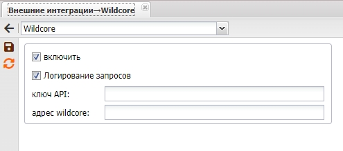
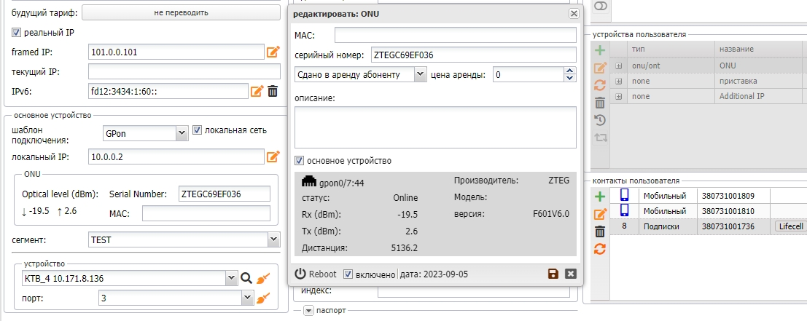
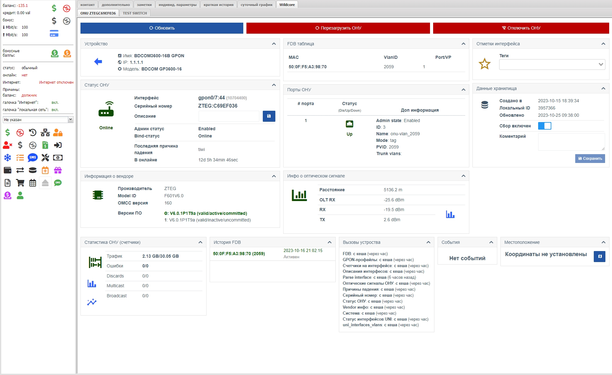
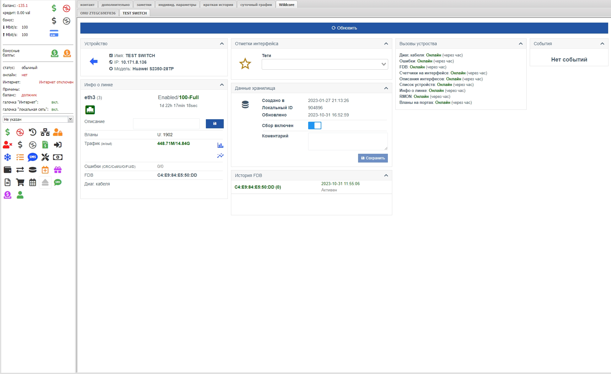
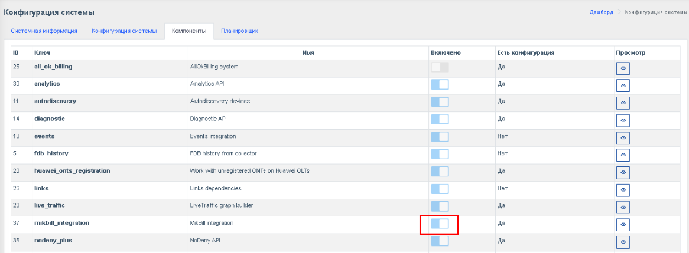
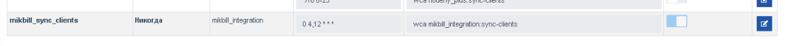
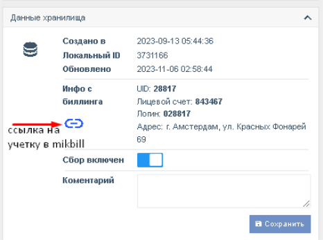
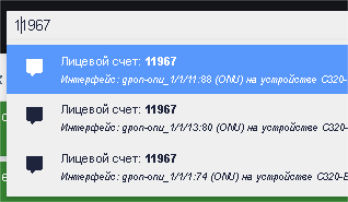

# Інтеграція з MikBill


Доступно з версії **0.19+**
[Документація MikBill](https://wiki.mikbill.pro/billing/wildcore)

# Налаштування взаємодії з MikBill

## Отримання даних з Wildcore в MikBill

#### 1. Створюємо користувацьку роль та користувача для MikBill:
**Переходимо в: _користувачі ⇒ ролі_, натискаємо _"створити нову роль"_.**
Ім'я ролі для прикладу: _mb_dms_
Встановлюємо прапорці:

- Система: **!!! Дозволити авторизацію інших користувачів (генерувати ключі)**
- Користувачі: **Список користувачів, Оновлення інформації про себе**
- Компонент **Діагностика: Діагностика інтерфейсу (для білінгу)**
- ОЛТ'и: **Інфо з ОЛТів**
- Світчі: **Інфо зі світчів**

Натискаємо _"створити"_.

**Переходимо в: _користувачі  ⇒ користувачі_, натискаємо _"створити користувача"_**
Заповнюємо всі поля, вибираємо групи пристроїв, доступні цьому користувачу, а також роль, створену вище: _mb_dms_
Логін для прикладу - _mikbill_

Натискаємо _"створити"_.

#### 2. Генеруємо API-ключ (токен) для цього користувача
З консолі:
```shell
wca user:generate-key mikbill 365d
```
де _mikbill_ – логін користувача, _365d_ – термін дії ключа

Приклад:
```shell
root@debian# wca user:generate-key mikbill 365d
+--------+------------------------+-----------------------------------------------------+-----------------------------+
|    ID  | User                   | Key                                                 | Expired At                  |
+--------+------------------------+-----------------------------------------------------+-----------------------------+
| 4780   | ID: 65                 | cd1f08c-dcea-4603-34d-471deb7c9387                  | 2024-11-14 14:37:04         |
|        | Login: mikbill         |                                                     |                             |
|        | Name: Биллинг          |                                                     |                             |
+--------+------------------------+-----------------------------------------------------+-----------------------------+
```

#### 3. Якщо адмінка білінгу працює на ssl, то також слід перевести wildcore на ssl
**З консолі (приклад для Ubuntu/Debian)**:

```shell 
apt update
apt -y install snapd nginx
snap install core
snap install --classic certbot
ln -s /snap/bin/certbot /usr/bin/certbot
# Налаштовуємо проксі на nginx, запускаємо nginx і запитуємо сертифікат
certbot --nginx -d dms.ispnet.demo # (не забуваємо відкрити порт 80 для доступу до wildcore ззовні)

```
де dms.ispnet.demo – ваше доменне ім'я       
**Приклад конфігурації nginx (перед отриманням сертифікату)**:
```shell
cat /etc/nginx/sites-enabled/wildcore-proxy
server {
	listen 80;
	root /var/www/html;
	index index.html index.htm index.nginx-debian.html;
	server_name dms.ispnet.demo;
    location / {
       proxy_pass      http://localhost:8088;
       proxy_set_header X-Real-IP $remote_addr;
       proxy_set_header Host $host;
       proxy_set_header X-Forwarded-Proto $scheme;
       proxy_set_header X-Forwarded-Host $host;
       proxy_set_header X-Forwarded-Server $host;
    }
}
```
#### 4. Увімкнення інтеграції в mikbill
Ідемо: _Налаштування ⇒ Системні опції ⇒ Зовнішні інтеграції, розділ **Wildcore**_      
Ставимо галку: **Увімкнути**      
Вказуємо адресу Wildcore: _https://dms.ispnet.demo_      
Вказуємо **API ключ**, згенерований в п.2      
Зберігаємо.



На даному етапі Mikbill вже буде отримувати дані про сигнали ону та відображати їх в картці абонента (якщо у пристрою тип onu/ont і SN/MAC знайдено в wildcore).        
Оновлення сигналів відбувається при кожному відкритті облікового запису.


         
Також в картці абонента Mikbill додано вкладку Wildcore, де можна переглянути інформацію безпосередньо з самого wildcore.

**Сторінка з ONU:**          
Для цього у абонента повинно бути додано пристрій: тип onu/ont. Білінг буде шукати пристрій в wildcore за onumac/onusn.          



**Сторінка порту в комутатора:**      
Для цього у абонента повинен бути вказаний свіч і порт, білінг буде шукати пристрій в wildcore за IP (тип пристрою: SWITCH, IP свіча в довіднику мікбілл повинен збігатися з IP свіча в вайлдкор)      


Також логін/пароль співробітника Mikbill повинен збігатися з логіном/паролем в wildcore і у його ролі повинні бути відповідні права:

- User management → Оновити власну інформацію
- OLTs → Інформація з OLTs
- Switches → Інформація зі світчів

Якщо прав не буде вистачати, то буде показана помилка:  _Wildcore iframe permission denied_      
Також за необхідності можна налаштувати масштаб завантажуваної в білінг сторінки.     
Для цього ідемо: Конфігурація ⇒ Конфігурація системи ⇒ вкладка Конфігурація системи і міняємо параметр WEB_ZOOM_IFRAME.    
За замовчуванням стоїть 1 (100%).      
Вказуємо за своїм смаком 0.9 (90%), 0.75 (75%), і т.д.


## Отримання даних з Mikbill в Wildcore

Wildcore з Mikbill може отримувати дані про абонентів, відображаючи їх в картці відповідного ONU або інтерфейсу комутатора:

- UID клієнта
- Посилання на картку абонента
- Номер договору
- Логін
- Адреса абонента (Місто, вулиця, будинок, квартира)


### Увімкнення інтеграції
#### 1. Активуємо компонент mikbill_integration
Ідемо в: _Конфігурація ⇒ Конфігурація системи_, вкладка _Компоненти_ і активуємо компонент _**mikbill_integration**_        

Після цього, во вкладці _Конфігурація системи_,  з'явиться розділ налаштувань **MikBill**.       
Пишемо туди адресу адмінки білінгу, ключ API, який генерували для білінгу в п.2,       
і вибираємо яке з полів буде доступно в _глобальному пошуку_ Wildcore (uid, номер договору, або логін).      
Жмемо зберегти

#### 2. Активуємо автоматичну синхронізацію
В _Конфігурація ⇒ Конфігурація системи_, вкладка  _планувальник_  активувати синхронізацію(також можна налаштувати бажаний час синхронізації, в форматі crontab).       

В даному прикладі синхронізація буде відбуватися двічі на добу: о 4:00 і о 12:00.

Для ручного запуску синхронізації (актуально при першому запуску) – виконайте в консолі команду:
```shell 
wca mikbill_integration:sync-clients
```     
Процес займе певний час. Залежить від кількості абонентів та продуктивності вашого сервера з wildcore.

#### Всі ОНУ та порти свічів (призначені в облікових записах абонентів) будуть доповнені даними з білінгу.

При кліці по посиланню - у новій вкладці відкриється обліковий запис в mikbill.

#### Також у глобальному пошуку тепер можна шукати абонентів за UID, логіном або номером договору (в залежності від того, що обрано для глобального пошуку)



## FAQ
#### Питання 1. В білінгу, в розділі wildcore відкривається ону, яка завжди офлайн, хоча абонент працює. Чому так?
Відповідь: Ймовірно, ону з таким ідентифікатором (onumac, onusn) присутня (або працювала раніше) на інших портах або OLT. Wildcore шукає ону за ідентифікатором і відкриває перший результат з пошуку. Видаліть ону з цим ідентифікатором з усіх неактуальних портів та OLT.

#### Питання 2. Я видалив повторюючіся ону з неактуальних портів та OLT, але по-прежньому відкривається "видалена ону". Що робити?
Відповідь: Трошки зачекайте (до 10-15 хвилин), поки OLT переопитається, і дані в БД оновляться.

_Продовження слідує_
