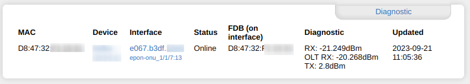
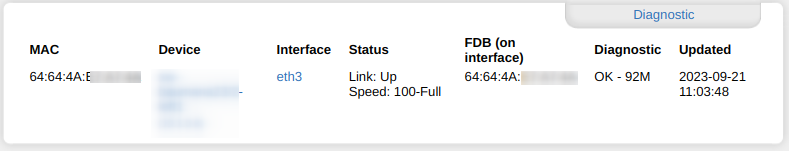
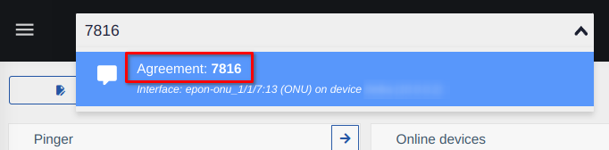
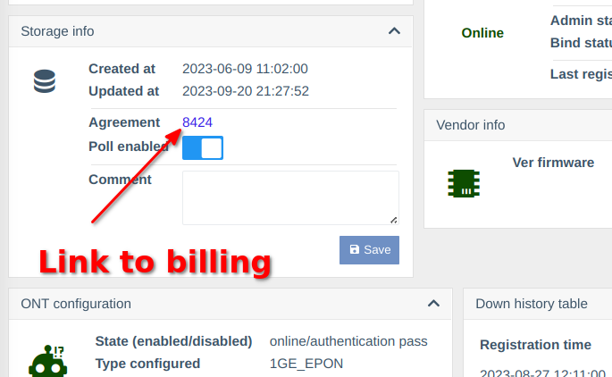
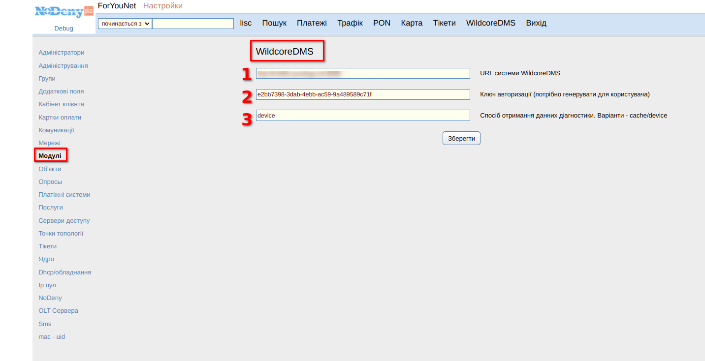
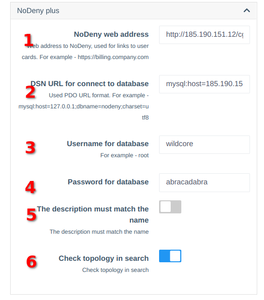
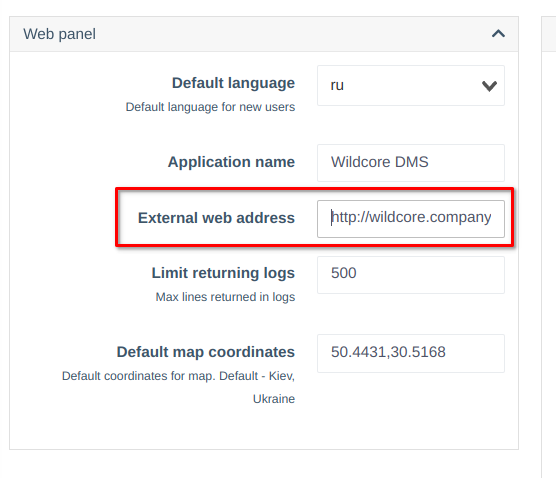

# Білінг NoDeny плюс інтеграція
## Про компонент
Компонент дозволяє взаємодіяти з білінгом NoDeny plus.    


## Функціонально
* Діагностичне вікно в картці клієнта в білінгу


* Пошук за клієнтськими MAC-адресами    
*Wildcore використовував таблицю mac_uid для порівняння MAC-адрес*
* Глобальний пошук за назвою в WildcoreDMS    

* Посилання на картку клієнта в білінгу від Wildcore


## Вимоги
* Плюс NoDeny
* Wildcore, версія 0.18+

## Встановлення
### В біллінгу
1. Завантажте останню версію модуля з github - [meklis/wildcore-nodeny-module](https://github.com/meklis/wildcore-nodeny-module/releases)
2. Встановіть модуль у білінг за допомогою [інструкції Nodeny](https://wiki.nodeny.com.ua/index.php?title=%D0%A3%D1%81%D1%82%D0%B0%D0%BD%D0%BE%D0%B2%D0%BA%D0%B0_%D0%BC%D0%BE%D0%B4%D1%83%D0%BB%D0%B5%D0%B9)
3. Створіть користувача в базі даних nodeny (з грантами - SELECT), для wildcore
4. Налаштувати модуль у білінгу
* Від адміністратора перейдіть до Налаштування->Модулі->WildcoreDMS

1. Веб-адреса системи wildcore, наприклад - http://wildcore.company.com:8088    
2. Ключ авторизації користувача. [Блок нижче](#generate-auth-key-for-billing-) описує, як згенерувати ключ
3. Звідки взяти діагностичні дані. Може бути з кешу чи пристрою. Якщо вказано кеш, щоб оновити дані діагностики, вам потрібно натиснути «оновити» на пристрої на сторінці wildcore


### У Wildcore
#### Налаштувати компонент    
Після оновлення, коли компонент `nodeny_plus` буде встановлено, перейдіть до    
**Конфігурація->Конфігурація системи->Конфігурація TAB** і перейдіть до блоку `NoDeny plus`.    
    
**Опис параметрів**    
**1. Адреса виставлення рахунків nodeny з /cgi-bin/stat.pl**.    
Наприклад - `https://billing.company.com/cgi-bin/stat.pl`    
_Його параметр, який використовується для створення посилань на білінг із дикого інтерфейсу_    
**2. Рядок підключення до бази даних у [форматі PDO](https://www.php.net/manual/en/pdo.connections.php).**    
Приклад рядка підключення - `mysql:host=billing.company.com;dbname=nodeny_db;charset=utf8`, де    
- `billing.company.com` - адреса сервера з базою даних nodeny    
- `nodeny_db` - назва бази даних nodeny    
**3. Ім'я користувача для бази даних nodeny**    
**4. Пароль для бази даних nodeny**    
**5. Якщо його параметр увімкнено, при виявленні MAC-адреси клієнта створені інтерфейси за описом будуть відфільтровані. Опис має відповідати імені в білінгу**    
**6. Якщо його параметр увімкнено, система перевірятиме топологію (посилання)**    
Якщо посилання буде виявлено, цей порт буде проігноровано    

#### Перевірте правильність URL-адреси підстановок у блоці `Web panel`    
Приклад URL - `http://wildcore.company.com:8088`    
    

Після завершення конфігурації натисніть «Зберегти» у верхній частині сторінки    
#### Створіть ключ авторизації для виставлення рахунків    
Відкрийте консоль на сервері та напишіть команду
```     
sudo wca user:generate-key admin 365d     
```     
* `admin` - ім'я користувача в системі wildcore. Білінг буде використовуватися від його користувача;
* `365d` - термін дії ключа
Вихід буде як
```     
+-----+--------------+--------------------------------------+---------------------+     
| ID  | User         | Key                                  | Expired At          |     
+-----+--------------+--------------------------------------+---------------------+     
| 121 | ID: 1        | e6cadf08-e4d3-42b3-b48b-bf0a86393b38 | 2024-09-19 19:32:47 |     
|     | Login: admin |                                      |                     |     
|     | Name: Admin  |                                      |                     |     
+-----+--------------+--------------------------------------+---------------------+     
```     
Потім збережіть ключ `e6cadf08-e4d3-42b3-b48b-bf0a86393b38`. Його ключ буде використовуватися при виставленні рахунків


