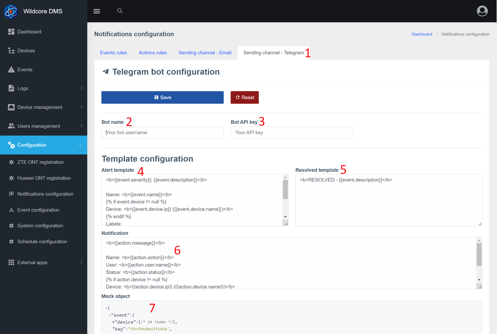
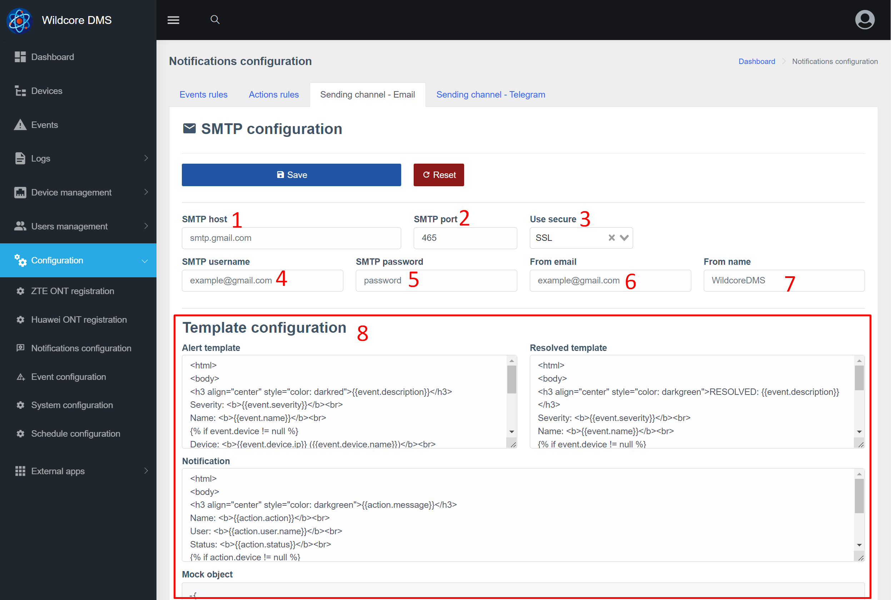

# Повідомлення (notifications)
## Про Компонент
Компонент **Notifications** дозволяє надсилати індивідуальні повідомлення користувачам системи через Telegram та Email.
Повідомлення можуть бути двох типів - події (Events) та повідомлення (логи дій у системі).


Однією з особливостей даного компонента є можливість надсилання повідомлень конкретного користувача (а не в групу).
Також користувач може налаштувати які саме повідомлення і через який канал (Email/Telegram) повинні приходити.

### Загальна схема взаємодії


Примітки:

* Події мають дві дати - початку та завершення (alert і resolved)
* Дії(повідомлення) мають одну дату - час скоєння дії.

Тому вони поділяються за різними групами і мають різні настройки.

## Повідомлення у веб-інтерфейсі
### Налаштування каналу відправки - Telegram


1. Вибір вкладки
2. Ім'я бота - тут потрібно ввести ім'я вашого бота, який вводили під час реєстрації в [@BotFather](https://t.me/BotFather)
3. API ключ - отриманий ключ від @BotFather
4. Шаблон alert (створення події) *
5. Шаблон resolved(завершення події)*
6. Шаблон notification(дії)*
7. Приклад об'єкта, що генерується для сповіщення. У випадку, якщо ця дія (повідомлення), параметр event = null. У випадку, якщо ця подія – action = null.
Ці змінні можна використовувати для створення тексту сповіщень.

_*Використовується шаблонизатор [twig](https://twig.symfony.com/)_

### Налаштування каналу відправки - Email


1. Адреса вашого SMTP сервера (IP або домен)
2. Порт SMTP
3. Яке шифрування використовувати (зазвичай від виду шифрування залежить порт)
4. Ваше ім'я користувача для авторизації на сервері SMTP. Зазвичай це ваш email
5. Пароль для авторизації на SMTP-сервері
6. Від якого email робити відправку (заголовок From в теле email). Зазвичай це ваш email
7. Яке ім'я вказати під час відправлення (заголовок From)
8. Налаштування шаблонів (детальніший опис у блоці з телеграм)


### Налаштування правил для надсилання за діями (сповіщення) <a id="action_rules_conf"></a>
На сторінці налаштування дій для надсилання, можна вказати, за якими діями потрібно генерувати повідомлення.
Також можна додати деякі умови, наприклад відправляти лише якщо дія завершилася помилкою.


1. Видалити правило
2. Ім'я дії. Це поле для введення з підказкою (система підказує на основі дій, що вже відбулися)
3. Увімкнення/відключення правила
4. Надсилати, якщо дія завершилася помилкою
5. Надсилати, якщо дія завершилася успішно

### Налаштування правил для надсилання подій <a id="event_rules_conf"></a>


1. Видалити правило
2. Ім'я події. Це поле для введення з підказкою (система підказує на основі подій, що вже відбулися)
3. Увімкнення/відключення правила
4. Чи генерувати повідомлення після завершення події. Актуально, наприклад, під час створення події про перезавантаження устаткування.
5. Скільки секунд чекати перед надсиланням повідомлення. Якщо подія завершиться раніше, відправлення повідомлення буде скасовано. Цей параметр відноситься тільки до повідомлень по alert, resolved завжди відправляється відразу ж.

### Налаштування контактів та правил надсилання в обліковому записі користувача <a id="config_contact"></a>


1. Натисніть змінити контакт у налаштуваннях облікового запису/зміна користувача, щоб отримати попап-вікно з налаштуванням контакту
2. Можна вимкнути контакт, якщо якийсь час не бажаєте отримувати сповіщень
3. За якими рівнями надсилати сповіщення через цей контакт. Також до рівнів є _Notify_ - це повідомлення(дії)
4. Список подій, які НЕ надсилати через цей контакт
5. Список дій, які НЕ надсилати через цей контакт


## Налаштування повідомлень через телеграм
### Налаштування каналу
1. Зайдіть у налаштування каналу надсилання телеграм
2. Вкажіть ім'я бота, ключ та збережіть
3. Виконайте перезапуск бота командою ```wca supervisor:control telegram-bot restart``` (що б обробник вхідних повідомлень отримав нові налаштування)

### Додавання контактів
1. Перейдіть до опцій облікового запису/зміни користувача та додайте номер телефону, який використовується в телеграм.

2. Після додавання контакту - перейдіть у ваш бот і надішліть /start або будь-яке інше повідомлення.
У відповідь бот повинен попросити передачу контактного номера. Після передачі контактного номера бот повинен відповісти наступне:

3. Перезавантажте сторінку з налаштуваннями облікового запису, щоб з'явився новий контакт із типом телеграми.

**Надсилання повідомлень через телеграм налаштовано!**
Далі, ви можете більш тонко налаштувати [які повідомлення хочете отримувати за цим контактом](#config_contact),
[які події](#event_rules_conf) та [які дії](#action_rules_conf)


