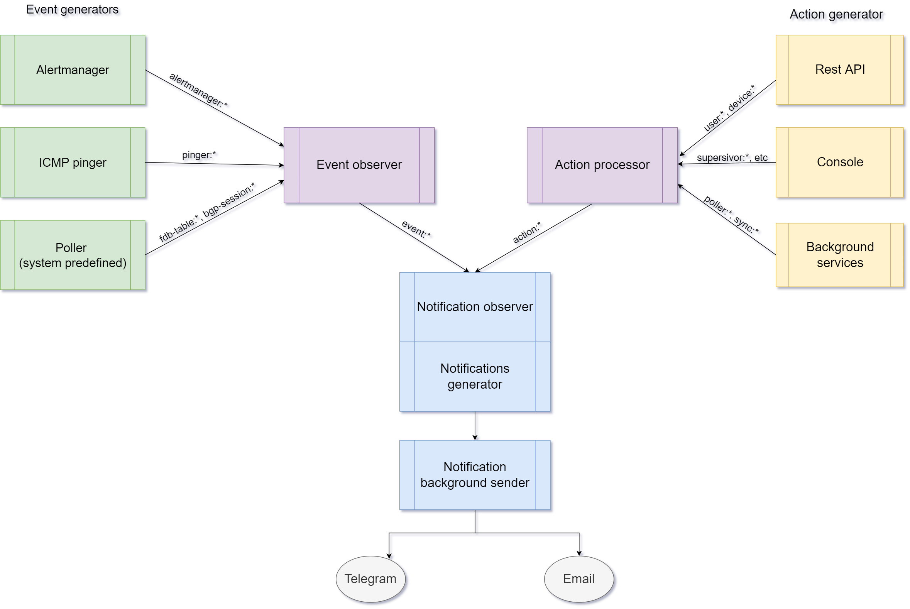
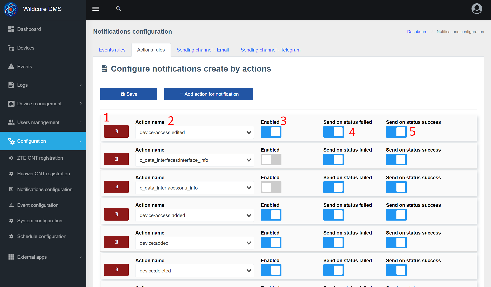

# Сповіщення
## Про компонент
Компонент **Повідомлення** дозволяє надсилати індивідуальні сповіщення користувачам системи за допомогою Telegram та електронної пошти.
Повідомлення можуть бути двох типів - події (Events) і повідомлення (логи дій в системі).

Однією з особливостей цього компонента є можливість надсилати повідомлення конкретному користувачеві (а не групі).
Користувач також може налаштувати, які сповіщення та через який канал (електронна пошта/Telegram) отримувати.

### Загальна схема взаємодії

Примітки:

* Події мають дві дати - початок і кінець (попередження та вирішення)
* Дії (повідомлення) мають одну дату - час дії.

З цієї причини вони поділяються на різні групи та мають різні налаштування.

## Сповіщення у веб-інтерфейсі
### Налаштування каналу відправки - Telegram

1. Вибір вкладки
2. Ім'я бота - тут потрібно ввести ім'я вашого бота, яке було введено під час реєстрації в [@BotFather](https://t.me/BotFather)
3. Ключ API - отриманий ключ від @BotFather
4. Сповіщення про шаблон (створити подію)*
5. Шаблон вирішено (завершення події)*
6. Шаблон повідомлення (дія)*
7. Приклад об'єкта, сформованого для повідомлення. Якщо це дія (сповіщення), параметр event = null. У випадку, якщо ця подія є action = null.
Ці змінні можна використовувати для створення тексту сповіщення.

_*Використовуйте [гілочку](https://twig.symfony.com/)_

### Налаштування каналу відправлення - Email

1. Адреса вашого SMTP-сервера (IP або домен)
2. Порт SMTP
3. Яке шифрування використовувати (зазвичай порт також залежить від типу шифрування)
4. Ваше ім'я користувача для авторизації на SMTP-сервері. Зазвичай це ваша електронна адреса
5. Пароль для авторизації на SMTP сервері
6. З якого електронного листа надсилати (заголовок From у тілі електронного листа). Зазвичай це ваша електронна адреса
7. Яке ім'я вказувати при відправці (З заголовка)
8. Налаштування шаблонів (докладніше в блоці telegram)

### Налаштування правил надсилання дій (повідомлень) 
На сторінці налаштування дій для надсилання ви можете вказати, які дії повинні генерувати сповіщення.
Ви також можете додати деякі умови, наприклад, надсилати, лише якщо дія закінчилася з помилкою.

1. Видаліть правило
2. Назва акції. Це поле введення з підказкою (система підказує на основі вже виконаних дій)
3. Увімкніть/вимкніть правило
4. Надіслати, якщо дія не вдається
5. Надіслати, якщо дія пройшла успішно

### Налаштування правил надсилання подій 

1. Видаліть правило
2. Назва події. Це поле введення з підказкою (система підказує на основі подій, які вже відбулися)
3. Увімкніть/вимкніть правило
4. Чи генерувати сповіщення про завершення події. Актуально, наприклад, при створенні події про перезавантаження обладнання.
5. Скільки секунд чекати перед надсиланням сповіщення. Якщо подія закінчиться раніше, сповіщення буде скасовано. Цей параметр застосовується лише до сповіщень про сповіщення, розв’язані завжди надсилаються негайно.

### Налаштування контактів і правил надсилання в обліковому записі користувача 

1. Натисніть редагувати контакт у налаштуваннях облікового запису / редагувати користувача, щоб відкрити спливаюче вікно з налаштуваннями контакту
2. Ви можете вимкнути контакт, якщо деякий час не хочете отримувати сповіщення
3. На яких рівнях надсилати сповіщення через цей контакт. Також є _Notify_ для рівнів - це повідомлення (дії)
4. Список подій, які НЕ відправляються через цей контакт
5. Список дій, які НЕ відправляються через цей контакт

## Налаштування сповіщень через telegram
### Налаштування каналу
1. Зайдіть в налаштування каналу відправки телеграм
2. Вказуємо назву бота, ключ і зберігаємо
3. Перезапустіть бота командою `wca supervisor:control telegram-bot restart` (щоб обробник вхідних повідомлень отримав нові налаштування)

### Додати контакти
1. Зайдіть в налаштування облікового запису / змініть користувача та додайте номер телефону, який використовується в телеграмі.

2. Після додавання контакту - зайдіть до свого бота та надішліть /start або будь-яке інше повідомлення.
У відповідь бот повинен запросити передачу контактного номера. Після передачі контактного номера бот повинен відповісти наступним чином:

3. Перезавантажте сторінку налаштувань облікового запису - повинен з'явитися новий контакт з типом Telegram.

**Налаштована відправка сповіщень через Telegram!**
Крім того, ви можете точно налаштувати [які сповіщення ви хочете отримувати для цього контакту](#config_contact),
[які події](#event_rules_conf) і [які дії](#action_rules_conf)

