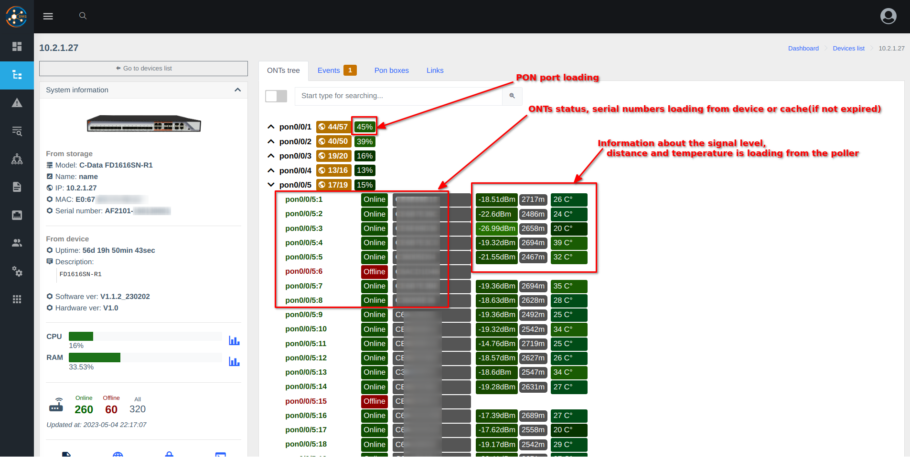
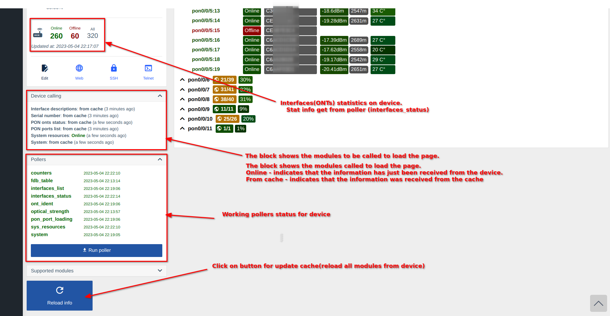
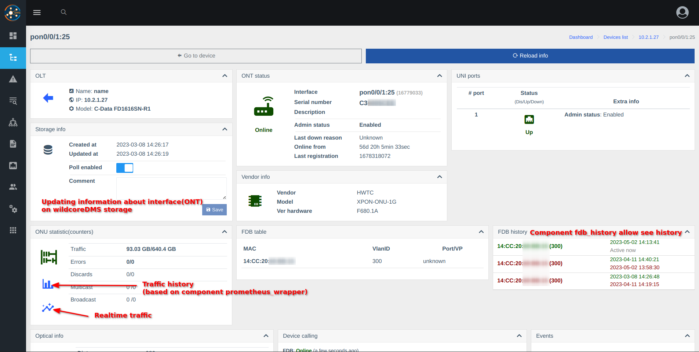

# Компонент OLT
Дозволяє працювати з пристроями типу OLT.

## Функція доступу для користувачів (на основі ролей)

Дозвіл «Інформація з OLT» дозволено за умовчанням.    

## Скріншоти

### Дерево ОНТ
    
    

### Інформація ОНТ
    

*Відображена інформація та блоки відрізнятимуться залежно від постачальника та моделі пристрою.*
