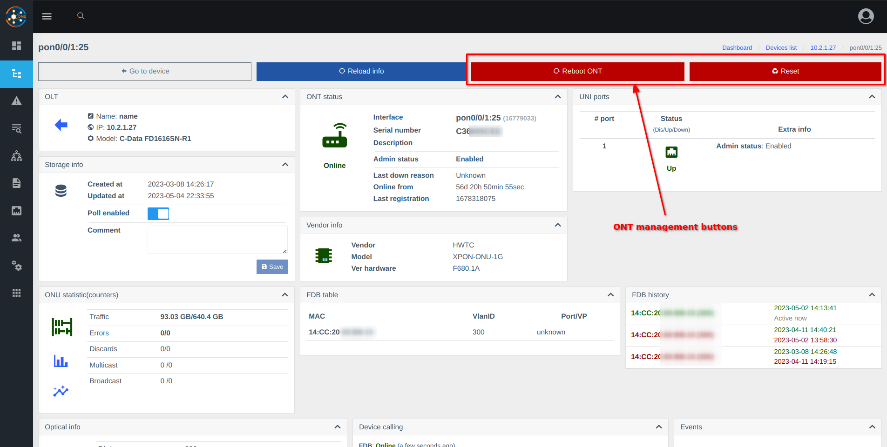

# Контроль OLT (olts_control)
Компонент розширює компонент OLT.    
**Компонент реалізує керування ONU. Функціональність залежить від постачальника та моделі OLT**

## Контроль доступу до функціоналу для користувачів (на основі ролей)

Поточні дозволи **не дозволено** за умовчанням

## Скріншоти
    

